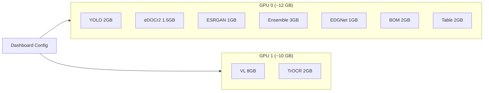

# GPU Configuration

## GPU-Enabled Services

| Service | Port | Default GPU | VRAM Usage |
|---------|------|-------------|------------|
| YOLO v11 | 5005 | GPU 0 | ~2 GB |
| eDOCr2 | 5002 | GPU 0 | ~1.5 GB |
| Vision-Language | 5004 | GPU 1 | ~8 GB |
| TrOCR | 5009 | GPU 1 | ~2 GB |
| ESRGAN | 5010 | GPU 0 | ~1 GB |
| OCR Ensemble | 5011 | GPU 0 | ~3 GB |
| EDGNet | 5012 | GPU 0 | ~1 GB |
| Blueprint AI BOM | 5020 | GPU 0 | ~2 GB |
| Table Detector | 5022 | GPU 0 | ~2 GB |

## GPU Allocation



## Dynamic Configuration

GPU 할당은 Dashboard에서 동적으로 변경 가능합니다.

### API Endpoint

```
POST /api/v1/gpu/config
```

```json
{
  "service": "yolo-api",
  "gpu_id": 0,
  "memory_limit": "4096MiB"
}
```

### Dashboard

Web UI Dashboard (`/dashboard`) → GPU Monitor 탭에서 시각적으로 관리:

- GPU 사용량 실시간 모니터링
- 서비스별 GPU 할당 변경
- 메모리 제한 설정

## Docker Override

```yaml
# docker-compose.override.yml
services:
  yolo-api:
    deploy:
      resources:
        reservations:
          devices:
            - driver: nvidia
              device_ids: ['0']
              capabilities: [gpu]
    environment:
      - CUDA_VISIBLE_DEVICES=0

  vl-api:
    deploy:
      resources:
        reservations:
          devices:
            - driver: nvidia
              device_ids: ['1']
              capabilities: [gpu]
    environment:
      - CUDA_VISIBLE_DEVICES=1
```

## Troubleshooting

| Issue | Solution |
|-------|----------|
| CUDA OOM | Reduce batch size, limit VRAM |
| GPU not detected | Check `nvidia-smi`, restart Docker |
| Slow inference | Check GPU utilization, reduce concurrent models |
| Container crash | Check `docker logs`, VRAM limits |
