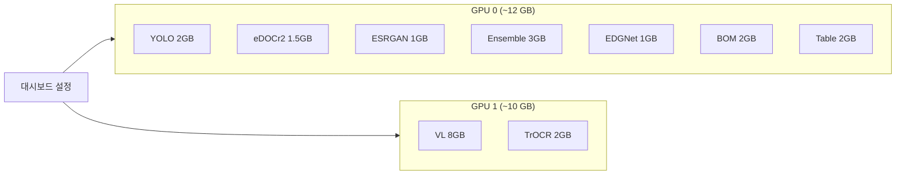

# GPU 설정

## GPU 사용 서비스

| 서비스 | 포트 | 기본 GPU | VRAM 사용량 |
|--------|------|----------|------------|
| YOLO v11 | 5005 | GPU 0 | ~2 GB |
| eDOCr2 | 5002 | GPU 0 | ~1.5 GB |
| Vision-Language | 5004 | GPU 1 | ~8 GB |
| TrOCR | 5009 | GPU 1 | ~2 GB |
| ESRGAN | 5010 | GPU 0 | ~1 GB |
| OCR Ensemble | 5011 | GPU 0 | ~3 GB |
| EDGNet | 5012 | GPU 0 | ~1 GB |
| Blueprint AI BOM | 5020 | GPU 0 | ~2 GB |
| Table Detector | 5022 | GPU 0 | ~2 GB |

## GPU 할당



## 동적 설정(Dynamic Configuration)

GPU 할당은 대시보드(Dashboard)에서 동적으로 변경할 수 있습니다.

### API 엔드포인트

```
POST /api/v1/gpu/config
```

```json
{
  "service": "yolo-api",
  "gpu_id": 0,
  "memory_limit": "4096MiB"
}
```

### 대시보드

Web UI 대시보드(`/dashboard`) → GPU Monitor 탭에서 시각적으로 관리할 수 있습니다:

- GPU 사용량 실시간 모니터링
- 서비스별 GPU 할당 변경
- 메모리 제한 설정

## Docker 오버라이드

```yaml
# docker-compose.override.yml
services:
  yolo-api:
    deploy:
      resources:
        reservations:
          devices:
            - driver: nvidia
              device_ids: ['0']
              capabilities: [gpu]
    environment:
      - CUDA_VISIBLE_DEVICES=0

  vl-api:
    deploy:
      resources:
        reservations:
          devices:
            - driver: nvidia
              device_ids: ['1']
              capabilities: [gpu]
    environment:
      - CUDA_VISIBLE_DEVICES=1
```

## 문제 해결(Troubleshooting)

| 문제 | 해결 방법 |
|------|----------|
| CUDA 메모리 부족 (OOM) | 배치 크기 줄이기, VRAM 제한 설정 |
| GPU 미감지 | `nvidia-smi` 확인, Docker 재시작 |
| 추론 속도 저하 | GPU 사용률 확인, 동시 실행 모델 수 줄이기 |
| 컨테이너 충돌 | `docker logs` 확인, VRAM 제한 조정 |
