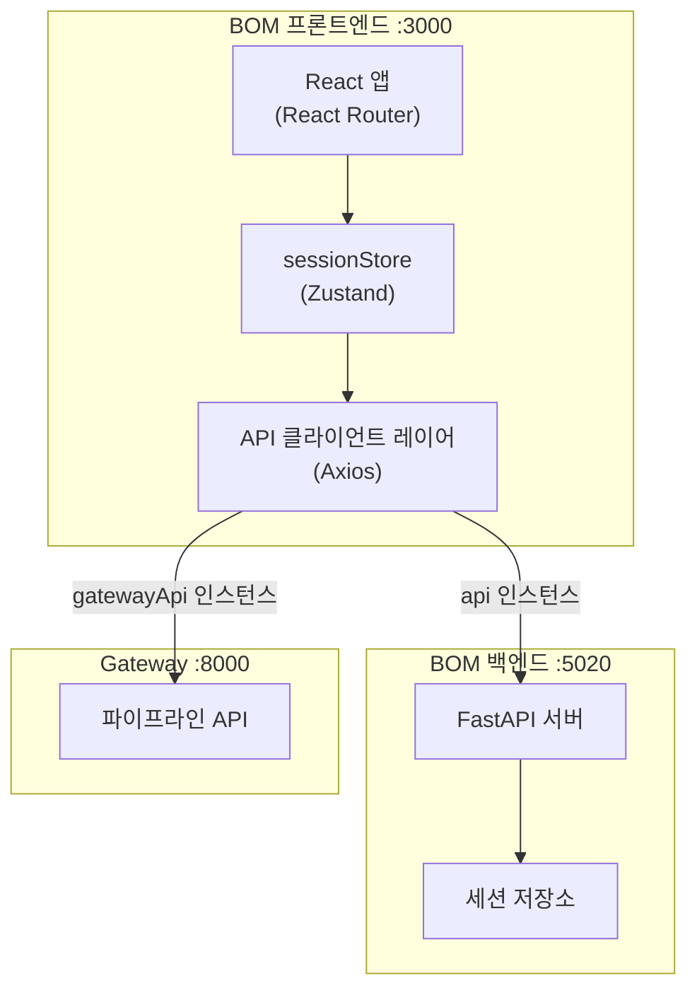
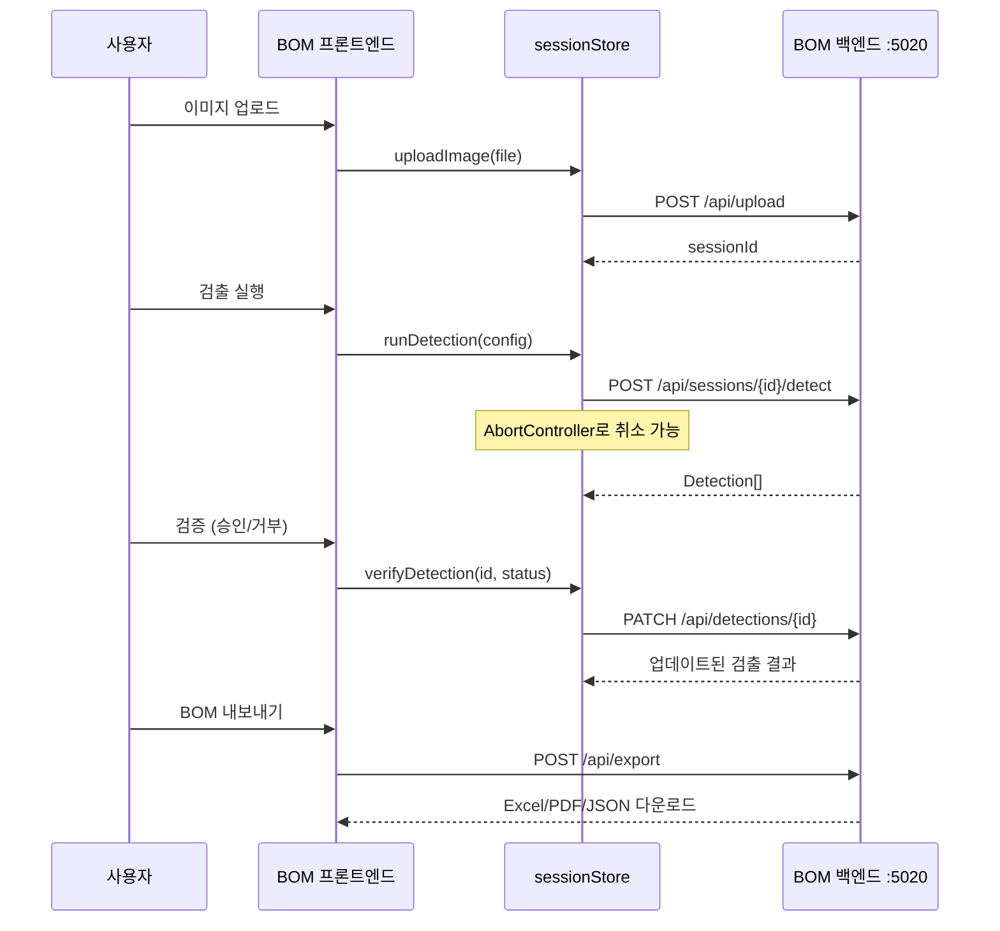

# BOM 프론트엔드

별도의 React 앱으로 구동되는 Blueprint AI BOM 전용 프론트엔드입니다 (포트 3000).

## 아키텍처

## 페이지 구조

총 **52개** 페이지/섹션 컴포넌트로 구성됩니다:

| 카테고리 | 페이지 | 설명 |
|----------|--------|------|
| **워크플로우** | `WorkflowPage`, `WorkflowSidebar` | 통합 분석 워크플로우 (기본 페이지) |
| **프로젝트** | `ProjectListPage`, `ProjectDetailPage`, `ProjectCard` | 프로젝트 CRUD 관리 |
| **Agent 검증** | `AgentVerificationPage`, `AgentDashboardPage` | Agent 검증 큐 + 결과 대시보드 |
| **고객** | `CustomerWorkflowPage`, `CustomerImageReviewPage`, `CustomerSessionPage` | 고객 전용 리뷰 UI |
| **검출** | `DetectionPage`, `DetectionResultsSection`, `DetectionRow` | 검출 결과 표시/편집 |
| **치수/GDT** | `DimensionSection`, `GDTSection` | 치수값 및 기하공차(GDT) 편집 |
| **BOM** | `BOMPage`, `BOMSection`, `BOMHierarchyTree`, `AssemblyBreakdown` | BOM 계층 구조 + 자재 분류 |
| **P&ID** | `PIDFeaturesSection`, `PIDWorkflowSection`, `ConnectivitySection` | P&ID 분석 결과 |
| **레거시** | `HomePage`, `VerificationPage` | 호환성 유지용 레거시 페이지 |

## 세션 생명주기(Session Lifecycle)

## 상태 관리 (Zustand)

단일 `sessionStore`로 모든 상태를 관리합니다:

| 상태 | 타입 | 설명 |
|------|------|------|
| `currentSession` | `SessionDetail \| null` | 현재 활성 세션 정보 |
| `sessions` | `Session[]` | 세션 목록 |
| `detections` | `Detection[]` | 검출 결과 배열 |
| `selectedDetectionId` | `string \| null` | 선택된 검출 항목 |
| `bomData` | `BOMData \| null` | BOM 계층 구조 데이터 |
| `imageData` | `string \| null` | 현재 표시 중인 이미지 |
| `currentImageId` | `string \| null` | 다중 이미지 세션의 현재 이미지 |

### 주요 액션

| 액션 | 설명 |
|------|------|
| `uploadImage(file)` | 이미지 업로드 후 세션 ID 반환 |
| `runDetection(config?)` | YOLO 검출 실행 (AbortController 지원) |
| `cancelDetection()` | 진행 중인 검출 취소 |
| `verifyDetection(id, status)` | 개별 검출 승인/거부/수정 |
| `approveAll()` / `rejectAll()` | 전체 일괄 승인/거부 |
| `loadSession(id)` | 세션 상세 로드 |
| `deleteSession(id)` | 세션 삭제 |

## 검증 키보드 단축키

| 키 | 동작 |
|----|------|
| `A` | 승인 (Approve) |
| `R` | 거부 (Reject) |
| `S` | 건너뛰기 (Skip) |
| `E` | 수정 모드 진입 (Edit) |
| `←` / `→` | 이전 / 다음 항목 |

## API 클라이언트 레이어

두 개의 Axios 인스턴스로 백엔드와 통신합니다:

| 인스턴스 | 대상 | 타임아웃 | 용도 |
|----------|------|----------|------|
| `api` | BOM 백엔드 (:5020) | 60초 | 세션, 검출, BOM, 내보내기 |
| `gatewayApi` | Gateway (:8000) | 10초 | BlueprintFlow 파이프라인 연동 |

API 모듈 구조 (`lib/api/`):

| 모듈 | 엔드포인트 |
|------|-----------|
| `analysis.ts` | 분석 실행 및 결과 조회 |
| `detection.ts` | 검출 CRUD + 검증 상태 변경 |
| `bom.ts` | BOM 생성/편집/계층 구조 |
| `export.ts` | Excel/PDF/JSON 내보내기 |
| `groundTruth.ts` | Ground Truth 비교 데이터 |
| `feedback.ts` | 사용자 피드백 수집 |
| `blueprintFlow.ts` / `longterm.ts` | Gateway 연동 및 장기 세션 |

## 주요 컴포넌트

| 컴포넌트 | 설명 |
|----------|------|
| `WorkflowPage` | 단계별 분석 워크플로우 (업로드 > 검출 > 검증 > BOM > 내보내기) |
| `VerificationQueue` | Agent 검증 큐 (키보드 단축키 기반 빠른 검증) |
| `DimensionOverlay` | 이미지 위에 치수값 오버레이 표시 |
| `DrawingCanvas` | 도면 이미지 뷰어 (확대/축소/패닝) |
| `GDTEditor` | 기하공차(GDT) 인라인 편집기 |
| `ReferencePanel` | 참조 도면 비교 패널 |

## 검증 임계값

자동 검증 판정 기준 (`constants.ts`): `AUTO_APPROVE` 0.9 (자동 승인), `HIGH_CONFIDENCE` 0.7 (녹색), `LOW_CONFIDENCE` 0.5 (경고).
