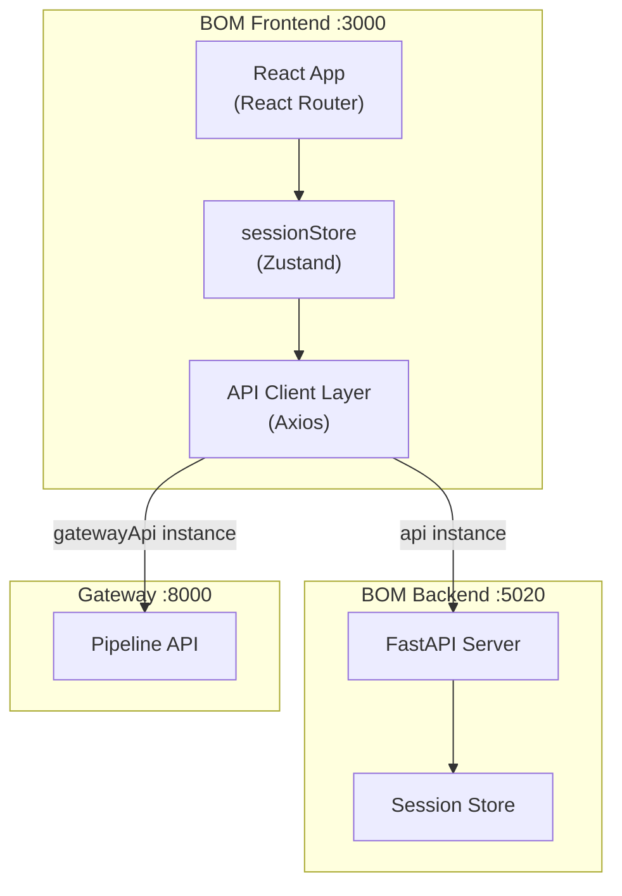
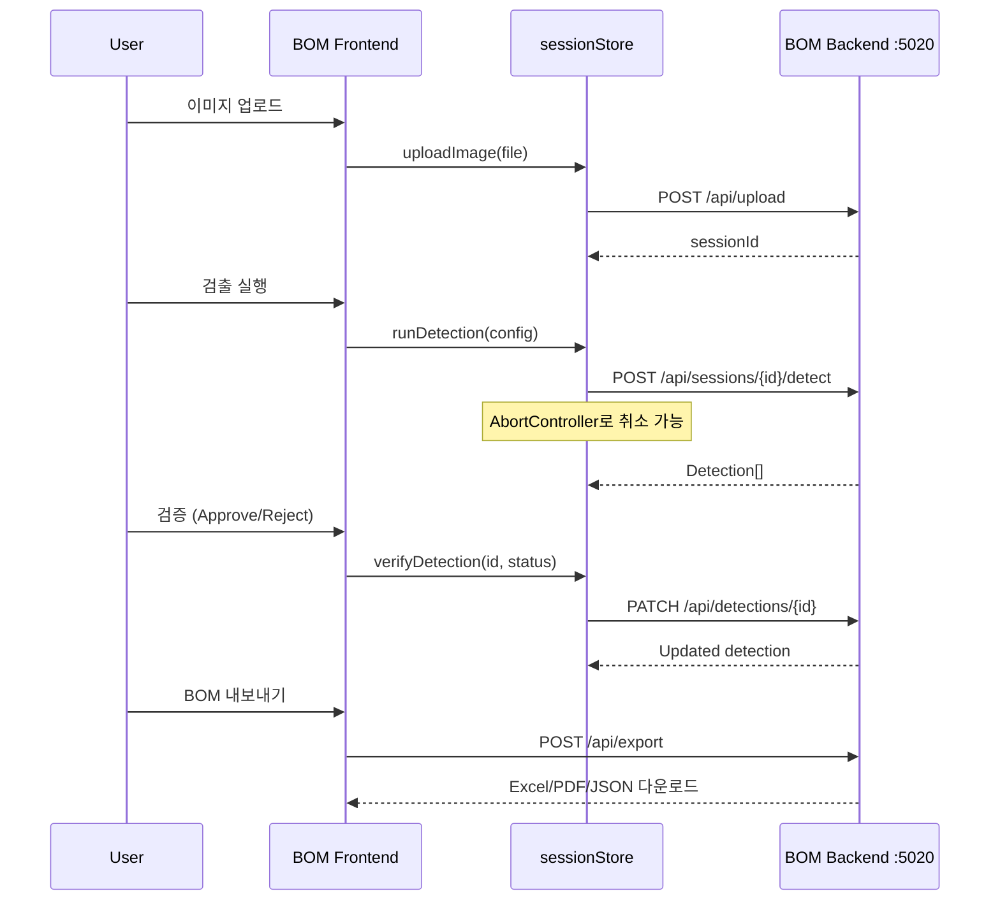

# BOM Frontend

별도의 React 앱으로 구동되는 Blueprint AI BOM 전용 프론트엔드입니다 (port 3000).

## Architecture

## Page Structure

총 **52개** 페이지/섹션 컴포넌트로 구성됩니다:

| Category | Pages | Description |
|----------|-------|-------------|
| **Workflow** | `WorkflowPage`, `WorkflowSidebar` | 통합 분석 워크플로우 (기본 페이지) |
| **Project** | `ProjectListPage`, `ProjectDetailPage`, `ProjectCard` | 프로젝트 CRUD 관리 |
| **Agent Verification** | `AgentVerificationPage`, `AgentDashboardPage` | Agent 검증 큐 + 결과 대시보드 |
| **Customer** | `CustomerWorkflowPage`, `CustomerImageReviewPage`, `CustomerSessionPage` | 고객 전용 리뷰 UI |
| **Detection** | `DetectionPage`, `DetectionResultsSection`, `DetectionRow` | 검출 결과 표시/편집 |
| **Dimension/GDT** | `DimensionSection`, `GDTSection` | 치수값 및 기하공차 편집 |
| **BOM** | `BOMPage`, `BOMSection`, `BOMHierarchyTree`, `AssemblyBreakdown` | BOM 계층 구조 + 자재 분류 |
| **P&ID** | `PIDFeaturesSection`, `PIDWorkflowSection`, `ConnectivitySection` | P&ID 분석 결과 |
| **Legacy** | `HomePage`, `VerificationPage` | 호환성 유지용 레거시 페이지 |

## Session Lifecycle

## State Management (Zustand)

단일 `sessionStore`로 모든 상태를 관리합니다:

| State | Type | Description |
|-------|------|-------------|
| `currentSession` | `SessionDetail \| null` | 현재 활성 세션 정보 |
| `sessions` | `Session[]` | 세션 목록 |
| `detections` | `Detection[]` | 검출 결과 배열 |
| `selectedDetectionId` | `string \| null` | 선택된 검출 항목 |
| `bomData` | `BOMData \| null` | BOM 계층 구조 데이터 |
| `imageData` | `string \| null` | 현재 표시 중인 이미지 |
| `currentImageId` | `string \| null` | 다중 이미지 세션의 현재 이미지 |

### Key Actions

| Action | Description |
|--------|-------------|
| `uploadImage(file)` | 이미지 업로드 후 세션 ID 반환 |
| `runDetection(config?)` | YOLO 검출 실행 (AbortController 지원) |
| `cancelDetection()` | 진행 중인 검출 취소 |
| `verifyDetection(id, status)` | 개별 검출 승인/거부/수정 |
| `approveAll()` / `rejectAll()` | 전체 일괄 승인/거부 |
| `loadSession(id)` | 세션 상세 로드 |
| `deleteSession(id)` | 세션 삭제 |

## Verification Keyboard Shortcuts

| Key | Action |
|-----|--------|
| `A` | Approve (승인) |
| `R` | Reject (거부) |
| `S` | Skip (건너뛰기) |
| `E` | Edit (수정 모드 진입) |
| `←` / `→` | Previous / Next item |

## API Client Layer

두 개의 Axios 인스턴스로 백엔드와 통신합니다:

| Instance | Target | Timeout | Usage |
|----------|--------|---------|-------|
| `api` | BOM Backend (:5020) | 60s | 세션, 검출, BOM, 내보내기 |
| `gatewayApi` | Gateway (:8000) | 10s | BlueprintFlow 파이프라인 연동 |

API 모듈 구조 (`lib/api/`):

| Module | Endpoints |
|--------|-----------|
| `analysis.ts` | 분석 실행 및 결과 조회 |
| `detection.ts` | 검출 CRUD + 검증 상태 변경 |
| `bom.ts` | BOM 생성/편집/계층 구조 |
| `export.ts` | Excel/PDF/JSON 내보내기 |
| `groundTruth.ts` | Ground Truth 비교 데이터 |
| `feedback.ts` | 사용자 피드백 수집 |
| `blueprintFlow.ts` / `longterm.ts` | Gateway 연동 및 장기 세션 |

## Key Components

| Component | Description |
|-----------|-------------|
| `WorkflowPage` | 단계별 분석 워크플로우 (업로드 > 검출 > 검증 > BOM > 내보내기) |
| `VerificationQueue` | Agent 검증 큐 (키보드 단축키 기반 빠른 검증) |
| `DimensionOverlay` | 이미지 위에 치수값 오버레이 표시 |
| `DrawingCanvas` | 도면 이미지 뷰어 (확대/축소/패닝) |
| `GDTEditor` | 기하공차 인라인 편집기 |
| `ReferencePanel` | 참조 도면 비교 패널 |

## Verification Thresholds

자동 검증 판정 기준 (`constants.ts`): `AUTO_APPROVE` 0.9 (자동 승인), `HIGH_CONFIDENCE` 0.7 (녹색), `LOW_CONFIDENCE` 0.5 (경고).
