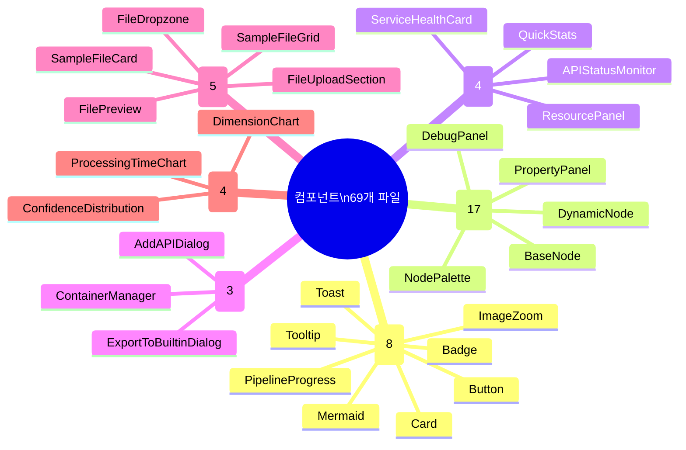

# 컴포넌트 라이브러리

총 **69개** TSX 컴포넌트가 **18개** 디렉토리에 구성되어 있습니다.

## 컴포넌트 계층 구조



## 컴포넌트 카테고리

| 카테고리 | 디렉토리 | 파일 수 | 설명 |
|----------|----------|---------|------|
| **UI 기본** | `components/ui/` | 8 | 재사용 가능한 기본 UI 요소 |
| **BlueprintFlow** | `components/blueprintflow/` | 17 | 워크플로우 빌더 전용 (노드, 팔레트, 패널) |
| **디버그** | `components/debug/` | 10 | 개발용 디버그 도구 |
| **업로드** | `components/upload/` | 5 | 파일 업로드 (드래그앤드롭, 미리보기) |
| **차트** | `components/charts/` | 4 | Recharts 기반 데이터 시각화 |
| **모니터링** | `components/monitoring/` | 4 | API 상태, GPU, 리소스 모니터링 |
| **가이드** | `components/guides/` | 4 | 사용자 가이드 및 온보딩 |
| **레이아웃** | `components/layout/` | 3 | Header, Sidebar, Layout 프레임 |
| **대시보드** | `components/dashboard/` | 3 | API 추가, 컨테이너 관리 다이얼로그 |
| **시각화** | `components/visualization/` | 2 | 결과 시각화 오버레이 |
| **공통** | `components/common/` | 2 | CropRegionPreview, GenericOverlayViewer |
| **기타** | `pid/`, `bom/`, `results/` 등 | 7 | 도메인별 특화 컴포넌트 |

## BlueprintFlow 컴포넌트

워크플로우 빌더의 핵심 컴포넌트 구조:

| 컴포넌트 | 경로 | 설명 |
|----------|------|------|
| `NodePalette` | `blueprintflow/node-palette/` | 드래그 가능한 노드 카탈로그 (4개 서브 컴포넌트 + 2 hooks) |
| `DynamicNode` | `blueprintflow/nodes/` | React Flow 커스텀 노드 렌더러 |
| `BaseNode` | `blueprintflow/nodes/` | 모든 노드의 기본 레이아웃 (핸들, 헤더, 상태) |
| `ApiNodes` | `blueprintflow/nodes/` | API 연동 노드 (검출, OCR, 분석) |
| `ControlNodes` | `blueprintflow/nodes/` | IF/Loop/Merge 제어 노드 |
| `DebugPanel` | `blueprintflow/` | 실행 로그 및 중간 결과 확인 |
| `NodeDetailPanel` | `blueprintflow/` | 선택된 노드 파라미터 편집 패널 |
| `ProfileManager` | `blueprintflow/` | 워크플로우 저장/불러오기 관리 |
| `CollapsedView` | `blueprintflow/` | 노드 축소 뷰 (미니맵용) |
| `ResultSummaryCard` | `blueprintflow/` | 파이프라인 실행 결과 요약 |

## 모니터링 컴포넌트

| 컴포넌트 | 설명 |
|----------|------|
| `APIStatusMonitor` | 21개 API 서비스 실시간 상태 대시보드 (정상/비정상/로딩) |
| `ServiceHealthCard` | 개별 서비스 카드 (응답시간, GPU 사용량, 포트 번호) |
| `QuickStats` | 전체 서비스 요약 통계 (가동률, 평균 응답시간) |
| `ResourcePanel` | GPU/CPU/메모리 리소스 모니터링 |

## UI 기본 컴포넌트

| 컴포넌트 | 속성(Props) | 설명 |
|----------|-------------|------|
| `Button` | `variant: primary / secondary / danger` | Tailwind 스타일 버튼 |
| `Badge` | `color`, `label` | 상태 표시 뱃지 (정상, 오류, 대기중) |
| `Card` | `title`, `children` | 콘텐츠 카드 컨테이너 |
| `Toast` | `type: success / error / info` | 알림 토스트 메시지 |
| `Tooltip` | `content`, `children` | 호버 시 툴팁 표시 |
| `ImageZoom` | `src`, `alt` | 이미지 확대/축소 뷰어 |
| `PipelineProgress` | `steps`, `current` | 파이프라인 단계별 진행 표시 |
| `Mermaid` | `chart` | Mermaid 다이어그램 렌더러 |

## 스타일링 접근 방식

### Tailwind CSS 설정

- **색상 팔레트**: Tailwind 기본 팔레트 + 커스텀 확장
- **다크 모드**: `class` 전략 (`dark:` 접두사, `uiStore.theme`으로 토글)
- **간격**: 4px 그리드 시스템 (Tailwind 기본)
- **브레이크포인트(Breakpoints)**: `sm(640)`, `md(768)`, `lg(1024)`, `xl(1280)`

### 패턴

```typescript
// 조건부 다크 모드 스타일링
<div className="bg-white dark:bg-gray-800 text-gray-900 dark:text-gray-100">

// 상태별 뱃지 색상
<Badge className={status === 'healthy' ? 'bg-green-100 text-green-800' : 'bg-red-100 text-red-800'} />
```

## 상태 관리

5개 Zustand 스토어가 컴포넌트에 상태를 제공합니다:

| 스토어 | 파일 | 설명 |
|--------|------|------|
| `workflowStore` | `store/workflowStore.ts` | 워크플로우 노드/엣지/실행 상태 |
| `apiConfigStore` | `store/apiConfigStore.ts` | API 엔드포인트 설정 |
| `uiStore` | `store/uiStore.ts` | 테마, 사이드바, UI 상태 |
| `monitoringStore` | `store/monitoringStore.ts` | 서비스 헬스 데이터 |
| `profileStore` | `store/profileStore.ts` | 워크플로우 프로필 저장/관리 |
