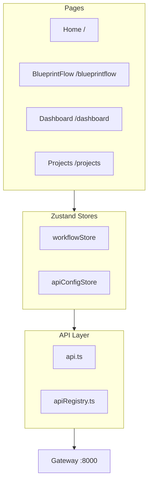

# Frontend Architecture

AX POC 프론트엔드는 두 개의 독립 React 앱으로 구성됩니다.

## Two Apps

| App | Port | Framework | Purpose |
|-----|------|-----------|---------|
| **Web UI** | 5173 | React 19 + Vite | 메인 앱 (BlueprintFlow, Dashboard) |
| **BOM Frontend** | 3000 | React | Blueprint AI BOM 전용 UI |

## Web UI Architecture



## Key Technologies

| Technology | Version | Purpose |
|-----------|---------|---------|
| React | 19 | UI Framework |
| TypeScript | 5.x | Type Safety |
| Vite | 6.x | Build Tool |
| Tailwind CSS | 3.x | Styling |
| Zustand | 4.x | State Management |
| React Flow | 11.x | Workflow Canvas |
| React Router | 6.x | Routing |

## File Structure

```
web-ui/
├── src/
│   ├── components/          # Shared components
│   │   ├── monitoring/      # Dashboard widgets
│   │   └── ui/              # Base UI components
│   ├── config/
│   │   ├── apiRegistry.ts   # 24 API definitions
│   │   ├── nodeDefinitions.ts # 29+ node types
│   │   └── nodes/           # Node category modules
│   ├── lib/
│   │   └── api.ts           # API client
│   ├── pages/
│   │   ├── blueprintflow/   # BlueprintFlow builder
│   │   └── ...
│   ├── services/
│   │   └── specService.ts   # API spec loader
│   └── store/
│       ├── workflowStore.ts # Workflow state
│       └── apiConfigStore.ts # API configuration
```

## Sub-pages

| Page | Description |
|------|-------------|
| [Routing](./routing) | 라우팅 및 페이지 구성 |
| [State Management](./state-management) | Zustand 상태 관리 |
| [Component Library](./component-library) | 공통 컴포넌트 |
| [BOM Frontend](./bom-frontend) | BOM 프론트엔드 |
