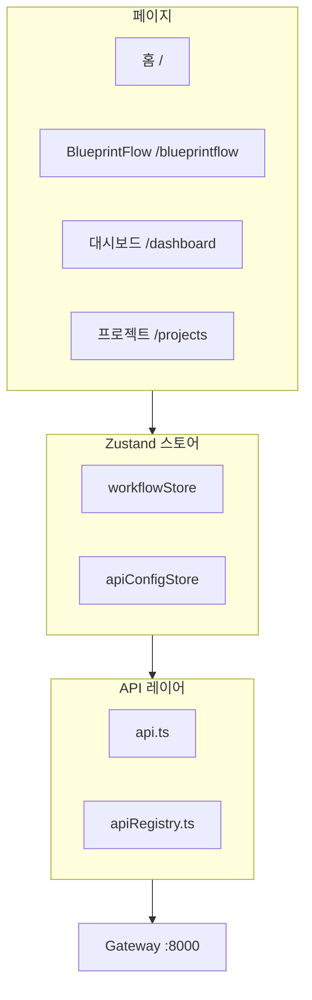

# 프론트엔드 아키텍처

AX POC 프론트엔드는 두 개의 독립적인 React 앱으로 구성됩니다.

## 두 개의 앱

| 앱 | 포트 | 프레임워크 | 용도 |
|----|------|-----------|------|
| **Web UI** | 5173 | React 19 + Vite | 메인 앱 (BlueprintFlow, 대시보드) |
| **BOM 프론트엔드** | 3000 | React | Blueprint AI BOM 전용 UI |

## Web UI 아키텍처



## 핵심 기술 스택

| 기술 | 버전 | 용도 |
|------|------|------|
| React | 19 | UI 프레임워크 |
| TypeScript | 5.x | 타입 안전성 |
| Vite | 6.x | 빌드 도구 |
| Tailwind CSS | 3.x | 스타일링 |
| Zustand | 4.x | 상태 관리 |
| React Flow | 11.x | 워크플로우 캔버스 |
| React Router | 6.x | 라우팅 |

## 파일 구조

```
web-ui/
├── src/
│   ├── components/          # 공유 컴포넌트
│   │   ├── monitoring/      # 대시보드 위젯
│   │   └── ui/              # 기본 UI 컴포넌트
│   ├── config/
│   │   ├── apiRegistry.ts   # 24개 API 정의
│   │   ├── nodeDefinitions.ts # 29개 이상 노드 타입
│   │   └── nodes/           # 노드 카테고리 모듈
│   ├── lib/
│   │   └── api.ts           # API 클라이언트
│   ├── pages/
│   │   ├── blueprintflow/   # BlueprintFlow 빌더
│   │   └── ...
│   ├── services/
│   │   └── specService.ts   # API 스펙 로더
│   └── store/
│       ├── workflowStore.ts # 워크플로우 상태
│       └── apiConfigStore.ts # API 설정
```

## 하위 페이지

| 페이지 | 설명 |
|--------|------|
| [라우팅](./routing) | 라우팅 및 페이지 구성 |
| [상태 관리](./state-management) | Zustand 상태 관리 |
| [컴포넌트 라이브러리](./component-library) | 공통 컴포넌트 |
| [BOM 프론트엔드](./bom-frontend) | BOM 프론트엔드 |
