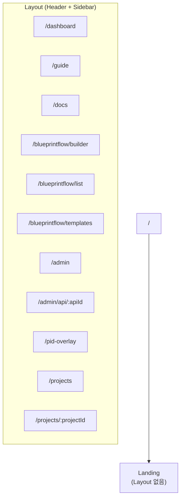
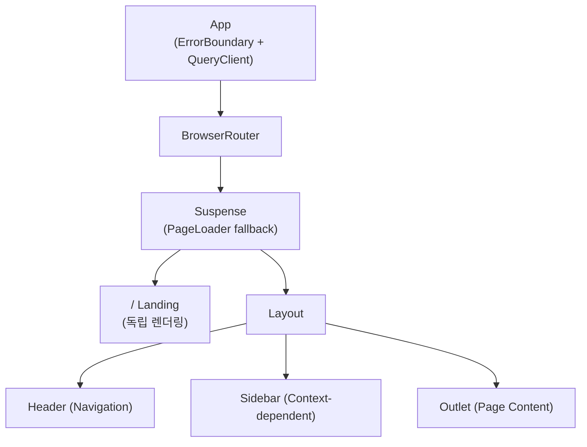

# Routing & Pages

## Route Map



## Web UI Route Table (port 5173)

| Route | Component | Loading | Description |
|-------|-----------|---------|-------------|
| `/` | `Landing` | **Sync** | 랜딩 페이지 (Layout 없음, 독립 렌더링) |
| `/dashboard` | `Dashboard` | Lazy | API 상태 + GPU 모니터링 통합 대시보드 |
| `/guide` | `Guide` | Lazy | 시스템 사용 가이드 |
| `/docs` | `Docs` | Lazy | API 문서 뷰어 |
| `/blueprintflow/builder` | `BlueprintFlowBuilder` | Lazy | 워크플로우 빌더 캔버스 (React Flow) |
| `/blueprintflow/list` | `BlueprintFlowList` | Lazy | 저장된 워크플로우 목록 |
| `/blueprintflow/templates` | `BlueprintFlowTemplates` | Lazy | 워크플로우 템플릿 갤러리 |
| `/admin` | `Admin` | Lazy | API 서비스 관리, Docker 컨테이너 관리 |
| `/admin/api/:apiId` | `APIDetail` | Lazy | 개별 API 상세 (파라미터, 로그, 테스트) |
| `/pid-overlay` | `PIDOverlayPage` | Lazy | P&ID SVG 오버레이 뷰어 |
| `/projects` | `ProjectList` | Lazy | 프로젝트 목록 |
| `/projects/:projectId` | `ProjectDetail` | Lazy | 프로젝트 상세 + 세션 목록 |

## BOM Frontend Route Table (port 3000)

| Route | Component | Description |
|-------|-----------|-------------|
| `/` | `WorkflowPage` | 통합 워크플로우 (기본 페이지) |
| `/workflow` | `WorkflowPage` | `/`와 동일 (명시적 경로) |
| `/guide` | `GuidePage` | BOM 시스템 사용 가이드 |
| `/projects` | `ProjectListPage` | 프로젝트 목록 관리 |
| `/projects/:projectId` | `ProjectDetailPage` | 프로젝트 상세 뷰 |
| `/verification/agent` | `AgentVerificationPage` | Agent 검증 UI (Layout 없음) |
| `/verification/dashboard` | `AgentDashboardPage` | 검증 결과 대시보드 |
| `/customer/:projectId` | `CustomerWorkflowPage` | 고객용 워크플로우 UI |
| `/customer/:projectId/review/:imageId` | `CustomerImageReviewPage` | 고객용 이미지 리뷰 |
| `/customer/session/:sessionId` | `CustomerSessionPage` | 고객용 세션 기반 뷰 |
| `/legacy` | `HomePage` | 레거시 홈 (Layout 포함) |
| `/detection` | `DetectionPage` | 레거시 검출 뷰 |
| `/verification` | `VerificationPage` | 레거시 검증 뷰 |
| `/bom` | `BOMPage` | 레거시 BOM 뷰 |

## Lazy Loading Strategy

`Landing`과 `Layout`만 동기 로드하고, 나머지 12개 페이지는 `React.lazy()`로 코드 분할합니다.

```typescript
// 동기 (항상 필요)
import Layout from './components/layout/Layout';
import Landing from './pages/Landing';

// 비동기 (방문 시 로드)
const BlueprintFlowBuilder = lazy(() => import('./pages/blueprintflow/BlueprintFlowBuilder'));
const Dashboard = lazy(() => import('./pages/dashboard/Dashboard'));
const Admin = lazy(() => import('./pages/admin/Admin'));
// ... 총 12개 lazy 컴포넌트
```

로딩 중에는 `<Suspense fallback={<PageLoader />}>`로 스피너를 표시합니다.

## React Query Configuration

`@tanstack/react-query`로 서버 상태를 관리합니다:

| 옵션 | 값 | 설명 |
|------|-----|------|
| `refetchOnWindowFocus` | `false` | 탭 전환 시 재요청 방지 |
| `retry` | `1` | 실패 시 1회 재시도 |
| `staleTime` | `30000ms` | 30초간 캐시 유지 |

## Layout Structure



## Theme System

`uiStore`의 `theme` 상태에 따라 `document.documentElement`에 `dark` 클래스를 토글합니다. Tailwind의 `dark:` prefix를 통해 다크 모드가 적용됩니다.

## Route Protection

현재 인증/권한 기반 라우트 보호는 적용되지 않습니다. 모든 라우트는 공개 접근이 가능하며, BOM Frontend의 고객용 라우트(`/customer/*`)는 URL 기반 접근 제어만 사용합니다.
