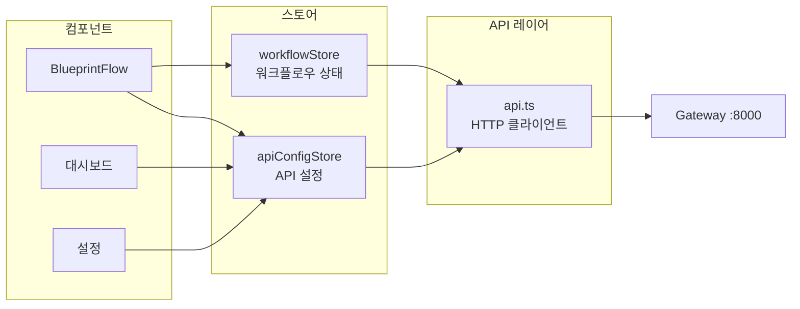

# 상태 관리

Zustand를 사용한 경량 상태 관리입니다.

## 스토어 아키텍처



## 스토어 목록

### workflowStore

워크플로우 빌더의 노드/엣지 상태를 관리합니다.

```typescript
interface WorkflowState {
  nodes: Node[];
  edges: Edge[];
  selectedNodeId: string | null;
  isExecuting: boolean;
  executionResults: Record<string, NodeResult>;

  // 액션
  addNode: (node: Node) => void;
  removeNode: (id: string) => void;
  updateNodeData: (id: string, data: any) => void;
  connect: (edge: Edge) => void;
  executeWorkflow: () => Promise<void>;
}
```

### apiConfigStore

API 서비스 설정과 상태를 관리합니다.

```typescript
interface ApiConfigState {
  services: ServiceConfig[];
  healthStatus: Record<string, HealthStatus>;

  // 액션
  updateServiceConfig: (id: string, config: Partial<ServiceConfig>) => void;
  checkHealth: (serviceId: string) => Promise<void>;
  checkAllHealth: () => Promise<void>;
}
```

## 패턴

### 셀렉터 패턴 (Selector Pattern)

```typescript
// 불필요한 리렌더링을 방지하기 위한 세밀한 구독
const nodes = useWorkflowStore(state => state.nodes);
const isExecuting = useWorkflowStore(state => state.isExecuting);
```

### 비동기 액션 (Async Actions)

```typescript
// 스토어 액션에 통합된 API 호출
executeWorkflow: async () => {
  set({ isExecuting: true });
  try {
    const results = await api.post('/workflow/execute', getState().toJSON());
    set({ executionResults: results, isExecuting: false });
  } catch (error) {
    set({ isExecuting: false });
  }
}
```
