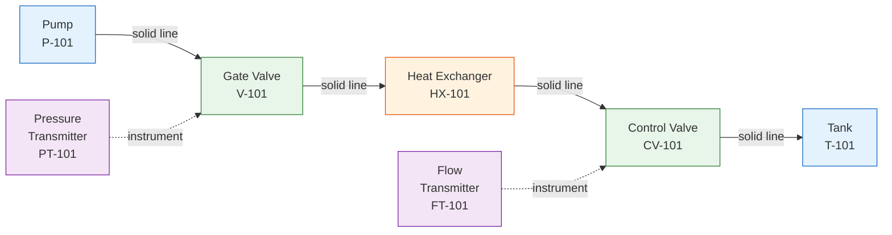

# Connectivity Analysis

The Connectivity Analyzer builds a graph of equipment connections from symbol detections and line detections. It determines which symbols are connected to each other, traces flow paths, and identifies orphan (disconnected) symbols.

## Analysis Approach

The analyzer uses three strategies to establish connections, applied in order of precision:

| Strategy | Method | Confidence | When Used |
|----------|--------|-----------|-----------|
| **Line-based** | Trace lines between symbols | High (0.8+) | Lines detected |
| **Intersection-based** | Connect through line crossings | Medium (0.6) | Complex routing |
| **Proximity-based** | Connect nearby symbols | Lower (0.5) | No line data available |

## Connection Graph



## Algorithm

### Step 1: Create Symbol Nodes

Each detected symbol becomes a node in the graph:

```json
{
  "id": "sym-001",
  "class_name": "gate_valve",
  "center": [1200.5, 800.0],
  "bbox": { "x1": 1178, "y1": 774, "x2": 1223, "y2": 826 },
  "connections": [],
  "connected_lines": [],
  "tag": "V-101"
}
```

### Step 2: Line-Based Connection Analysis

When line detection data is available, the analyzer:

1. For each line, check if either endpoint is within `line_endpoint_threshold` (30px) of a symbol's bounding box
2. When two symbols share a common line, create a connection
3. Record the line IDs used in each connection for traceability

```python
# Pseudocode
for line in detected_lines:
    symbols_touching_start = find_symbols_near(line.start, threshold=30px)
    symbols_touching_end = find_symbols_near(line.end, threshold=30px)

    for source in symbols_touching_start:
        for target in symbols_touching_end:
            create_connection(source, target, via=line)
```

### Step 3: Intersection-Based Connection

Lines that cross at intersection points may indicate indirect connections:

1. For each intersection, find which lines meet
2. For each pair of lines at an intersection, trace back to their connected symbols
3. Create indirect connections between symbols connected through shared intersections

### Step 4: Proximity-Based Fallback

When no line data is available, the analyzer falls back to proximity:

- Symbols within `proximity_threshold` (50px) of each other are considered directly connected
- Only pairs within `max_path_length` (500px) are considered

### Step 5: Orphan Detection

Symbols not connected to any other symbol are flagged as orphans. High orphan counts may indicate:

- Incomplete line detection
- Symbols in notes or legend areas
- Disconnected instrumentation

## Configuration Parameters

| Parameter | Default | Description |
|-----------|---------|-------------|
| `proximity_threshold` | 50 px | Max distance for direct proximity connection |
| `line_endpoint_threshold` | 30 px | Max distance from line endpoint to symbol |
| `max_path_length` | 500 px | Maximum connection path length |

## Output Format

```json
{
  "nodes": {
    "sym-001": {
      "id": "sym-001",
      "class_name": "gate_valve",
      "center": [1200.5, 800.0],
      "bbox": { "x1": 1178, "y1": 774, "x2": 1223, "y2": 826 },
      "connections": ["sym-002", "sym-005"],
      "connected_lines": ["line-012", "line-015"],
      "tag": "V-101"
    }
  },
  "connections": [
    {
      "id": "conn-001",
      "source_id": "sym-001",
      "target_id": "sym-002",
      "line_ids": ["line-012"],
      "connection_type": "through_lines",
      "confidence": 0.8,
      "path_length": 120.5
    }
  ],
  "orphan_symbols": ["sym-042", "sym-067"],
  "statistics": {
    "total_nodes": 85,
    "total_connections": 72,
    "orphan_count": 2,
    "avg_connections_per_node": 1.7,
    "max_connections": 5,
    "connection_types": {
      "through_lines": 58,
      "intersection": 10,
      "proximity": 4
    }
  }
}
```

## Connection Types

| Type | Description | Confidence |
|------|-------------|-----------|
| `direct` | Symbols within proximity threshold | 0.5 |
| `through_lines` | Connected via detected line segments | 0.8 |
| `inferred` | Connected through intersection analysis | 0.6 |

## Flow Tracing

The connection graph enables equipment-to-equipment flow tracing:

```
Start: Pump P-101
Path: P-101 → V-101 (gate valve) → HX-101 (heat exchanger)
       → CV-101 (control valve) → T-101 (tank)
Distance: 485 px total path length
Lines: line-012, line-015, line-022, line-031
```

Flow tracing is used by:
- **Design Checker**: Verify required equipment in flow path
- **BOM Generation**: Generate equipment list from flow analysis
- **Process Verification**: Confirm process logic integrity

## BOM Generation from P&ID

Connectivity data enriches BOM generation:

1. **Component counting**: Each unique symbol = BOM line item
2. **Quantity**: Symbols with same class and tag pattern are counted
3. **Relationships**: Connected instruments are associated with their equipment
4. **Line specs**: Line style and size feed into piping BOM
5. **Valve schedule**: All valves extracted with their connection context

## Statistics

The connectivity analysis produces summary statistics useful for quality assessment:

| Metric | Description | Healthy Range |
|--------|-------------|:------------:|
| Orphan count | Disconnected symbols | < 5% of total |
| Avg connections/node | Graph density | 1.5 - 3.0 |
| Max connections | Hub node degree | 3 - 8 |
| Line-based ratio | Connections from lines | > 70% |
