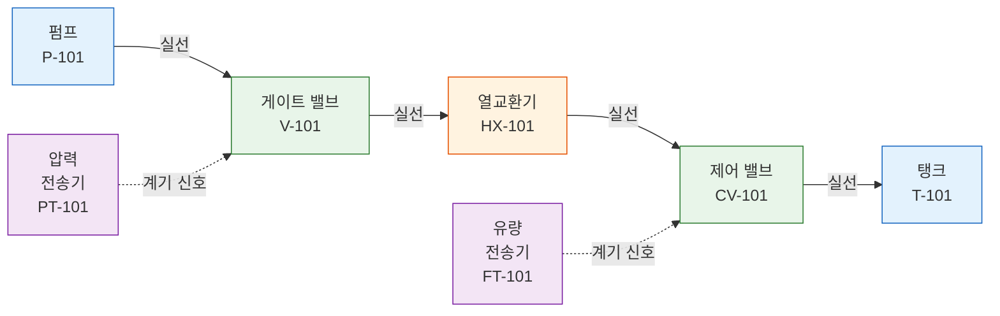

# 연결성 분석

연결성 분석기(Connectivity Analyzer)는 심볼 검출과 라인 검출 결과를 기반으로 장비 연결 그래프를 구축합니다. 어떤 심볼이 서로 연결되어 있는지 판별하고, 흐름 경로를 추적하며, 고립(Orphan) 심볼(연결되지 않은 심볼)을 식별합니다.

## 분석 방식

분석기는 정밀도 순서에 따라 세 가지 전략을 사용하여 연결을 수립합니다:

| 전략 | 방법 | 신뢰도 | 사용 시점 |
|------|------|--------|-----------|
| **라인 기반** | 심볼 간 라인 추적 | 높음 (0.8+) | 라인이 검출된 경우 |
| **교차점 기반** | 라인 교차를 통한 연결 | 중간 (0.6) | 복잡한 라우팅 |
| **근접 기반** | 가까운 심볼 연결 | 낮음 (0.5) | 라인 데이터 없는 경우 |

## 연결 그래프



## 알고리즘

### 1단계: 심볼 노드 생성

검출된 각 심볼은 그래프의 노드가 됩니다:

```json
{
  "id": "sym-001",
  "class_name": "gate_valve",
  "center": [1200.5, 800.0],
  "bbox": { "x1": 1178, "y1": 774, "x2": 1223, "y2": 826 },
  "connections": [],
  "connected_lines": [],
  "tag": "V-101"
}
```

### 2단계: 라인 기반 연결 분석

라인 검출 데이터가 있는 경우, 분석기는 다음을 수행합니다:

1. 각 라인에 대해, 양쪽 끝점이 심볼의 바운딩 박스로부터 `line_endpoint_threshold`(30px) 이내인지 확인
2. 두 심볼이 공통 라인을 공유하면 연결 생성
3. 추적 가능성을 위해 각 연결에 사용된 라인 ID를 기록

```python
# 의사코드
for line in detected_lines:
    symbols_touching_start = find_symbols_near(line.start, threshold=30px)
    symbols_touching_end = find_symbols_near(line.end, threshold=30px)

    for source in symbols_touching_start:
        for target in symbols_touching_end:
            create_connection(source, target, via=line)
```

### 3단계: 교차점 기반 연결

교차점에서 만나는 라인은 간접 연결을 나타낼 수 있습니다:

1. 각 교차점에서 어떤 라인이 만나는지 확인
2. 교차점의 각 라인 쌍에 대해, 연결된 심볼까지 역추적
3. 공유 교차점을 통해 연결된 심볼 간 간접 연결 생성

### 4단계: 근접 기반 폴백

라인 데이터가 없는 경우, 분석기는 근접 기반으로 대체합니다:

- `proximity_threshold`(50px) 이내의 심볼은 직접 연결된 것으로 간주
- `max_path_length`(500px) 이내의 쌍만 고려

### 5단계: 고립 심볼 검출

다른 심볼과 연결되지 않은 심볼은 고립(Orphan)으로 표시됩니다. 고립 심볼 수가 많으면 다음을 나타낼 수 있습니다:

- 불완전한 라인 검출
- 노트 또는 범례 영역의 심볼
- 연결 해제된 계기

## 설정 파라미터

| 파라미터 | 기본값 | 설명 |
|----------|--------|------|
| `proximity_threshold` | 50 px | 직접 근접 연결의 최대 거리 |
| `line_endpoint_threshold` | 30 px | 라인 끝점에서 심볼까지의 최대 거리 |
| `max_path_length` | 500 px | 최대 연결 경로 길이 |

## 출력 형식

```json
{
  "nodes": {
    "sym-001": {
      "id": "sym-001",
      "class_name": "gate_valve",
      "center": [1200.5, 800.0],
      "bbox": { "x1": 1178, "y1": 774, "x2": 1223, "y2": 826 },
      "connections": ["sym-002", "sym-005"],
      "connected_lines": ["line-012", "line-015"],
      "tag": "V-101"
    }
  },
  "connections": [
    {
      "id": "conn-001",
      "source_id": "sym-001",
      "target_id": "sym-002",
      "line_ids": ["line-012"],
      "connection_type": "through_lines",
      "confidence": 0.8,
      "path_length": 120.5
    }
  ],
  "orphan_symbols": ["sym-042", "sym-067"],
  "statistics": {
    "total_nodes": 85,
    "total_connections": 72,
    "orphan_count": 2,
    "avg_connections_per_node": 1.7,
    "max_connections": 5,
    "connection_types": {
      "through_lines": 58,
      "intersection": 10,
      "proximity": 4
    }
  }
}
```

## 연결 타입

| 타입 | 설명 | 신뢰도 |
|------|------|--------|
| `direct` | 근접 임계값 내의 심볼 | 0.5 |
| `through_lines` | 검출된 라인 세그먼트를 통한 연결 | 0.8 |
| `inferred` | 교차점 분석을 통한 연결 | 0.6 |

## 흐름 추적

연결 그래프는 장비 간 흐름 추적을 가능하게 합니다:

```
시작: 펌프 P-101
경로: P-101 → V-101 (게이트 밸브) → HX-101 (열교환기)
       → CV-101 (제어 밸브) → T-101 (탱크)
거리: 총 경로 길이 485 px
라인: line-012, line-015, line-022, line-031
```

흐름 추적은 다음에서 사용됩니다:
- **설계 검사기**: 흐름 경로 내 필수 장비 확인
- **BOM 생성**: 흐름 분석에서 장비 목록 생성
- **공정 검증**: 공정 로직 무결성 확인

## P&ID로부터의 BOM 생성

연결성 데이터는 BOM(자재 명세서, Bill of Materials) 생성을 풍부하게 합니다:

1. **구성요소 집계**: 각 고유 심볼 = BOM 항목
2. **수량**: 동일한 클래스와 태그 패턴을 가진 심볼 집계
3. **관계**: 연결된 계기가 해당 장비와 연관됨
4. **라인 사양**: 라인 스타일과 크기가 배관 BOM에 반영
5. **밸브 일람표**: 모든 밸브가 연결 컨텍스트와 함께 추출됨

## 통계

연결성 분석은 품질 평가에 유용한 요약 통계를 생성합니다:

| 지표 | 설명 | 정상 범위 |
|------|------|:---------:|
| 고립 수 | 연결되지 않은 심볼 | 전체의 < 5% |
| 노드당 평균 연결 수 | 그래프 밀도 | 1.5 - 3.0 |
| 최대 연결 수 | 허브 노드 차수 | 3 - 8 |
| 라인 기반 비율 | 라인으로부터의 연결 | > 70% |
