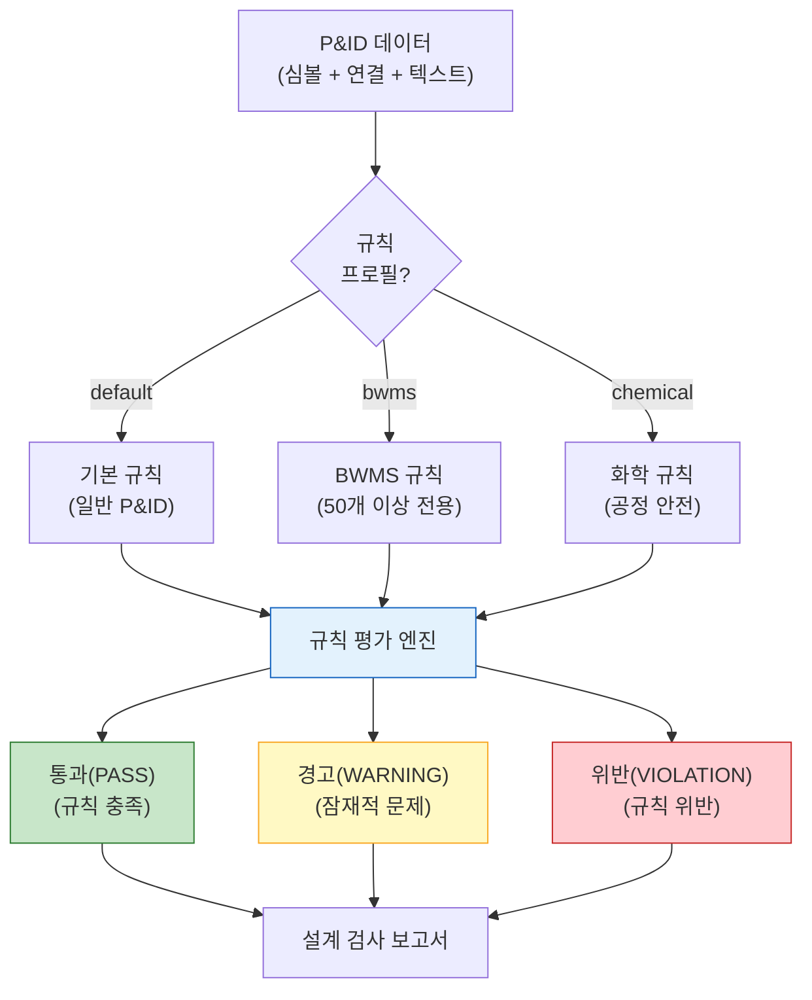

# 설계 검사기

설계 검사기 API(Design Checker API, 포트 5019)는 사전 정의된 설계 규칙에 따라 P&ID 도면을 평가합니다. 장비 존재 여부, 배관 표준, 계기 요구사항 및 안전 준수 사항을 자동으로 검증합니다. 이 시스템은 BWMS(선박평형수 처리 시스템, Ballast Water Management System) 장비에 특화된 50개 이상의 규칙을 포함합니다.

## 개요

| 속성 | 값 |
|------|-----|
| 서비스 | `design-checker-api` |
| 포트 | 5019 |
| 버전 | 1.0.0 |
| GPU 필요 | 아니오 |
| 규칙 수 | 50개 이상 (BWMS 전용 포함) |
| 규칙 프로필 | `default`, `bwms`, `chemical` |

## 규칙 엔진 아키텍처



## 규칙 카테고리

### 장비 규칙

P&ID에 필수 장비가 존재하는지 확인합니다:

| 규칙 | 설명 | 심각도 |
|------|------|--------|
| 필수 장비 확인 | 모든 필수 장비가 검출되었는지 확인 | 위반 |
| 장비 태그 형식 | 태그가 명명 규칙을 따르는지 확인 | 경고 |
| 이중화 확인 | 중요 장비에 백업이 있는지 확인 | 경고 |
| 장비 규모 확인 | 장비 수가 사양과 일치하는지 확인 | 위반 |

### 배관 규칙

배관 표준 및 구성을 확인합니다:

| 규칙 | 설명 | 심각도 |
|------|------|--------|
| 데드엔드 검출 | 연결 없이 끝나는 배관 세그먼트가 없는지 확인 | 경고 |
| 밸브 배치 | 필수 위치에 차단 밸브가 있는지 확인 | 위반 |
| 체크 밸브 방향 | 체크 밸브가 흐름 방향으로 설치되었는지 확인 | 위반 |
| 드레인/벤트 설치 | 저점에 드레인, 고점에 벤트가 있는지 확인 | 경고 |

### 계기 규칙

계기 설치 및 구성을 확인합니다:

| 규칙 | 설명 | 심각도 |
|------|------|--------|
| 필수 계기 확인 | 필수 측정 포인트가 존재하는지 확인 | 위반 |
| 계기 태그 규칙 | 모든 계기에 적절한 ISA 태그가 있는지 확인 | 경고 |
| 제어 루프 무결성 | 제어기가 전송기에 연결되어 있는지 확인 | 경고 |
| 경보 포인트 | 주요 파라미터에 안전 경보가 있는지 확인 | 위반 |

### 안전 규칙

안전 관련 설계 요구사항을 확인합니다:

| 규칙 | 설명 | 심각도 |
|------|------|--------|
| 릴리프 밸브 존재 | 압력 용기에 릴리프 밸브가 있는지 확인 | 위반 |
| 비상 차단 | 주요 라인에 ESD 밸브가 있는지 확인 | 위반 |
| 소방 보호 | 위험 구역에 방화 밸브가 있는지 확인 | 경고 |
| 격리 가능성 | 유지보수를 위해 장비를 격리할 수 있는지 확인 | 경고 |

## BWMS 전용 규칙

BWMS(선박평형수 처리 시스템) 규칙 세트에는 TECHCROSS BWMS P&ID 검증을 위한 50개 이상의 전용 규칙이 포함되어 있습니다:

### 필수 BWMS 장비

| 장비 | 규칙 설명 |
|------|-----------|
| UV 반응기(UV Reactor) | 처리 루프에 존재해야 함 |
| 필터(Filter) | UV 반응기 전 전처리 필터 |
| 밸러스트 펌프(Ballast Pump) | 주 밸러스트 수 펌프 |
| 유량계(Flow Meter) | 처리 검증용 유량 측정 |
| 염분 센서(Salinity Sensor) | 해수/담수 감지 |
| 제어 패널(Control Panel) | BWMS 제어 시스템 |
| 샘플링 포인트(Sampling Point) | 수질 샘플링 설비 |
| 바이패스 밸브(Bypass Valve) | 비상 바이패스 기능 |

### BWMS 배관 규칙

| 규칙 | 설명 |
|------|------|
| 처리 루프 무결성 | 처리 시스템을 통과하는 완전한 흐름 경로 |
| 바이패스 격리 | 바이패스 라인에 적절한 차단 밸브 설치 |
| 역류 방지 | 체크 밸브로 역류 방지 |
| 드레인 설치 | 모든 저점에서 배수 가능 |
| 세척 기능 | 담수 세척 연결 |

### BWMS 계기 규칙

| 규칙 | 설명 |
|------|------|
| 유량 모니터링 | 각 처리 라인에 유량 전송기 설치 |
| UV 강도 | 각 UV 반응기에 UV 강도 센서 설치 |
| 온도 | 주요 지점에서의 온도 모니터링 |
| 압력 | 필터 전후 차압 측정 |
| TRO(총 잔류 산화제) | 배출 준수 모니터링 |

## 심각도 수준

| 수준 | 아이콘 | 설명 | 필요 조치 |
|------|--------|------|-----------|
| **통과(Pass)** | 초록 | 규칙 완전 충족 | 없음 |
| **경고(Warning)** | 노랑 | 잠재적 설계 문제 | 검토 권장 |
| **위반(Violation)** | 빨강 | 설계 규칙 위반 | 반드시 해결 |

## API 엔드포인트

### P&ID 설계 검사

```
POST /api/v1/check
Content-Type: multipart/form-data

Parameters:
  symbols: JSON string of detected symbols
  connections: JSON string of connections
  texts: JSON string of OCR-extracted text
  rule_profile: "default" | "bwms" | "chemical"
  enabled_rules: comma-separated rule IDs (optional)
```

### BWMS 설계 검사

```
POST /api/v1/check/bwms
Content-Type: multipart/form-data

Parameters:
  symbols: JSON string of detected symbols
  connections: JSON string of connections
  texts: JSON string of OCR-extracted text
```

### 사용 가능한 규칙 조회

```
GET /api/v1/rules
GET /api/v1/rules/bwms
```

### 응답 형식

```json
{
  "success": true,
  "data": {
    "results": [
      {
        "rule_id": "BWMS-EQ-001",
        "name": "UV Reactor presence",
        "name_en": "UV Reactor Required",
        "description": "UV Reactor must be present in treatment loop",
        "category": "equipment",
        "severity": "violation",
        "status": "pass",
        "details": "UV Reactor detected: 2 units",
        "evidence": {
          "symbols_found": ["sym-012", "sym-013"],
          "class_name": "uv_reactor"
        }
      },
      {
        "rule_id": "BWMS-PIPE-003",
        "name": "Bypass isolation",
        "name_en": "Bypass Line Isolation",
        "description": "Bypass line must have proper isolation valves",
        "category": "piping",
        "severity": "warning",
        "status": "warning",
        "details": "Bypass line found but only 1 isolation valve detected (2 required)",
        "evidence": {
          "bypass_valves": ["sym-045"],
          "expected_count": 2
        }
      }
    ],
    "summary": {
      "total_rules": 52,
      "pass": 45,
      "warning": 5,
      "violation": 2,
      "pass_rate": 86.5,
      "profile": "bwms"
    },
    "processing_time": 0.45
  }
}
```

## 규칙 정의 형식

규칙은 구조화된 형식으로 정의됩니다:

```python
{
    "rule_id": "BWMS-EQ-001",
    "name": "UV 반응기 존재 확인",
    "name_en": "UV Reactor Required",
    "description": "BWMS 처리 루프에 UV 반응기가 존재해야 합니다",
    "category": "equipment",       # equipment, piping, instrumentation, safety
    "severity": "violation",       # pass, warning, violation
    "standard": "TECHCROSS BWMS",  # 참조 표준
    "auto_checkable": True,        # 자동 검사 가능 여부
    "check_function": "check_uv_reactor_presence"
}
```

## 동적 규칙 로딩

설계 검사기는 외부 JSON 파일에서 동적으로 규칙을 로딩하는 기능을 지원하여 다음을 가능하게 합니다:

- 고객/프로젝트별 커스텀 규칙 세트
- 코드 배포 없이 규칙 업데이트
- 규칙 버전 관리 및 감사 추적

```
GET /api/v1/rules/bwms?include_dynamic=true
```

## BOM 백엔드와의 통합

BOM 백엔드는 P&ID 기능 모듈을 통해 설계 검사를 조율합니다:

```
POST /pid-features/{session_id}/checklist/check
Query Parameters:
  rule_profile: "bwms"
  enabled_rules: "BWMS-EQ-001,BWMS-PIPE-003"
```

이 엔드포인트는 다음을 수행합니다:
1. 세션 데이터(심볼, 연결, OCR 텍스트)를 조회
2. 설계 검사기 API를 호출
3. 검증 추적을 위해 세션에 결과를 저장
4. 구조화된 체크리스트 응답을 반환

## 체크리스트 검증

설계 검사 결과는 검증 워크플로우를 지원합니다:

| 상태 | 설명 |
|------|------|
| `pass` | 준수 사항으로 자동 검증됨 |
| `warning` | 사람 검토 대상으로 표시됨 |
| `violation` | 승인 전 해결 필수 |
| `override` | 규칙 결과에 대한 사람의 재정의 |
| `not_applicable` | 이 도면에 해당 규칙이 적용되지 않음 |

엔지니어는 근거를 기재하여 개별 규칙 결과를 재정의할 수 있으며, 이를 통해 설계 결정에 대한 감사 추적이 생성됩니다.
