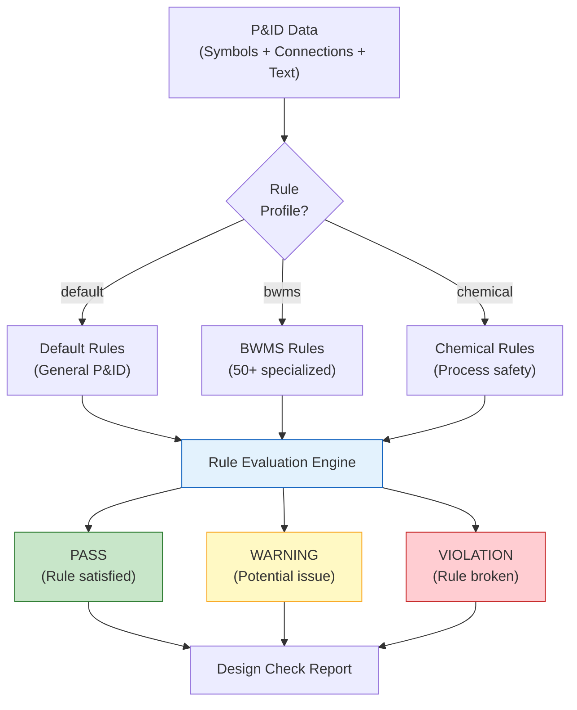

# Design Checker

The Design Checker API (port 5019) evaluates P&ID diagrams against predefined design rules. It automatically verifies equipment presence, piping standards, instrumentation requirements, and safety compliance. The system includes 50+ rules with specialization for BWMS (Ballast Water Management System) equipment.

## Overview

| Property | Value |
|----------|-------|
| Service | `design-checker-api` |
| Port | 5019 |
| Version | 1.0.0 |
| GPU Required | No |
| Rule Count | 50+ (including BWMS-specific) |
| Rule Profiles | `default`, `bwms`, `chemical` |

## Rule Engine Architecture



## Rule Categories

### Equipment Rules

Verify that required equipment is present in the P&ID:

| Rule | Description | Severity |
|------|-------------|----------|
| Required equipment check | All mandatory equipment detected | Violation |
| Equipment tag format | Tags follow naming convention | Warning |
| Redundancy check | Critical equipment has backup | Warning |
| Equipment sizing | Equipment count matches spec | Violation |

### Piping Rules

Verify piping standards and configuration:

| Rule | Description | Severity |
|------|-------------|----------|
| Dead-end detection | No pipe segments end without connection | Warning |
| Valve placement | Isolation valves at required locations | Violation |
| Check valve direction | Check valves oriented in flow direction | Violation |
| Drain/vent provision | Low points have drains, high points have vents | Warning |

### Instrumentation Rules

Verify instrument coverage and configuration:

| Rule | Description | Severity |
|------|-------------|----------|
| Required instruments | Mandatory measurement points present | Violation |
| Instrument tagging | All instruments have proper ISA tags | Warning |
| Control loop integrity | Controllers connected to transmitters | Warning |
| Alarm points | Safety alarms on critical parameters | Violation |

### Safety Rules

Verify safety-related design requirements:

| Rule | Description | Severity |
|------|-------------|----------|
| Relief valve presence | Pressure vessels have relief valves | Violation |
| Emergency shutdown | ESD valves on critical lines | Violation |
| Fire protection | Fire-safe valves in hazardous zones | Warning |
| Isolation capability | Equipment can be isolated for maintenance | Warning |

## BWMS-Specific Rules

The BWMS (Ballast Water Management System) rule set includes 50+ specialized rules for TECHCROSS BWMS P&ID verification:

### Required BWMS Equipment

| Equipment | Rule Description |
|-----------|-----------------|
| UV Reactor | Must be present in treatment loop |
| Filter | Pre-treatment filter before UV reactor |
| Ballast Pump | Main ballast water pump |
| Flow Meter | Flow measurement for treatment verification |
| Salinity Sensor | Seawater/freshwater detection |
| Control Panel | BWMS control system |
| Sampling Point | Water quality sampling provision |
| Bypass Valve | Emergency bypass capability |

### BWMS Piping Rules

| Rule | Description |
|------|-------------|
| Treatment loop integrity | Complete flow path through treatment system |
| Bypass isolation | Bypass line has proper isolation valves |
| Backflow prevention | Check valves prevent reverse flow |
| Drain provision | All low points drainable |
| Flushing capability | Freshwater flushing connection |

### BWMS Instrumentation Rules

| Rule | Description |
|------|-------------|
| Flow monitoring | Flow transmitter on each treatment line |
| UV intensity | UV intensity sensor on each UV reactor |
| Temperature | Temperature monitoring at key points |
| Pressure | Differential pressure across filter |
| TRO (Total Residual Oxidant) | Discharge compliance monitoring |

## Severity Levels

| Level | Icon | Description | Action Required |
|-------|------|-------------|----------------|
| **Pass** | Green | Rule fully satisfied | None |
| **Warning** | Yellow | Potential design issue | Review recommended |
| **Violation** | Red | Design rule broken | Must be resolved |

## API Endpoints

### Check P&ID Design

```
POST /api/v1/check
Content-Type: multipart/form-data

Parameters:
  symbols: JSON string of detected symbols
  connections: JSON string of connections
  texts: JSON string of OCR-extracted text
  rule_profile: "default" | "bwms" | "chemical"
  enabled_rules: comma-separated rule IDs (optional)
```

### Check BWMS Design

```
POST /api/v1/check/bwms
Content-Type: multipart/form-data

Parameters:
  symbols: JSON string of detected symbols
  connections: JSON string of connections
  texts: JSON string of OCR-extracted text
```

### Get Available Rules

```
GET /api/v1/rules
GET /api/v1/rules/bwms
```

### Response Format

```json
{
  "success": true,
  "data": {
    "results": [
      {
        "rule_id": "BWMS-EQ-001",
        "name": "UV Reactor presence",
        "name_en": "UV Reactor Required",
        "description": "UV Reactor must be present in treatment loop",
        "category": "equipment",
        "severity": "violation",
        "status": "pass",
        "details": "UV Reactor detected: 2 units",
        "evidence": {
          "symbols_found": ["sym-012", "sym-013"],
          "class_name": "uv_reactor"
        }
      },
      {
        "rule_id": "BWMS-PIPE-003",
        "name": "Bypass isolation",
        "name_en": "Bypass Line Isolation",
        "description": "Bypass line must have proper isolation valves",
        "category": "piping",
        "severity": "warning",
        "status": "warning",
        "details": "Bypass line found but only 1 isolation valve detected (2 required)",
        "evidence": {
          "bypass_valves": ["sym-045"],
          "expected_count": 2
        }
      }
    ],
    "summary": {
      "total_rules": 52,
      "pass": 45,
      "warning": 5,
      "violation": 2,
      "pass_rate": 86.5,
      "profile": "bwms"
    },
    "processing_time": 0.45
  }
}
```

## Rule Definition Format

Rules are defined in a structured format:

```python
{
    "rule_id": "BWMS-EQ-001",
    "name": "UV 반응기 존재 확인",
    "name_en": "UV Reactor Required",
    "description": "BWMS 처리 루프에 UV 반응기가 존재해야 합니다",
    "category": "equipment",       # equipment, piping, instrumentation, safety
    "severity": "violation",       # pass, warning, violation
    "standard": "TECHCROSS BWMS",  # Reference standard
    "auto_checkable": True,        # Can be checked automatically
    "check_function": "check_uv_reactor_presence"
}
```

## Dynamic Rule Loading

The Design Checker supports dynamic rule loading from external JSON files, allowing:

- Custom rule sets per customer/project
- Rule updates without code deployment
- Rule versioning and audit trail

```
GET /api/v1/rules/bwms?include_dynamic=true
```

## Integration with BOM Backend

The BOM Backend orchestrates design checks through the P&ID Features module:

```
POST /pid-features/{session_id}/checklist/check
Query Parameters:
  rule_profile: "bwms"
  enabled_rules: "BWMS-EQ-001,BWMS-PIPE-003"
```

This endpoint:
1. Retrieves session data (symbols, connections, OCR text)
2. Calls the Design Checker API
3. Stores results in the session for verification tracking
4. Returns a structured checklist response

## Checklist Verification

Design check results support a verification workflow:

| Status | Description |
|--------|-------------|
| `pass` | Automatically verified as compliant |
| `warning` | Flagged for human review |
| `violation` | Requires resolution before approval |
| `override` | Human override of a rule result |
| `not_applicable` | Rule not applicable to this drawing |

Engineers can override individual rule results with justification, creating an audit trail of design decisions.
