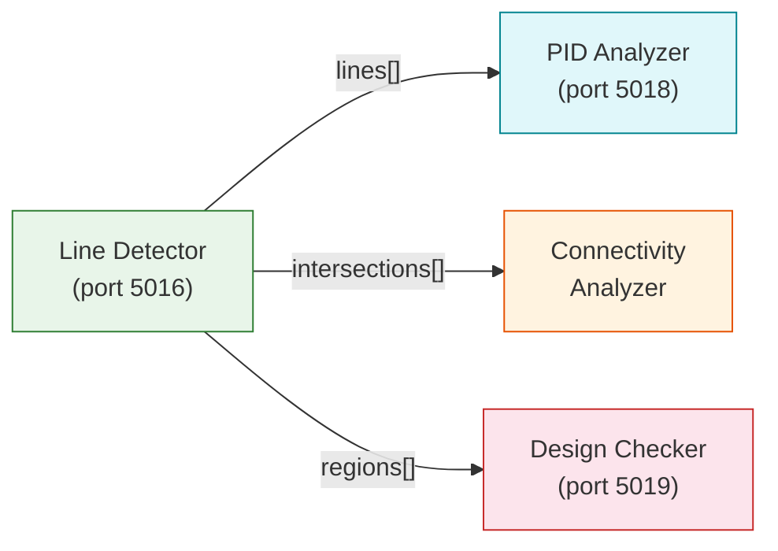

# Line Detection

The Line Detector API (port 5016) detects piping and instrumentation lines in P&ID diagrams using OpenCV-based algorithms. It classifies line styles, colors, and detects intersections -- providing the connectivity backbone for P&ID analysis.

## Overview

| Property | Value |
|----------|-------|
| Service | `line-detector-api` |
| Port | 5016 |
| GPU Required | No (CPU only, OpenCV-based) |
| Version | 1.1.0 |
| Processing Time | ~1-2s per 1080p image |
| Memory | ~2GB |

## Detection Methods

The API supports three line detection algorithms:

| Method | Algorithm | Best For |
|--------|-----------|----------|
| `lsd` | Line Segment Detector | General-purpose, most accurate |
| `hough` | Hough Transform | Straight lines, noisy images |
| `combined` | LSD + Hough merge | Maximum coverage |

## Line Style Classification

Detected lines are classified by visual style, which indicates their function in the P&ID:

| Style | Korean | P&ID Meaning | Visual Pattern |
|-------|--------|-------------|----------------|
| `solid` | Solid line | Process piping (main flow) | Continuous line |
| `dashed` | Dashed line | Instrument signal line | Short segments with gaps |
| `dotted` | Dotted line | Auxiliary / optional line | Small dots |
| `dash_dot` | Dash-dot | Boundary / center line | Alternating dash and dot |
| `double` | Double line | Major piping / casing | Two parallel lines |
| `wavy` | Wavy line | Flexible hose / expansion | Sinusoidal pattern |

## Color Classification

Line color classification maps to process function:

| Color | Usage | P&ID Meaning |
|-------|-------|-------------|
| Black | Process line | Main process piping |
| Blue | Instrument | Instrument signal / cooling water |
| Red | Emergency | Emergency / fire protection |
| Green | Utility | Utility lines |

## Region Detection

The Line Detector can identify bounded regions defined by dashed boxes:

| Region Type | Korean | Description |
|-------------|--------|-------------|
| `signal_group` | Signal group | "SIGNAL FOR BWMS" enclosures |
| `equipment_boundary` | Equipment boundary | Package/skid boundaries |
| `note_box` | Note box | Annotation/description areas |
| `hazardous_area` | Hazardous zone | Hazardous area markers |
| `scope_boundary` | Supply scope | Supplier/buyer scope delineation |
| `detail_area` | Detail area | Detail drawing reference areas |

## Intersection Detection

Line intersections are critical for connectivity analysis. The detector identifies points where two or more lines cross:

```json
{
  "intersections": [
    {
      "point": [200, 200],
      "lines": [1, 2]
    },
    {
      "point": [450, 300],
      "lines": [3, 5, 7]
    }
  ]
}
```

Intersections feed into the [Connectivity Analysis](./connectivity.md) stage where they help determine whether lines are actually connected (tee junction) or merely crossing (bridge/crossover).

## API Endpoints

### Health Check

```
GET /api/v1/health
```

### Line Detection (Main Endpoint)

```
POST /api/v1/process
Content-Type: multipart/form-data
```

**Parameters**:

| Parameter | Type | Default | Description |
|-----------|------|---------|-------------|
| `file` | file | required | Image file (PNG, JPEG) |
| `method` | string | `lsd` | Detection method: `lsd`, `hough`, `combined` |
| `merge_lines` | bool | `true` | Merge collinear line segments |
| `classify_types` | bool | `true` | Classify by function type |
| `classify_colors` | bool | `true` | Classify by color |
| `classify_styles` | bool | `true` | Classify line visual style |
| `find_intersections` | bool | `true` | Detect line intersections |
| `detect_regions` | bool | `false` | Detect dashed box regions |
| `min_length` | int | `0` | Minimum line length in pixels |
| `max_lines` | int | `0` | Max lines to return (0 = unlimited) |
| `visualize` | bool | `true` | Generate visualization overlay |

### Response Format

```json
{
  "status": "success",
  "data": {
    "lines": [
      {
        "id": 1,
        "start": [100, 200],
        "end": [400, 200],
        "style": "solid",
        "color": "black",
        "usage": "process",
        "length": 300
      }
    ],
    "intersections": [
      {
        "point": [200, 200],
        "lines": [1, 2]
      }
    ],
    "regions": [
      {
        "id": 1,
        "type": "signal_group",
        "label": "SIGNAL FOR BWMS",
        "bbox": [500, 100, 800, 400],
        "lines_count": 12
      }
    ],
    "statistics": {
      "total_lines": 156,
      "by_style": { "solid": 120, "dashed": 28, "dash_dot": 8 },
      "by_color": { "black": 140, "blue": 12, "red": 4 },
      "regions_found": 3
    },
    "visualization": "data:image/png;base64,..."
  },
  "processing_time": 1.85
}
```

## Line Merging

When `merge_lines` is enabled, collinear segments are merged to reduce fragmentation:

```
Before merge: [A]--[B]  [B]--[C]  (2 segments, same direction)
After merge:  [A]--------[C]       (1 segment)
```

Merge criteria:
- Segments must be nearly collinear (angle difference < 5 degrees)
- Gap between segment endpoints must be < 10 pixels
- Merged line inherits the style/color of the longer segment

## Performance Tips

| Optimization | Impact | When to Use |
|-------------|--------|-------------|
| Set `min_length` > 20 | Filter noise lines | Noisy/textured drawings |
| Set `max_lines` | Limit output | Very dense diagrams |
| Disable `classify_colors` | Faster processing | When color info not needed |
| Use `lsd` method | Fastest | Default use case |
| Use `combined` method | Most complete | When maximum recall needed |

## Integration with Pipeline

The Line Detector output feeds directly into two downstream services:



- **PID Analyzer**: Uses lines and intersections for flow path analysis
- **Connectivity Analyzer**: Combines lines with symbol detections to build the connection graph
- **Design Checker**: Uses region detection for scope verification and equipment boundary checks
