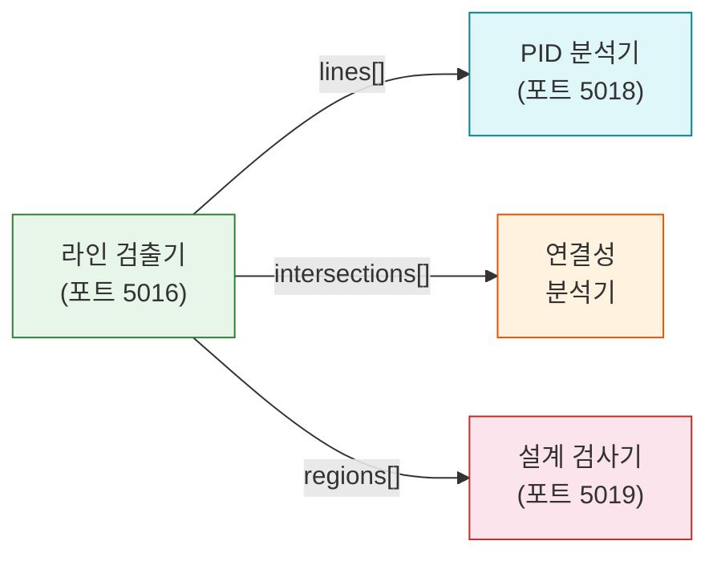

# 라인 검출

라인 검출기 API(Line Detector API, 포트 5016)는 OpenCV 기반 알고리즘을 사용하여 P&ID 도면에서 배관 및 계장 라인을 검출합니다. 라인 스타일과 색상을 분류하고 교차점을 검출하여 P&ID 분석의 연결성 기반을 제공합니다.

## 개요

| 속성 | 값 |
|------|-----|
| 서비스 | `line-detector-api` |
| 포트 | 5016 |
| GPU 필요 | 아니오 (CPU 전용, OpenCV 기반) |
| 버전 | 1.1.0 |
| 처리 시간 | 1080p 이미지 당 약 1-2초 |
| 메모리 | 약 2GB |

## 검출 방법

API는 세 가지 라인 검출 알고리즘을 지원합니다:

| 방법 | 알고리즘 | 적합한 경우 |
|------|----------|-------------|
| `lsd` | LSD(Line Segment Detector) | 범용, 가장 정확 |
| `hough` | 허프 변환(Hough Transform) | 직선, 노이즈 많은 이미지 |
| `combined` | LSD + 허프 병합 | 최대 검출 범위 |

## 라인 스타일 분류

검출된 라인은 시각적 스타일에 따라 분류되며, 이는 P&ID에서의 기능을 나타냅니다:

| 스타일 | 한국어 | P&ID 의미 | 시각적 패턴 |
|--------|--------|-----------|-------------|
| `solid` | 실선 | 공정 배관 (주 흐름) | 연속 선 |
| `dashed` | 파선 | 계기 신호선 | 짧은 선분과 간격 |
| `dotted` | 점선 | 보조/옵션 라인 | 작은 점 |
| `dash_dot` | 일점쇄선 | 경계/중심선 | 파선과 점의 교대 |
| `double` | 이중선 | 주요 배관/케이싱 | 두 개의 평행선 |
| `wavy` | 파형선 | 플렉시블 호스/팽창 | 사인파 패턴 |

## 색상 분류

라인 색상 분류는 공정 기능에 매핑됩니다:

| 색상 | 용도 | P&ID 의미 |
|------|------|-----------|
| 검정(Black) | 공정 라인 | 주 공정 배관 |
| 파랑(Blue) | 계기 | 계기 신호/냉각수 |
| 빨강(Red) | 비상 | 비상/소방 보호 |
| 녹색(Green) | 유틸리티 | 유틸리티 라인 |

## 영역 검출

라인 검출기는 파선 상자로 정의된 경계 영역을 식별할 수 있습니다:

| 영역 타입 | 한국어 | 설명 |
|-----------|--------|------|
| `signal_group` | 신호 그룹 | "SIGNAL FOR BWMS" 구획 |
| `equipment_boundary` | 장비 경계 | 패키지/스키드 경계 |
| `note_box` | 노트 박스 | 주석/설명 영역 |
| `hazardous_area` | 위험 구역 | 위험 구역 표시 |
| `scope_boundary` | 공급 범위 | 공급자/구매자 범위 구분 |
| `detail_area` | 상세 영역 | 상세 도면 참조 영역 |

## 교차점 검출

라인 교차점은 연결성 분석에 매우 중요합니다. 검출기는 두 개 이상의 라인이 교차하는 지점을 식별합니다:

```json
{
  "intersections": [
    {
      "point": [200, 200],
      "lines": [1, 2]
    },
    {
      "point": [450, 300],
      "lines": [3, 5, 7]
    }
  ]
}
```

교차점은 [연결성 분석](./connectivity.md) 단계로 전달되어, 라인이 실제로 연결되어 있는지(티 분기) 또는 단순히 교차하는 것인지(브리지/크로스오버)를 판별하는 데 사용됩니다.

## API 엔드포인트

### 헬스 체크

```
GET /api/v1/health
```

### 라인 검출 (주요 엔드포인트)

```
POST /api/v1/process
Content-Type: multipart/form-data
```

**파라미터**:

| 파라미터 | 타입 | 기본값 | 설명 |
|----------|------|--------|------|
| `file` | file | 필수 | 이미지 파일 (PNG, JPEG) |
| `method` | string | `lsd` | 검출 방법: `lsd`, `hough`, `combined` |
| `merge_lines` | bool | `true` | 동일선상 라인 세그먼트 병합 |
| `classify_types` | bool | `true` | 기능 타입별 분류 |
| `classify_colors` | bool | `true` | 색상별 분류 |
| `classify_styles` | bool | `true` | 라인 시각 스타일 분류 |
| `find_intersections` | bool | `true` | 라인 교차점 검출 |
| `detect_regions` | bool | `false` | 파선 상자 영역 검출 |
| `min_length` | int | `0` | 최소 라인 길이 (픽셀) |
| `max_lines` | int | `0` | 반환할 최대 라인 수 (0 = 무제한) |
| `visualize` | bool | `true` | 시각화 오버레이 생성 |

### 응답 형식

```json
{
  "status": "success",
  "data": {
    "lines": [
      {
        "id": 1,
        "start": [100, 200],
        "end": [400, 200],
        "style": "solid",
        "color": "black",
        "usage": "process",
        "length": 300
      }
    ],
    "intersections": [
      {
        "point": [200, 200],
        "lines": [1, 2]
      }
    ],
    "regions": [
      {
        "id": 1,
        "type": "signal_group",
        "label": "SIGNAL FOR BWMS",
        "bbox": [500, 100, 800, 400],
        "lines_count": 12
      }
    ],
    "statistics": {
      "total_lines": 156,
      "by_style": { "solid": 120, "dashed": 28, "dash_dot": 8 },
      "by_color": { "black": 140, "blue": 12, "red": 4 },
      "regions_found": 3
    },
    "visualization": "data:image/png;base64,..."
  },
  "processing_time": 1.85
}
```

## 라인 병합

`merge_lines`가 활성화되면, 동일선상의 세그먼트가 병합되어 단편화가 줄어듭니다:

```
병합 전: [A]--[B]  [B]--[C]  (2개 세그먼트, 같은 방향)
병합 후: [A]--------[C]       (1개 세그먼트)
```

병합 기준:
- 세그먼트가 거의 동일선상이어야 함 (각도 차이 < 5도)
- 세그먼트 끝점 간 간격이 < 10 픽셀이어야 함
- 병합된 라인은 더 긴 세그먼트의 스타일/색상을 상속

## 성능 최적화 팁

| 최적화 | 효과 | 사용 시점 |
|--------|------|-----------|
| `min_length` > 20 설정 | 노이즈 라인 필터링 | 노이즈/텍스처가 많은 도면 |
| `max_lines` 설정 | 출력 제한 | 매우 밀집된 도면 |
| `classify_colors` 비활성화 | 처리 속도 향상 | 색상 정보가 불필요한 경우 |
| `lsd` 방법 사용 | 가장 빠름 | 기본 사용 사례 |
| `combined` 방법 사용 | 가장 완전함 | 최대 재현율이 필요한 경우 |

## 파이프라인 통합

라인 검출기의 출력은 두 개의 하위 서비스로 직접 전달됩니다:



- **PID 분석기**: 라인과 교차점을 사용하여 흐름 경로 분석
- **연결성 분석기**: 라인과 심볼 검출 결과를 결합하여 연결 그래프 구축
- **설계 검사기**: 영역 검출을 사용하여 범위 검증 및 장비 경계 확인
