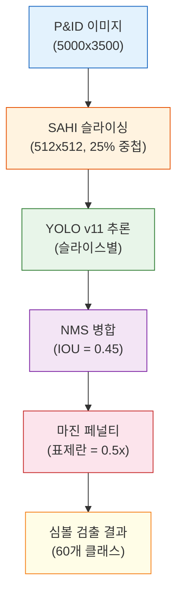

# 심볼 검출

P&ID 심볼 검출은 P&ID 도면에 대해 학습된 전용 모델과 함께 YOLO v11을 사용합니다. `pid_symbol` 모델은 공정 및 계장 도면에서 일반적으로 발견되는 60개 클래스의 심볼을 인식하며, 특히 BWMS(선박평형수 처리 시스템, Ballast Water Management System) 도면에 최적화되어 있습니다.

## 검출 모델

세 가지 P&ID 전용 모델을 사용할 수 있습니다:

| 모델 | 클래스 수 | 설명 | 사용 사례 |
|------|-----------|------|-----------|
| `pid_symbol` | 60 | 전체 P&ID 심볼 세트 | 일반 P&ID 분석 |
| `pid_class_aware` | 32 | 높은 정확도의 축소 클래스 세트 | 클래스 정밀도가 중요한 경우 |
| `pid_class_agnostic` | 1 | 단일 "심볼" 클래스 | 위치 정보만 필요한 경우 |

### 기본 파라미터

모든 P&ID 모델은 최적화된 기본값을 공유합니다:

| 파라미터 | 값 | 근거 |
|----------|-----|------|
| `confidence` | 0.10 | 작거나 희미한 심볼을 잡기 위한 낮은 임계값 |
| `iou` | 0.45 | 적절한 중첩 허용 범위 |
| `imgsz` | 1024 | 세부 사항을 위한 고해상도 |
| `use_sahi` | true | 소형 심볼 검출을 위한 슬라이싱 |
| `slice_height` | 512 | SAHI 슬라이스 크기 |
| `slice_width` | 512 | SAHI 슬라이스 크기 |
| `overlap_ratio` | 0.25 | 슬라이스 간 25% 중첩 |

## 심볼 카테고리

### 밸브(Valve)

| 심볼 | 설명 | 일반적인 P&ID 표현 |
|------|------|-------------------|
| 게이트 밸브(Gate Valve) | 전개 개폐(Full bore on/off) | 중앙에서 만나는 두 개의 삼각형 |
| 글로브 밸브(Globe Valve) | 조절/제어(Throttling/control) | 밸브 몸체 위의 원 |
| 볼 밸브(Ball Valve) | 쿼터턴(Quarter-turn) | 채워진 원 |
| 버터플라이 밸브(Butterfly Valve) | 대구경 배관 제어 | 이중선 디스크 |
| 체크 밸브(Check Valve) | 역류 방지(Non-return) | 단일 삼각형 |
| 릴리프 밸브(Relief Valve) | 압력 안전 | 각도/스프링 심볼 |
| 제어 밸브(Control Valve) | 자동화 | 밸브 + 액추에이터 심볼 |
| 솔레노이드 밸브(Solenoid Valve) | 전기 작동 | 밸브 + 솔레노이드 코일 |
| 3방향 밸브(3-Way Valve) | 3포트 라우팅 | 3분기 밸브 몸체 |
| 니들 밸브(Needle Valve) | 미세 제어 | 뾰족한 스템 |

### 펌프 및 압축기

| 심볼 | 설명 |
|------|------|
| 원심 펌프(Centrifugal Pump) | 토출 라인이 있는 원 |
| 용적식 펌프(Positive Displacement Pump) | 점이 있는 원 |
| 압축기(Compressor) | 삼각형/팬 형태 |
| 블로어(Blower) | 유동 화살표가 있는 원 |

### 열교환기(Heat Exchanger)

| 심볼 | 설명 |
|------|------|
| 셸 앤 튜브(Shell & Tube) | 사각형 내의 원 |
| 판형 열교환기(Plate Heat Exchanger) | 지그재그 패턴 |
| 냉각기(Cooler) | 팬 심볼이 있는 열교환기 |

### 용기 및 탱크

| 심볼 | 설명 |
|------|------|
| 탱크(Tank) | 사각형/원통 |
| 반응기(Reactor) | 교반기가 있는 원/용기 |
| 컬럼(Column) | 세로로 긴 사각형 |
| 필터(Filter) | 분할된 사각형 |
| 분리기(Separator) | 수평 용기 |

### 계기(Instrument)

| 태그 | 전체 명칭 | 측정 변수 |
|------|-----------|-----------|
| PI | 압력 지시계(Pressure Indicator) | 압력 (현장 표시) |
| PT | 압력 전송기(Pressure Transmitter) | 압력 (원격) |
| TI | 온도 지시계(Temperature Indicator) | 온도 (현장) |
| TT | 온도 전송기(Temperature Transmitter) | 온도 (원격) |
| FI | 유량 지시계(Flow Indicator) | 유량 (현장) |
| FT | 유량 전송기(Flow Transmitter) | 유량 (원격) |
| LI | 레벨 지시계(Level Indicator) | 액위 (현장) |
| LT | 레벨 전송기(Level Transmitter) | 액위 (원격) |
| AI | 분석 지시계(Analyzer Indicator) | 화학 분석 |
| AT | 분석 전송기(Analyzer Transmitter) | 화학 분석 (원격) |
| Controller | PID 제어기(PID Controller) | 제어 루프 |
| Switch | 프로세스 스위치(Process Switch) | 온/오프 트리거 |

### 배관 요소(Piping Element)

| 심볼 | 설명 |
|------|------|
| 레듀서(Reducer) | 배관 크기 변경 |
| 티(Tee) | T자 분기 |
| 엘보(Elbow) | 90도 굽힘 |
| 플랜지(Flange) | 볼트 연결 |
| 오리피스 플레이트(Orifice Plate) | 유량 측정 제한 장치 |
| 스펙터클 블라인드(Spectacle Blind) | 완전 차단 장치 |
| 스트레이너(Strainer) | 이물질 여과 |

## SAHI (슬라이싱 보조 추론, Slicing Aided Hyper Inference)

P&ID 도면은 일반적으로 대형(A1/A0 형식, 5000+ 픽셀)이며 심볼이 작습니다. SAHI는 다음과 같이 이를 해결합니다:

1. **슬라이싱**: 이미지를 512x512 크기의 중첩 타일로 분할
2. **검출**: 각 타일을 전체 해상도로 독립적으로 처리
3. **병합**: 모든 타일의 검출 결과를 NMS(비최대 억제, Non-Maximum Suppression)로 병합

```
원본 이미지: 5000 x 3500 px
├── 슬라이스 [0,0]: 512x512 → 3건 검출
├── 슬라이스 [384,0]: 512x512 → 2건 검출
├── 슬라이스 [768,0]: 512x512 → 5건 검출
├── ... (중첩 그리드)
└── 슬라이스 [4488,2988]: 512x512 → 1건 검출
NMS 후: 156건의 고유 검출
```

### SAHI 효과

| 지표 | SAHI 미사용 | SAHI 사용 |
|------|:----------:|:---------:|
| 소형 심볼 재현율(Recall) | ~60% | ~90% |
| 처리 시간 | ~40ms | ~200-400ms |
| 메모리 사용량 | ~2GB | ~3GB |
| 검출 수 | 낮음 | 높음 |

## 비최대 억제(NMS, Non-Maximum Suppression)

검출 후(특히 SAHI 사용 시), 중첩된 검출 결과가 병합됩니다:

1. 검출 결과를 신뢰도 기준 내림차순 정렬
2. 각 검출에 대해 나머지 검출과의 IOU 계산
3. IOU > 임계값(0.45)이고 신뢰도가 낮은 검출 제거
4. 각 실제 객체에 대해 가장 높은 신뢰도의 검출만 유지

## 검출 파이프라인



## API 사용법

### 검출 엔드포인트

```
POST http://localhost:5005/api/v1/detect
Content-Type: multipart/form-data

Parameters:
  file: <image>
  model_type: pid_symbol
  conf_threshold: 0.10
  iou_threshold: 0.45
  imgsz: 1024
  use_sahi: true
  slice_height: 512
  slice_width: 512
  overlap_ratio: 0.25
  visualize: true
```

### 응답 형식

```json
{
  "detections": [
    {
      "class_id": 5,
      "class_name": "gate_valve",
      "confidence": 0.87,
      "bbox": { "x": 1200, "y": 800, "width": 45, "height": 52 }
    },
    {
      "class_id": 22,
      "class_name": "pressure_transmitter",
      "confidence": 0.92,
      "bbox": { "x": 1350, "y": 750, "width": 30, "height": 30 }
    }
  ],
  "total_count": 156,
  "processing_time": 0.342,
  "image_width": 5000,
  "image_height": 3500
}
```

## 신뢰도 가이드라인

| 신뢰도 범위 | 해석 | 조치 |
|-------------|------|------|
| >= 0.8 | 높은 신뢰도 | 자동 승인 |
| 0.4 - 0.8 | 중간 신뢰도 | 에이전트 또는 사람 검토 |
| 0.1 - 0.4 | 낮은 신뢰도 | 사람 검토 필수 |
| < 0.1 | 임계값 미만 | 보고되지 않음 |

P&ID 분석에서 낮은 기본 임계값(0.10)은 최대 재현율(Recall)을 보장합니다 -- 잠재적 심볼을 검출한 후 검증 단계에서 필터링하는 것이 아예 놓치는 것보다 낫습니다.
