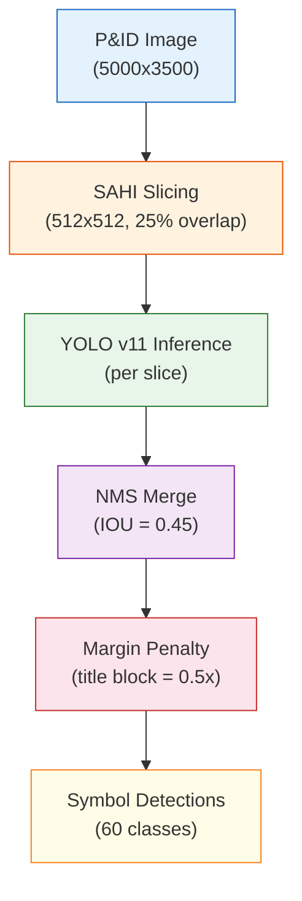

# Symbol Detection

P&ID symbol detection uses YOLO v11 with specialized models trained on P&ID diagrams. The `pid_symbol` model recognizes 60 classes of symbols commonly found in process and instrumentation diagrams, with particular optimization for BWMS (Ballast Water Management System) drawings.

## Detection Models

Three P&ID-specific models are available:

| Model | Classes | Description | Use Case |
|-------|---------|-------------|----------|
| `pid_symbol` | 60 | Full P&ID symbol set | General P&ID analysis |
| `pid_class_aware` | 32 | Reduced class set with higher accuracy | When class precision matters |
| `pid_class_agnostic` | 1 | Single "symbol" class | When only location matters |

### Default Parameters

All P&ID models share optimized defaults:

| Parameter | Value | Rationale |
|-----------|-------|-----------|
| `confidence` | 0.10 | Low threshold to catch small/faint symbols |
| `iou` | 0.45 | Moderate overlap tolerance |
| `imgsz` | 1024 | High resolution for fine details |
| `use_sahi` | true | Slicing for small symbol detection |
| `slice_height` | 512 | SAHI slice dimensions |
| `slice_width` | 512 | SAHI slice dimensions |
| `overlap_ratio` | 0.25 | 25% overlap between slices |

## Symbol Categories

### Valves

| Symbol | Description | Common P&ID Representation |
|--------|-------------|---------------------------|
| Gate Valve | Full bore on/off | Two triangles meeting at center |
| Globe Valve | Throttling/control | Circle on valve body |
| Ball Valve | Quarter-turn | Filled circle |
| Butterfly Valve | Large pipe control | Double-line disc |
| Check Valve | Non-return | Single triangle |
| Relief Valve | Pressure safety | Angled/spring symbol |
| Control Valve | Automated | Valve + actuator symbol |
| Solenoid Valve | Electric actuation | Valve + solenoid coil |
| 3-Way Valve | Three-port routing | Three-branch valve body |
| Needle Valve | Fine control | Pointed stem |

### Pumps and Compressors

| Symbol | Description |
|--------|-------------|
| Centrifugal Pump | Circle with discharge line |
| Positive Displacement Pump | Circle with dots |
| Compressor | Triangular/fan shape |
| Blower | Circle with flow arrows |

### Heat Exchangers

| Symbol | Description |
|--------|-------------|
| Shell & Tube | Circle in rectangle |
| Plate Heat Exchanger | Zigzag pattern |
| Cooler | HX with fan symbol |

### Vessels and Tanks

| Symbol | Description |
|--------|-------------|
| Tank | Rectangle/cylinder |
| Reactor | Circle/vessel with agitator |
| Column | Tall rectangle |
| Filter | Divided rectangle |
| Separator | Horizontal vessel |

### Instruments

| Tag | Full Name | Measured Variable |
|-----|-----------|------------------|
| PI | Pressure Indicator | Pressure (local display) |
| PT | Pressure Transmitter | Pressure (remote) |
| TI | Temperature Indicator | Temperature (local) |
| TT | Temperature Transmitter | Temperature (remote) |
| FI | Flow Indicator | Flow rate (local) |
| FT | Flow Transmitter | Flow rate (remote) |
| LI | Level Indicator | Liquid level (local) |
| LT | Level Transmitter | Liquid level (remote) |
| AI | Analyzer Indicator | Chemical analysis |
| AT | Analyzer Transmitter | Chemical analysis (remote) |
| Controller | PID Controller | Control loop |
| Switch | Process Switch | On/off trigger |

### Piping Elements

| Symbol | Description |
|--------|-------------|
| Reducer | Pipe size change |
| Tee | T-junction |
| Elbow | 90-degree bend |
| Flange | Bolted connection |
| Orifice Plate | Flow measurement restriction |
| Spectacle Blind | Positive isolation |
| Strainer | Debris filtering |

## SAHI (Slicing Aided Hyper Inference)

P&ID diagrams are typically large (A1/A0 format, 5000+ pixels) with small symbols. SAHI addresses this by:

1. **Slicing**: Image is divided into 512x512 overlapping tiles
2. **Detection**: Each tile is processed independently at full resolution
3. **Merging**: Detections from all tiles are merged with NMS (Non-Maximum Suppression)

```
Original Image: 5000 x 3500 px
├── Slice [0,0]: 512x512 → 3 detections
├── Slice [384,0]: 512x512 → 2 detections
├── Slice [768,0]: 512x512 → 5 detections
├── ... (overlapping grid)
└── Slice [4488,2988]: 512x512 → 1 detection
After NMS: 156 unique detections
```

### SAHI Benefits

| Metric | Without SAHI | With SAHI |
|--------|:-----------:|:---------:|
| Small symbol recall | ~60% | ~90% |
| Processing time | ~40ms | ~200-400ms |
| Memory usage | ~2GB | ~3GB |
| Detection count | Lower | Higher |

## Non-Maximum Suppression (NMS)

After detection (especially with SAHI), overlapping detections are merged:

1. Sort detections by confidence (highest first)
2. For each detection, compute IOU with remaining detections
3. Remove detections with IOU > threshold (0.45) that have lower confidence
4. Keep the highest-confidence detection for each real object

## Detection Pipeline



## API Usage

### Detection Endpoint

```
POST http://localhost:5005/api/v1/detect
Content-Type: multipart/form-data

Parameters:
  file: <image>
  model_type: pid_symbol
  conf_threshold: 0.10
  iou_threshold: 0.45
  imgsz: 1024
  use_sahi: true
  slice_height: 512
  slice_width: 512
  overlap_ratio: 0.25
  visualize: true
```

### Response Format

```json
{
  "detections": [
    {
      "class_id": 5,
      "class_name": "gate_valve",
      "confidence": 0.87,
      "bbox": { "x": 1200, "y": 800, "width": 45, "height": 52 }
    },
    {
      "class_id": 22,
      "class_name": "pressure_transmitter",
      "confidence": 0.92,
      "bbox": { "x": 1350, "y": 750, "width": 30, "height": 30 }
    }
  ],
  "total_count": 156,
  "processing_time": 0.342,
  "image_width": 5000,
  "image_height": 3500
}
```

## Confidence Guidelines

| Confidence Range | Interpretation | Action |
|-----------------|----------------|--------|
| >= 0.8 | High confidence | Auto-approve |
| 0.4 - 0.8 | Medium confidence | Agent or human review |
| 0.1 - 0.4 | Low confidence | Human review required |
| < 0.1 | Below threshold | Not reported |

For P&ID analysis, the low default threshold (0.10) ensures maximum recall -- it is better to detect a potential symbol and filter it in verification than to miss it entirely.
