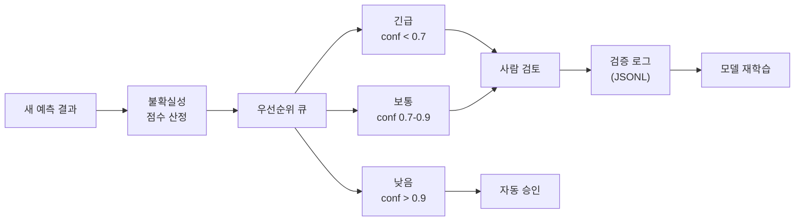

# 능동 학습 (Active Learning)

## 개요

불확실한 예측 결과를 우선적으로 사람에게 검토 요청하여 모델을 효율적으로 개선합니다.



## 우선순위 점수 산정 알고리즘 (Priority Scoring Algorithm)

`ActiveLearningService._determine_priority()` 는 각 항목의 신뢰도(confidence)와 관계(relation) 상태를 평가하여 4단계 우선순위를 결정합니다.

```python
# 1. confidence < CRITICAL_THRESHOLD(0.7) → CRITICAL
# 2. has_relation == False (심볼 연결 없음) → HIGH
# 3. confidence < AUTO_APPROVE_THRESHOLD(0.9) → MEDIUM
# 4. confidence >= 0.9 → LOW (자동 승인 후보)
```

| 우선순위 | 조건 | 조치 | 예상 검토 시간/항목 |
|----------|------|------|---------------------|
| **CRITICAL** | `confidence < 0.7` | 즉시 사람 검토 | 30초 |
| **HIGH** | `has_relation == False` | 관계 확인 필요 | 20초 |
| **MEDIUM** | `0.7 <= confidence < 0.9` | 배치 검토 큐 | 10초 |
| **LOW** | `confidence >= 0.9` | 자동 승인 후 샘플링 | 2초 |

## 임계값 설정 (Threshold Configuration)

환경 변수로 임계값을 조정합니다:

| 환경 변수 | 기본값 | 설명 |
|-----------|--------|------|
| `AUTO_APPROVE_THRESHOLD` | `0.9` | 이 값 이상이면 자동 승인 후보 |
| `CRITICAL_THRESHOLD` | `0.7` | 이 값 미만이면 CRITICAL 등급 |
| `VERIFICATION_LOG_PATH` | `/data/logs/verification` | 검증 로그 저장 경로 |

## 큐 관리 (Queue Management)

`get_verification_queue()` 는 전체 항목을 우선순위 순으로 정렬된 단일 큐로 반환합니다:

1. **CRITICAL** 항목을 신뢰도 오름차순으로 정렬 (가장 불확실한 것부터)
2. **HIGH** 항목을 신뢰도 오름차순으로 정렬
3. **MEDIUM** 항목을 신뢰도 오름차순으로 정렬
4. **LOW** 항목은 큐 하단 (자동 승인 후보)

자동 승인 조건: `confidence >= auto_approve_threshold` **AND** `verification_status == 'pending'`

## 검증 통계 (Verification Statistics)

`get_verification_stats()` 는 전체 항목에 대한 통계와 예상 검토 시간을 반환합니다:

```json
{
  "total": 150,
  "verified": 45,
  "pending": 105,
  "critical": 12,
  "high": 8,
  "medium": 35,
  "low": 50,
  "auto_approve_candidates": 50,
  "estimated_review_time_minutes": 14.2
}
```

## 재학습 데이터 수집 (Retraining Data Collection)

검증 결과는 `VerificationLog` 로 기록되어 모델 재학습에 활용됩니다.

### 로그 형식 (JSONL)

일별 파일(`verification_YYYY-MM-DD.jsonl`)에 저장:

```json
{
  "item_id": "dim_001_a3b2c1d4",
  "item_type": "dimension",
  "original_data": {"value": "Ø45.2", "confidence": 0.65},
  "user_action": "modified",
  "modified_data": {"value": "Ø45.0"},
  "timestamp": "2026-02-22T10:30:00",
  "session_id": "sess_abc123",
  "review_time_seconds": 12.5
}
```

### 사용자 행동 (User Actions)

| 행동 | 의미 | 재학습 활용 |
|------|------|------------|
| `approved` | 원본 정확 | 긍정 샘플 (positive sample) |
| `rejected` | 오검출 | 부정 샘플 (negative sample) |
| `modified` | 수정됨 | 수정된 정답 데이터 (corrected ground truth) |

### 학습 데이터 조회 (Training Data Query)

`get_training_data()` 로 세션별/액션별 필터링된 학습 데이터를 조회:

```python
# 수정된 항목만 조회 (가장 유용한 학습 데이터)
training_data = service.get_training_data(action_filter="modified")
```

## 에이전트 검증과의 연동 (Integration with Agent Verification)

능동 학습은 에이전트 검증 시스템의 L2 (Agent Review) 레벨과 연동됩니다:

1. 낮은 신뢰도 검출 → 능동 학습 큐 등록
2. 에이전트 (Claude Sonnet)가 우선 검토
3. 에이전트 불확실 → L3 사람 검토(Human Review)로 에스컬레이션
4. 검토 결과 → `VerificationLog` 에 기록 → 학습 데이터로 수집
