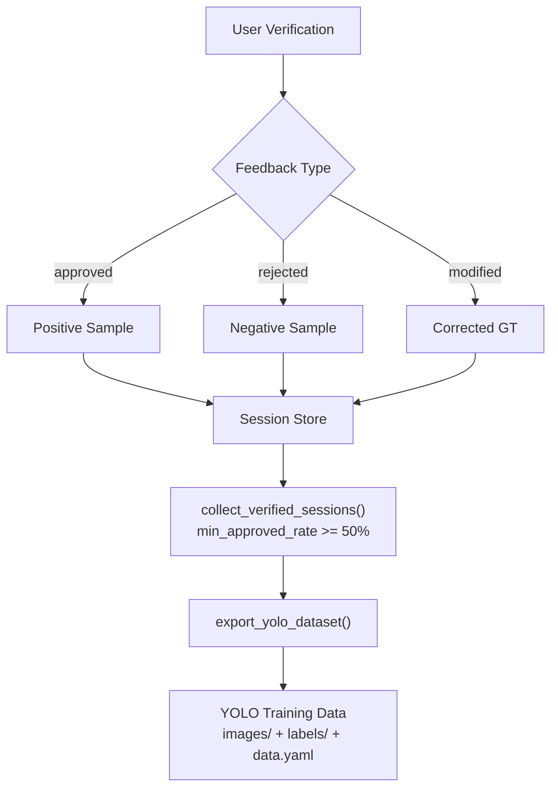
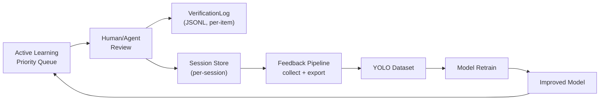

# Feedback Pipeline

## Overview

사용자 피드백을 수집하고 검증 완료된 데이터를 YOLO 재학습용 데이터셋으로 변환하여 모델을 지속적으로 개선합니다.



## Feedback Types

| Type | `verification_status` | 의미 | 재학습 활용 |
|------|----------------------|------|------------|
| **Approve** | `approved` | 검출 정확함 | 원본 bbox + class를 positive sample로 사용 |
| **Reject** | `rejected` | 오검출 | 기본 제외 (`include_rejected=True` 로 포함 가능) |
| **Modify** | `modified` | 수정 필요 | `modified_class_name`, `modified_bbox` 사용 |

수정된 항목은 원본 대신 수정된 값을 학습 데이터로 사용합니다:

```python
# class: modified_class_name or class_name
class_name = det.get("modified_class_name") or det.get("class_name")
# bbox: modified_bbox or bbox
bbox = det.get("modified_bbox") or det.get("bbox")
```

## Data Collection

`collect_verified_sessions()` 는 다음 조건으로 학습 가능한 세션을 필터링합니다:

| Filter | Default | Description |
|--------|---------|-------------|
| `min_approved_rate` | `0.5` (50%) | 최소 승인율 |
| `days_back` | `None` (전체) | 최근 N일 내 세션만 |
| `pending == 0` | 필수 | 모든 항목 검증 완료 필수 |

## YOLO Dataset Export

`export_yolo_dataset()` 는 검증된 세션을 YOLO 형식으로 내보냅니다:

### Output Structure

```
feedback_dataset_20260222_103000/
  images/          # 원본 이미지 복사
  labels/          # YOLO TXT 라벨 (session_id.txt)
  classes.txt      # 클래스 목록 (정렬순)
  data.yaml        # YOLO 학습 설정
  metadata.json    # 내보내기 메타데이터
```

### YOLO Label Format

검출 bbox를 정규화된 YOLO 좌표로 변환합니다:

```python
x_center = ((x1 + x2) / 2) / image_width   # 0.0 ~ 1.0
y_center = ((y1 + y2) / 2) / image_height   # 0.0 ~ 1.0
width    = (x2 - x1) / image_width
height   = (y2 - y1) / image_height
# 유효성: 0 <= x_center <= 1, width > 0, height > 0
```

## API Endpoints

| Method | Endpoint | Description |
|--------|----------|-------------|
| `GET` | `/feedback/stats` | 피드백 통계 (승인/거부/수정 비율) |
| `GET` | `/feedback/sessions` | 검증 완료 세션 목록 |
| `POST` | `/feedback/export/yolo` | YOLO 데이터셋 내보내기 |
| `GET` | `/feedback/exports` | 이전 내보내기 목록 |
| `GET` | `/feedback/health` | 서비스 상태 |

### Export Request

```json
{
  "output_name": "my_dataset",
  "include_rejected": false,
  "min_approved_rate": 0.5,
  "days_back": 30
}
```

### Stats Response

```json
{
  "total_sessions": 25,
  "total_detections": 450,
  "approved_count": 380,
  "rejected_count": 40,
  "modified_count": 30,
  "approval_rate": 0.844,
  "rejection_rate": 0.089,
  "modification_rate": 0.067
}
```

## Integration with Active Learning

피드백 파이프라인은 Active Learning 서비스와 상호 보완적으로 동작합니다:



- **Active Learning**: 항목 레벨 로그 (`VerificationLog` JSONL) - 개별 판단 기록
- **Feedback Pipeline**: 세션 레벨 수집 - 검증 완료된 전체 세션을 YOLO 데이터셋으로 변환

## Conflict Resolution

동일 세션에서 다수의 검토자가 있을 경우:

- 각 detection의 `verification_status`는 마지막 검토 결과를 반영
- 세션 내 모든 항목이 `pending`이 아닐 때 수집 대상이 됨
- `min_approved_rate` 필터로 품질이 낮은 세션(거부 비율 높음)은 자동 제외
