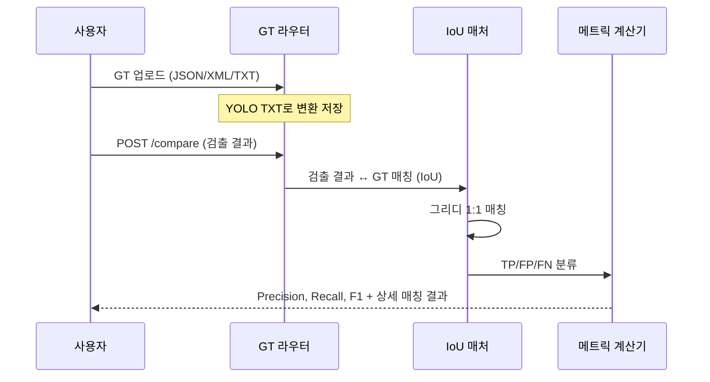

# 정답 비교 (Ground Truth Comparison)

## 개요

예측 결과를 정답(Ground Truth) 데이터와 비교하여 모델 성능을 정량 평가합니다.



## GT 라벨 형식

시스템은 YOLO TXT 형식으로 GT 라벨을 저장합니다. 업로드 시 JSON, XML(Pascal VOC), TXT 형식을 자동 변환합니다.

```text
# YOLO format: class_id x_center y_center width height (normalized)
0 0.512300 0.345600 0.102000 0.085000
1 0.234500 0.678900 0.045000 0.032000
```

| 업로드 형식 | 변환 방식 | 예시 |
|-------------|----------|------|
| **JSON** | `bbox {x1,y1,x2,y2}` → YOLO 정규화 | `[{"class_name":"valve", "bbox":{"x1":10,"y1":20,"x2":110,"y2":120}}]` |
| **XML** (Pascal VOC) | `<bndbox>` → YOLO 정규화 | `<object><name>valve</name><bndbox>...</bndbox></object>` |
| **TXT** (YOLO) | 그대로 저장 | `0 0.5 0.3 0.1 0.08` |

## IoU 기반 매칭 알고리즘 (IoU-Based Matching Algorithm)

`compare_with_ground_truth()` 는 그리디(Greedy) 매칭 방식으로 검출-GT 쌍을 구성합니다:

```python
# IoU 계산
intersection = (min(x2_det, x2_gt) - max(x1_det, x1_gt)) *
               (min(y2_det, y2_gt) - max(y1_det, y1_gt))
union = area_det + area_gt - intersection
iou = intersection / union  # 0.0 ~ 1.0
```

### 매칭 과정

1. 각 검출 결과(detection)에 대해 모든 미매칭 GT와 IoU 계산
2. **클래스 매칭 모드**: `det_class == gt_class` AND `IoU >= threshold`
3. **클래스 무관(Class-agnostic) 모드**: `IoU >= threshold` 만으로 매칭 (클래스 무시)
4. 가장 높은 IoU를 가진 GT와 1:1 매칭
5. 매칭된 GT/검출 결과는 재사용 불가

## 혼동 행렬 분류 (Confusion Matrix Classification)

| 유형 | 정의 | 시각화 색상 |
|------|------|------------|
| **TP** (True Positive) | 검출 결과와 GT가 IoU >= threshold로 매칭 | 초록색 |
| **FP** (False Positive) | 매칭되는 GT가 없는 검출 결과 (오검출) | 빨간색 |
| **FN** (False Negative) | 매칭되는 검출 결과가 없는 GT (미검출) | 노란색 |

## 메트릭 계산 (Metric Calculation)

```python
precision = TP / (TP + FP)  # 검출 중 정확한 비율
recall    = TP / (TP + FN)  # GT 중 검출된 비율
f1_score  = 2 * precision * recall / (precision + recall)
```

결과는 0-100% 스케일(소수점 2자리)로 반환됩니다.

## API 엔드포인트

| 메서드 | 엔드포인트 | 설명 |
|--------|----------|------|
| `GET` | `/api/ground-truth` | 사용 가능한 GT 라벨 목록 조회 |
| `GET` | `/api/ground-truth/{filename}` | 특정 이미지의 GT 라벨 조회 |
| `POST` | `/api/ground-truth/upload` | GT 라벨 업로드 (JSON/XML/TXT) |
| `POST` | `/api/ground-truth/compare` | 검출 결과와 GT 비교 |
| `DELETE` | `/api/ground-truth/{filename}` | 업로드된 GT 삭제 (레퍼런스 보호) |

### 비교 파라미터

| 파라미터 | 기본값 | 설명 |
|----------|--------|------|
| `iou_threshold` | `0.3` | IoU 매칭 임계값 |
| `class_agnostic` | `false` | 클래스 무시 모드 |
| `model_type` | `null` | 모델별 클래스 파일 선택 (`bom_detector`, `engineering` 등) |

### 비교 응답

```json
{
  "metrics": {
    "tp": 12, "fp": 3, "fn": 2,
    "precision": 80.0,
    "recall": 85.71,
    "f1_score": 82.76,
    "iou_threshold": 0.3
  },
  "gt_count": 14,
  "detection_count": 15,
  "tp_matches": [{"detection_idx": 0, "gt_idx": 2, "iou": 0.87, "class_match": true}],
  "fp_detections": [...],
  "fn_labels": [...]
}
```

## GT 파일 해석 우선순위 (GT File Resolution)

업로드된 GT 파일이 레퍼런스 GT보다 우선합니다:

1. `uploads/gt_labels/{name}.txt` 확인 (업로드된 파일)
2. `test_drawings/labels/{name}.txt` 확인 (레퍼런스 파일)
3. 모두 없으면 `has_ground_truth: false` 반환
