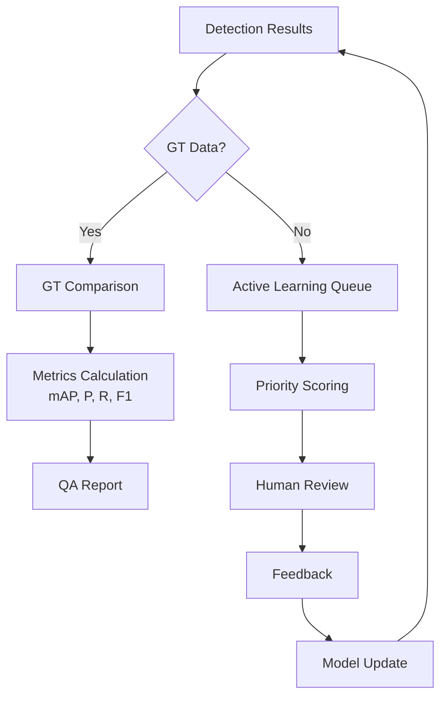

# Quality Assurance

ML 분석 결과의 품질을 보장하는 체계입니다.

## QA Lifecycle

## Key Metrics

| Metric | Description | Target |
|--------|-------------|--------|
| **mAP@50** | Mean Average Precision | > 0.85 |
| **Precision** | 정밀도 | > 0.90 |
| **Recall** | 재현율 | > 0.85 |
| **F1 Score** | 조화 평균 | > 0.87 |
| **CER** | Character Error Rate (OCR) | < 5% |

## Three Pillars

| Pillar | Description |
|--------|-------------|
| [GT Comparison](./gt-comparison) | Ground Truth 데이터와 비교 분석 |
| [Active Learning](./active-learning) | 불확실 샘플 우선 학습 |
| [Feedback Pipeline](./feedback-pipeline) | 사용자 피드백 수집 및 처리 |
| [OCR Metrics](./ocr-metrics) | OCR 성능 측정 |
