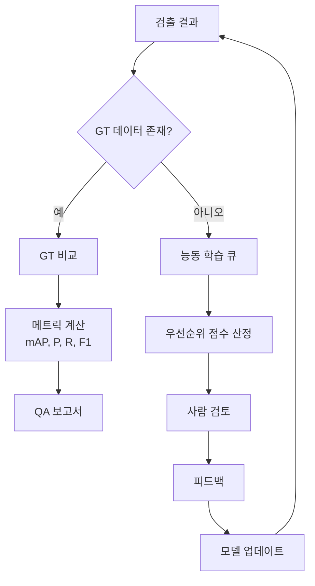

# 품질 보증 (Quality Assurance)

ML 분석 결과의 품질을 보장하는 체계입니다.

## QA 생명주기

## 핵심 메트릭 (Key Metrics)

| 메트릭 | 설명 | 목표 |
|--------|------|------|
| **mAP@50** | 평균 정밀도 (Mean Average Precision) | > 0.85 |
| **Precision** | 정밀도 | > 0.90 |
| **Recall** | 재현율 | > 0.85 |
| **F1 Score** | 조화 평균 | > 0.87 |
| **CER** | 문자 오류율 (Character Error Rate, OCR) | < 5% |

## 세 가지 핵심 축

| 핵심 축 | 설명 |
|---------|------|
| [GT 비교](./gt-comparison) | 정답(Ground Truth) 데이터와 비교 분석 |
| [능동 학습](./active-learning) | 불확실 샘플 우선 학습 |
| [피드백 파이프라인](./feedback-pipeline) | 사용자 피드백 수집 및 처리 |
| [OCR 메트릭](./ocr-metrics) | OCR 성능 측정 |
