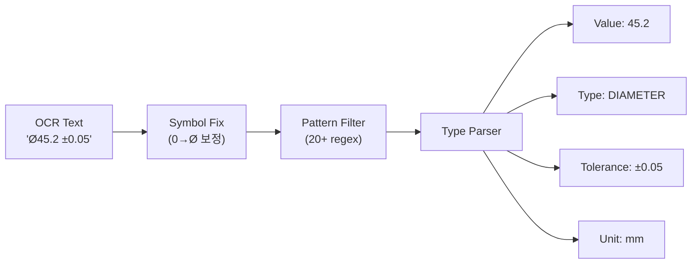
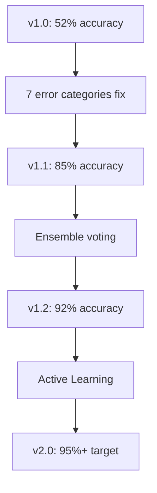

# OCR Metrics

## Key Metrics

| Metric | Description | Formula |
|--------|-------------|---------|
| **CER** | Character Error Rate | `(S + D + I) / N` |
| **WER** | Word Error Rate | `(Sw + Dw + Iw) / Nw` |
| **Dimension Accuracy** | 치수 파싱 정확도 | `correct_dims / total_dims` |

### CER / WER Calculation

CER은 문자 레벨에서 편집 거리(Levenshtein distance)를 기반으로 계산됩니다:

```
CER = (Substitutions + Deletions + Insertions) / Total Reference Characters
```

**예시**: Reference `Ø45.2` vs OCR output `045.2`

| Operation | Count | Detail |
|-----------|-------|--------|
| Substitution | 1 | `Ø` → `0` |
| Deletion | 0 | - |
| Insertion | 0 | - |
| **CER** | **1/5 = 20%** | |

WER은 동일한 원리를 단어 단위로 적용합니다:

```
WER = (Word Substitutions + Word Deletions + Word Insertions) / Total Reference Words
```

## Error Categories

| Category | Type | Description | Example |
|----------|------|-------------|---------|
| **Substitution** | Character | 다른 문자로 대체 | `Ø` → `0`, `±` → `+` |
| **Deletion** | Character | 문자 누락 | `45.2` → `45.` |
| **Insertion** | Character | 불필요한 문자 삽입 | `M20` → `M20.` |
| **Symbol error** | Semantic | 특수 심볼 오인식 | `Ø` → `0`, `∅` → `O` |
| **Decimal error** | Semantic | 소수점 오류 | `45.2` → `452` |
| **Unit confusion** | Semantic | 단위 혼동 | `mm` → `in` |
| **Tolerance miss** | Semantic | 공차 미인식 | `±0.05` 누락 |

## Engine Comparison

| Engine | CER | WER | Speed | GPU | Best For |
|--------|-----|-----|-------|-----|----------|
| **eDOCr2** | ~3% | ~5% | Medium | Yes | 한국어 치수 |
| **PaddleOCR** | ~4% | ~7% | Fast | No | 다국어 범용 |
| **Tesseract** | ~6% | ~10% | Fast | No | 문서 텍스트 |
| **TrOCR** | ~5% | ~8% | Slow | Yes | 필기체 |
| **OCR Ensemble** | ~2% | ~4% | Slowest | Yes | 최고 정확도 |
| **Surya OCR** | ~4% | ~7% | Medium | No | 레이아웃 분석 |
| **DocTR** | ~4% | ~6% | Medium | No | 문서 구조 |
| **EasyOCR** | ~5% | ~8% | Medium | No | CPU 환경 |

### Ensemble Voting Mechanism

OCR Ensemble은 가중 투표(Weighted Voting)로 다중 엔진 결과를 병합합니다:

```python
# 1. 텍스트 유사도로 클러스터링 (Jaccard similarity >= 0.7)
# 2. 클러스터 내 가중 투표: vote = weight * confidence
# 3. 합의 보너스: +0.05 per agreeing engine (max 0.2)
# 4. 최종 confidence = weighted_avg_confidence + agreement_bonus
```

## Dimension Parsing Accuracy

치수 파싱은 OCR 결과에서 수치, 단위, 공차, 타입을 추출합니다.



### Dimension Types

`parse_dimension_text()` 가 인식하는 치수 타입:

| DimensionType | Pattern | Example |
|---------------|---------|---------|
| `DIAMETER` | `Ø\d+` | `Ø45.2` |
| `RADIUS` | `R\d+` | `R12.5` |
| `THREAD` | `M\d+` | `M20×1.5` |
| `ANGLE` | `\d+°` | `45°` |
| `CHAMFER` | `C\d+` | `C2×45°` |
| `SURFACE_FINISH` | `Ra\d+` or ISO 4287 | `Ra3.2` |
| `LENGTH` | `\d+` (default) | `125.0` |

### Quality Filters

`is_valid_dimension()` 은 OCR 오탐을 제거하는 6단계 필터를 적용합니다:

1. 텍스트 길이 `> 1` and 숫자 포함
2. Garbage 문자 비율 `< 30%` (`:;|{}[]\\`)
3. 줄바꿈 없음, 텍스트 길이 `<= 30`
4. 숫자 비율 `>= 30%`
5. BBox 너비 `<= 500px`
6. 수치 값 `< 5000` (비현실적 치수 제외)

## Improvement Tracking


