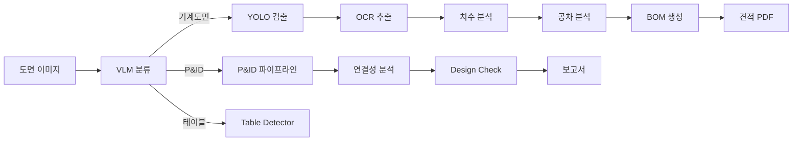

# System Overview / 시스템 개요

AX POC는 **기계 도면 자동 분석 및 제조 견적 생성 시스템**입니다.

```
도면 이미지 → VLM 분류 → YOLO 검출 → OCR 추출 → 공차 분석 → 리비전 비교 → 견적 PDF
```

## Key Metrics

| Metric | Value |
|--------|-------|
| **Microservices** | 21 Docker containers |
| **API Endpoints** | 24 services |
| **GPU Services** | 10 |
| **CPU Services** | 11 |
| **Detection Classes** | 73 |
| **Node Types** | 29+ |
| **Tests** | 549 (364 backend + 185 frontend) |

## High-Level Architecture

import ArchitectureDiagram from '@site/src/components/ArchitectureDiagram';

<ArchitectureDiagram />

## Data Flow



## Sections

| # | Section | Description |
|---|---------|-------------|
| 1 | [System Overview](./architecture-map) | 아키텍처, 서비스 카탈로그, 기술스택 |
| 2 | [Analysis Pipeline](/docs/analysis-pipeline) | VLM → YOLO → OCR → 분석 파이프라인 |
| 3 | [BlueprintFlow](/docs/blueprintflow) | 비주얼 워크플로우 빌더 |
| 4 | [Agent Verification](/docs/agent-verification) | 3-Level 하이브리드 검증 |
| 5 | [BOM & Quoting](/docs/bom-generation) | BOM 생성 및 견적 |
| 6 | [P&ID Analysis](/docs/pid-analysis) | P&ID 분석 파이프라인 |
| 7 | [Batch & Delivery](/docs/batch-delivery) | 배치 처리 및 납품 |
| 8 | [Quality Assurance](/docs/quality-assurance) | 품질 보증 체계 |
| 9 | [Frontend](/docs/frontend) | 프론트엔드 아키텍처 |
| 10 | [DevOps](/docs/devops) | DevOps 및 인프라 |
