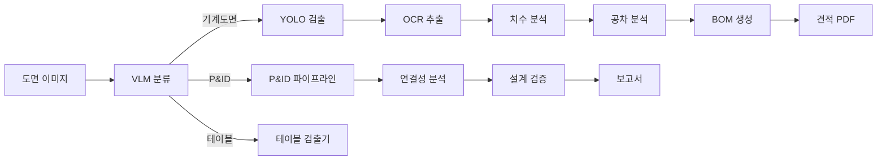

# 시스템 개요

AX POC는 **기계 도면 자동 분석 및 제조 견적 생성 시스템**입니다.

```
도면 이미지 → VLM 분류 → YOLO 검출 → OCR 추출 → 공차 분석 → 리비전 비교 → 견적 PDF
```

## 핵심 지표

| 지표 | 값 |
|------|-----|
| **마이크로서비스(Microservices)** | Docker 컨테이너 21개 |
| **API 엔드포인트(Endpoints)** | 서비스 24개 |
| **GPU 서비스** | 10개 |
| **CPU 서비스** | 11개 |
| **검출 클래스(Detection Classes)** | 73개 |
| **노드 타입(Node Types)** | 29개 이상 |
| **테스트** | 549개 (백엔드 364 + 프론트엔드 185) |

## 상위 아키텍처

import ArchitectureDiagram from '@site/src/components/ArchitectureDiagram';

<ArchitectureDiagram />

## 데이터 흐름



## 섹션 안내

| # | 섹션 | 설명 |
|---|------|------|
| 1 | [시스템 개요](./architecture-map) | 아키텍처, 서비스 카탈로그, 기술 스택 |
| 2 | [분석 파이프라인](/docs/analysis-pipeline) | VLM → YOLO → OCR → 분석 파이프라인 |
| 3 | [BlueprintFlow](/docs/blueprintflow) | 비주얼 워크플로우 빌더 |
| 4 | [에이전트 검증](/docs/agent-verification) | 3단계 하이브리드 검증 |
| 5 | [BOM 및 견적](/docs/bom-generation) | BOM 생성 및 견적 |
| 6 | [P&ID 분석](/docs/pid-analysis) | P&ID 분석 파이프라인 |
| 7 | [배치 및 납품](/docs/batch-delivery) | 배치 처리 및 납품 |
| 8 | [품질 보증](/docs/quality-assurance) | 품질 보증 체계 |
| 9 | [프론트엔드](/docs/frontend) | 프론트엔드 아키텍처 |
| 10 | [DevOps](/docs/devops) | DevOps 및 인프라 |
