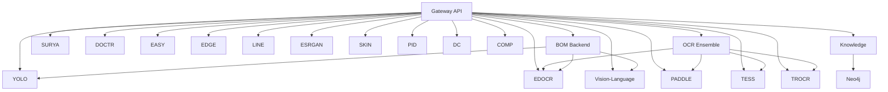

import PortMap from '@site/src/components/PortMap';
import ArchitectureDiagram from '@site/src/components/ArchitectureDiagram';

# Port & Network Map

## Port Allocation

<PortMap />

## Docker Network

모든 서비스는 `ax_poc_network` (bridge) 네트워크를 공유합니다.

<ArchitectureDiagram />

## Service Dependencies



## Health Check Endpoints

모든 서비스는 표준 헬스체크를 제공합니다:

```bash
# Gateway
GET http://localhost:8000/api/v1/health

# Individual services
GET http://localhost:<port>/health

# BOM Backend
GET http://localhost:5020/health
```

| Service | Health Endpoint | Expected Response |
|---------|----------------|-------------------|
| Gateway | `/api/v1/health` | `{"status": "healthy"}` |
| All ML APIs | `/health` | `{"status": "healthy"}` |
| Neo4j | `:7474` (HTTP) | Browser UI |
