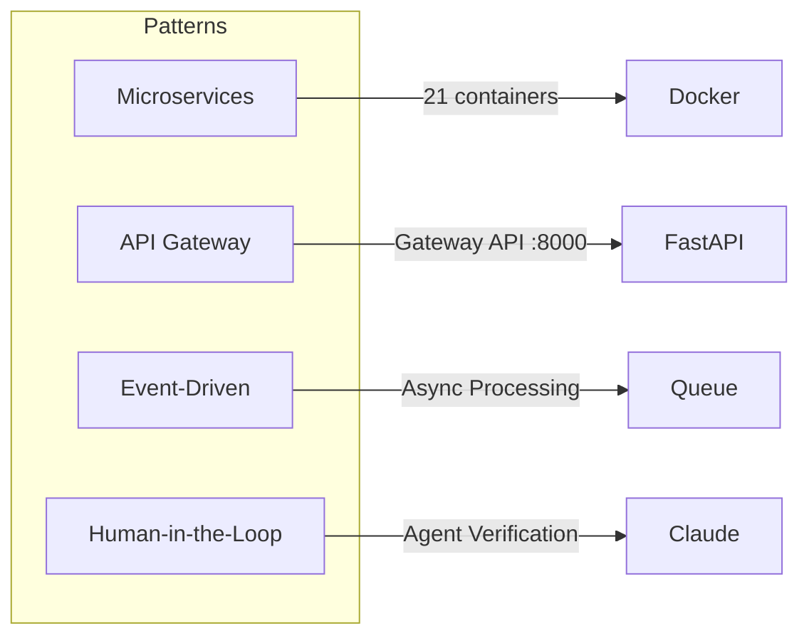

# Tech Stack

## Frontend

| Technology | Version | Purpose |
|-----------|---------|---------|
| **React** | 19 | UI Framework |
| **TypeScript** | 5.x | Type safety |
| **Vite** | 6.x | Build tool |
| **Tailwind CSS** | 3.x | Styling |
| **Zustand** | 4.x | State management |
| **React Flow** | 11.x | Workflow canvas |
| **React Router** | 6.x | Routing |

## Backend

| Technology | Version | Purpose |
|-----------|---------|---------|
| **FastAPI** | 0.100+ | API Framework |
| **Python** | 3.11 | Runtime |
| **Uvicorn** | 0.23+ | ASGI Server |
| **Pydantic** | 2.x | Data validation |

## ML / AI

| Technology | Purpose |
|-----------|---------|
| **PyTorch** | Deep learning framework |
| **Ultralytics YOLOv11** | Object detection |
| **eDOCr2** | Engineering drawing OCR |
| **PaddleOCR** | Multi-language OCR |
| **Tesseract** | General OCR |
| **TrOCR** | Handwriting recognition |
| **Surya OCR** | Layout-aware OCR |
| **DocTR** | Document text recognition |
| **EasyOCR** | Easy-to-use OCR |
| **Qwen2-VL** | Vision-Language model |
| **ESRGAN** | Image super-resolution |

## Infrastructure

| Technology | Purpose |
|-----------|---------|
| **Docker Compose** | Container orchestration |
| **Neo4j** | Knowledge graph database |
| **Nginx** | Reverse proxy (production) |
| **GitHub Actions** | CI/CD |

## Architecture Patterns

### Key Patterns

| Pattern | Implementation |
|---------|---------------|
| **API Gateway** | Gateway API가 모든 서비스 라우팅 |
| **Microservices** | 각 ML 모델이 독립 컨테이너 |
| **Human-in-the-Loop** | 3-Level 검증 (Auto/Agent/Human) |
| **Ensemble** | OCR 4엔진 가중 투표 |
| **DAG Execution** | BlueprintFlow 토폴로지 정렬 실행 |
| **Active Learning** | 불확실한 샘플 우선 학습 |
