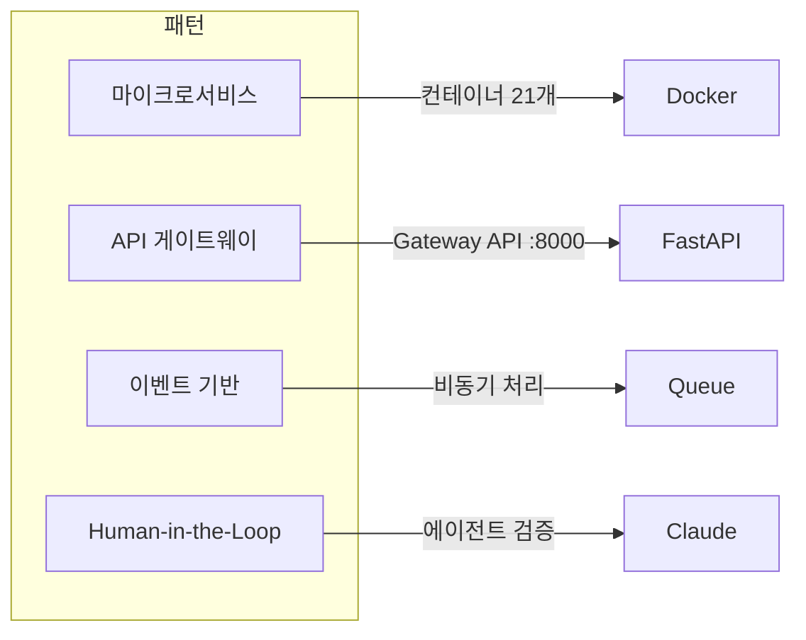

# 기술 스택

## 프론트엔드

| 기술 | 버전 | 용도 |
|------|------|------|
| **React** | 19 | UI 프레임워크 |
| **TypeScript** | 5.x | 타입 안정성(Type Safety) |
| **Vite** | 6.x | 빌드 도구 |
| **Tailwind CSS** | 3.x | 스타일링 |
| **Zustand** | 4.x | 상태 관리(State Management) |
| **React Flow** | 11.x | 워크플로우 캔버스 |
| **React Router** | 6.x | 라우팅 |

## 백엔드

| 기술 | 버전 | 용도 |
|------|------|------|
| **FastAPI** | 0.100+ | API 프레임워크 |
| **Python** | 3.11 | 런타임 |
| **Uvicorn** | 0.23+ | ASGI 서버 |
| **Pydantic** | 2.x | 데이터 유효성 검증 |

## 머신러닝 / 인공지능(ML / AI)

| 기술 | 용도 |
|------|------|
| **PyTorch** | 딥러닝 프레임워크 |
| **Ultralytics YOLOv11** | 객체 검출(Object Detection) |
| **eDOCr2** | 설계 도면 전용 OCR |
| **PaddleOCR** | 다국어 OCR |
| **Tesseract** | 범용 OCR |
| **TrOCR** | 필기체 인식(Handwriting Recognition) |
| **Surya OCR** | 레이아웃 인식 OCR |
| **DocTR** | 문서 텍스트 인식 |
| **EasyOCR** | 간편 OCR |
| **Qwen2-VL** | 비전-언어 모델(Vision-Language Model) |
| **ESRGAN** | 이미지 초해상도(Super-Resolution) |

## 인프라

| 기술 | 용도 |
|------|------|
| **Docker Compose** | 컨테이너 오케스트레이션 |
| **Neo4j** | 지식 그래프 데이터베이스 |
| **Nginx** | 리버스 프록시 (프로덕션 환경) |
| **GitHub Actions** | CI/CD 파이프라인 |

## 아키텍처 패턴

### 핵심 패턴

| 패턴 | 구현 방식 |
|------|-----------|
| **API 게이트웨이(API Gateway)** | Gateway API가 모든 서비스 라우팅 담당 |
| **마이크로서비스(Microservices)** | 각 ML 모델이 독립 컨테이너로 운영 |
| **Human-in-the-Loop** | 3단계 검증 (자동/에이전트/사람) |
| **앙상블(Ensemble)** | OCR 4엔진 가중 투표 방식 |
| **DAG 실행(DAG Execution)** | BlueprintFlow 토폴로지 정렬 실행 |
| **능동 학습(Active Learning)** | 불확실한 샘플 우선 학습 |
