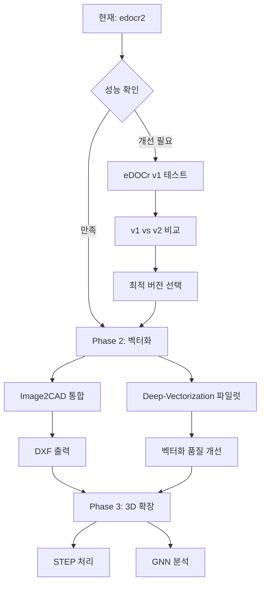

# 엔지니어링 도면 처리 오픈소스 저장소 분석 보고서

**분석 날짜**: 2025-10-29
**분석 대상**: 15개 GitHub 저장소
**목적**: POC 시스템 통합 가능성 평가

---

## 📋 목차

1. [개요](#개요)
2. [분류 기준](#분류-기준)
3. [카테고리별 상세 분석](#카테고리별-상세-분석)
4. [구현 우선순위](#구현-우선순위)
5. [통합 로드맵](#통합-로드맵)

---

## 개요

### 분석 통계

| 분류 | 개수 | 저장소 |
|------|------|--------|
| ✅ 즉시 통합 가능 | 3 | edocr2, eDOCr, Image2CAD |
| ⚠️ 단기 통합 고려 | 2 | Deep-Vectorization, pygcn |
| 🔬 연구 및 장기 | 3 | 3D_STEP_Classification, vectornet, cafr_framework |
| ❌ 통합 불가능 | 2 | FloorPlanParser, Vectra2D |
| 🏗️ 범위 외 | 5 | FloorplanTransformation, DeepFloorplan, engineering-drawing-extractor, CADNet, ecml22-grape |

### 디렉토리 구조

```
/home/uproot/ax/poc/opensource/
├── README.md (본 문서)
├── 01-immediate/ (즉시 통합 가능)
├── 02-short-term/ (단기 통합 고려)
├── 03-research/ (연구 및 장기)
├── 04-not-available/ (통합 불가능)
└── 05-out-of-scope/ (범위 외)
```

---

## 분류 기준

### ✅ 즉시 통합 가능
- 완전한 코드 및 사전 훈련 모델 제공
- 설치 및 실행 가능성 높음 (90% 이상)
- 현재 POC와 직접 관련
- 프로덕션 준비 완료

### ⚠️ 단기 통합 고려
- 코드 및 모델 제공
- 일부 수정 필요 (60-85%)
- POC 개선에 유용
- 3-6개월 내 통합 가능

### 🔬 연구 및 장기
- 학술적 가치 높음
- 복잡한 설정 또는 제한 사항 (30-55%)
- 장기 확장 계획에 포함
- 6개월 이상 소요

### ❌ 통합 불가능
- 상업용 제품 (코드 미제공)
- 라이센스 문제
- 오픈소스 아님

### 🏗️ 범위 외
- 현재 POC 범위와 맞지 않음
- 평면도 전용, 어셈블리 추천 등
- 기계 도면 처리 불가

---

## 카테고리별 상세 분석

### 카테고리 1: OCR (엔지니어링 도면)

#### ✅ 1. edocr2 (javvi51/edocr2)
**분류**: 즉시 통합 가능 ⭐⭐⭐⭐⭐

**기술 스택**:
- Python 3.11
- TensorFlow + CUDA 11.8
- Tesseract OCR
- Vision Language Models (Qwen2-VL, GPT-4o)

**주요 기능**:
- 레이어 세그멘테이션 (frame, GDT boxes, tables, dimensions)
- OCR: 치수, GD&T, 텍스트
- 테이블 인식
- LLM 통합

**구현 가능성**: 95%

**장점**:
- ✅ eDOCr v2 (최신 버전)
- ✅ **현재 POC에서 사용 중**
- ✅ 사전 훈련 모델 제공 (Releases에서 다운로드)
- ✅ 자세한 설치 가이드 (`docs/install.md`)
- ✅ 여러 테스트 파일 제공 (`test_drawing.py`, `test_all.py`, `test_llm.py`)

**단점**:
- ⚠️ CUDA 11.8 필요 (GPU 종속)
- ⚠️ 복잡한 설치 과정

**통합 상태**: ✅ **이미 통합됨** (`/home/uproot/ax/poc/edocr2-api/`)

**추천 작업**:
1. 현재 POC 코드와 GitHub 최신 버전 비교
2. 성능 차이가 있는지 확인
3. 필요 시 최신 코드로 업데이트

---

#### ✅ 2. eDOCr (javvi51/eDOCr)
**분류**: 즉시 통합 가능 ⭐⭐⭐⭐

**기술 스택**:
- Python 3.6+, TensorFlow 2.0+
- keras-ocr 기반
- 사전 훈련 모델 3개 (dimensions, infoblock, GD&T)

**주요 기능**:
- 박스 트리 탐지 (`findrect`)
- 인포블록, GDT, 치수 파이프라인
- 커스텀 알파벳 학습 지원
- PDF 지원

**구현 가능성**: 90%

**장점**:
- ✅ 완전히 작동하는 모델 (`eDOCr/keras_ocr_models/models/`)
- ✅ PyPI 설치 가능 (`pip install eDOCr`)
- ✅ 명령줄 인터페이스 제공 (`ocr_it.py`)
- ✅ 워터마크 제거 기능

**단점**:
- ⚠️ v1 버전 (README에서 edocr2 권장)
- ⚠️ 오래된 아키텍처

**통합 계획**:
1. edocr2 백업 시스템으로 구축
2. v1 vs v2 성능 비교 테스트
3. 특정 기능 (워터마크 제거 등) 선별 통합

**테스트 명령어**:
```bash
conda create -n edocr python=3.9 -y
conda activate edocr
cd /home/uproot/ax/poc/opensource/eDOCr
pip install -r requirements.txt
pip install .

# 테스트 실행
python eDOCr/ocr_it.py tests/test_samples/Candle_holder.jpg --dest-folder tests/test_Results
```

---

#### 🏗️ 3. engineering-drawing-extractor
**분류**: 범위 외 ⭐⭐⭐

**기술 스택**:
- Python 3.x, OpenCV, Tesseract OCR
- openpyxl (Excel 출력)

**주요 기능**:
- 도면에서 테이블 분리
- 메타데이터 추출 (도면 번호, 저자, 제목)
- Excel 출력

**구현 가능성**: 70%

**장점**:
- ✅ 단순한 종속성
- ✅ Excel 출력

**단점**:
- ❌ 기본 Tesseract OCR (정확도 낮음)
- ❌ GD&T 기호 미지원
- ❌ 제한적인 기능

**평가**: edocr2의 테이블 인식 기능으로 충분

---

### 카테고리 2: 벡터화 및 세그멘테이션

#### ⚠️ 4. Deep-Vectorization-of-Technical-Drawings
**분류**: 단기 통합 고려 ⭐⭐⭐⭐

**GitHub**: ECCV 2020 논문
**기술 스택**:
- PyTorch
- Linux 전용
- Cairo, pycairo

**주요 기능**:
- Cleaning: 노이즈 제거
- Vectorization: 라인 및 곡선 벡터화
- Refinement: 벡터 정제
- Merging: 벡터 병합

**구현 가능성**: 65%

**장점**:
- ✅ ECCV 2020 게재 (학술적 가치)
- ✅ 완전한 파이프라인
- ✅ 사전 훈련 모델 제공 (Google Drive)
- ✅ Bezier curve 지원

**단점**:
- ⚠️ **Linux 전용** (WSL 필요)
- ⚠️ 복잡한 종속성 (cairo==1.14.12, chamferdist)
- ⚠️ Docker 권장

**통합 계획**:
1. Docker 환경 구축
2. EDGNet과 비교 테스트
3. 벡터화 품질 평가

**설치 가이드**:
```bash
# Docker 사용
cd /home/uproot/ax/poc/opensource/Deep-Vectorization-of-Technical-Drawings
docker build -t deep_vectorization:latest .

# 또는 직접 설치
pip install -r requirements.txt
# cairo, pycairo, chamferdist 별도 설치 필요
```

---

#### 🏗️ 5. FloorplanTransformation
**분류**: 범위 외 ⭐⭐⭐

**이유**: 평면도 전용 (기계 도면 아님)

---

#### 🏗️ 6. DeepFloorplan
**분류**: 범위 외 ⭐⭐⭐

**이유**: 평면도 전용, 구버전 TF 1.x

---

#### ❌ 7. FloorPlanParser
**분류**: 통합 불가능 ⭐

**이유**: 상업용 서비스 (코드 미제공)

---

#### 🔬 8. vectornet
**분류**: 연구 및 장기 ⭐⭐⭐⭐

**GitHub**: Eurographics 2018
**기술 스택**:
- TensorFlow 1.4
- PathNet + OverlapNet

**주요 기능**:
- 선 드로잉 벡터화
- SVG 출력

**구현 가능성**: 60%

**장점**:
- ✅ 흥미로운 아키텍처
- ✅ 사전 처리 데이터셋

**단점**:
- ❌ **문자 전용** (한자, 일본어)
- ❌ 기계 도면 부적합
- ⚠️ 구버전 TensorFlow

**평가**: 연구 참고용

---

#### ❌ 9. Vectra2D
**분류**: 통합 불가능 ⭐⭐

**이유**: 완전 상업용 (웹앱/안드로이드 앱)

---

### 카테고리 3: CAD 변환

#### ✅ 10. Image2CAD
**분류**: 즉시 통합 가능 ⭐⭐⭐⭐

**GitHub**: CVIP 2019 논문
**기술 스택**:
- OpenCV 3.x
- Tesseract OCR
- ezdxf (DXF 생성)

**주요 기능**:
- 화살표 탐지
- 치수선 탐지
- 텍스트 추출
- 선/원 탐지
- **DXF 파일 출력** (CAD 편집 가능)

**구현 가능성**: 75%

**장점**:
- ✅ 완전한 파이프라인
- ✅ DXF 출력
- ✅ 90% 성공률
- ✅ 단순한 종속성

**단점**:
- ⚠️ 논문 원본보다 단순화됨
- ⚠️ GD&T는 원본에만 있음

**통합 계획**:
1. edocr2 출력 → Image2CAD 입력
2. DXF 파일 생성 파이프라인 구축
3. CAD 소프트웨어 호환성 테스트

**테스트 명령어**:
```bash
cd /home/uproot/ax/poc/opensource/Image2CAD
pip install opencv-python pytesseract numpy openpyxl matplotlib ezdxf
python Image2CAD.py TestData/1.png
```

---

### 카테고리 4: Graph Neural Networks for CAD

#### 🏗️ 11. CADNet
**분류**: 범위 외 ⭐⭐⭐

**이유**: 3D B-Rep CAD 전용 (2D 도면 아님)

---

#### 🔬 12. 3D_STEP_Classification
**분류**: 연구 및 장기 ⭐⭐⭐⭐

**GitHub**: arXiv 2022
**기술 스택**:
- PyTorch 1.11
- PyTorch Geometric
- PythonOCC (STEP 파싱)

**주요 기능**:
- STEP 파일 직접 처리
- GNN 기반 분류
- 3D 모델 검색

**구현 가능성**: 55%

**장점**:
- ✅ STEP 파일 변환 없이 처리
- ✅ Traceparts 데이터셋 제공

**단점**:
- ❌ 3D CAD 전용
- ⚠️ PythonOCC 설치 복잡

**평가**: 3D 확장 시 고려

---

#### 🔬 13. cafr_framework
**분류**: 연구 및 장기 ⭐⭐⭐

**이유**: STL 3D 전용

---

#### 🏗️ 14. ecml22-grape
**분류**: 범위 외 ⭐⭐⭐

**이유**: 어셈블리 추천 시스템 (OCR 아님)

---

#### ⚠️ 15. pygcn
**분류**: 단기 통합 고려 ⭐⭐⭐

**GitHub**: 기본 GCN 구현
**기술 스택**:
- PyTorch 0.4/0.5
- 최소 종속성

**주요 기능**:
- GCN 기본 구현
- 교육용

**구현 가능성**: 85% (교육용)

**장점**:
- ✅ 단순하고 명확
- ✅ GNN 학습 기초

**단점**:
- ❌ 응용 없음 (예제만)

**평가**: GNN 학습용 참고 자료

---

## 구현 우선순위

### Phase 1: OCR 강화 (현재)
**목표**: 현재 시스템 안정화 및 성능 개선

1. ✅ **edocr2 최신 버전 확인**
   - 현재 코드와 GitHub 버전 비교
   - 성능 차이 분석
   - 필요 시 업데이트

2. ✅ **eDOCr v1 테스트**
   - 백업 시스템 구축
   - v1 vs v2 성능 비교
   - 워터마크 제거 등 특수 기능 평가

3. ⏱️ **예상 소요 시간**: 1-2주

---

### Phase 2: 벡터화 추가 (3개월)
**목표**: DXF 출력 및 벡터화 기능 추가

1. 🔄 **Image2CAD 통합**
   - DXF 파일 생성 파이프라인
   - edocr2 출력과 연동
   - CAD 소프트웨어 호환성 테스트

2. 🔄 **Deep-Vectorization 파일럿**
   - Docker 환경 구축
   - EDGNet과 비교
   - 벡터화 품질 평가

3. ⏱️ **예상 소요 시간**: 2-3개월

---

### Phase 3: 3D 확장 (6개월+)
**목표**: 3D CAD 분석 기능 추가

1. 🔬 **3D_STEP_Classification 연구**
   - STEP 파일 처리 파이프라인
   - GNN 모델 학습

2. 🔬 **CADNet/cafr_framework 평가**
   - 가공 피처 인식
   - 3D 모델 분류

3. ⏱️ **예상 소요 시간**: 6개월 이상

---

## 통합 로드맵



---

## 다음 단계

### 즉시 실행 (이번 주)
1. ✅ 현재 edocr2 코드와 GitHub 버전 비교
2. ✅ eDOCr v1 설치 및 테스트
3. ✅ 성능 비교 보고서 작성

### 단기 계획 (1개월)
1. Image2CAD 테스트 및 통합 계획 수립
2. Deep-Vectorization Docker 환경 구축
3. DXF 출력 파이프라인 설계

### 중기 계획 (3개월)
1. DXF 출력 기능 프로덕션 배포
2. 벡터화 기능 A/B 테스트
3. 사용자 피드백 수집

---

## 부록

### A. 저장소 위치
모든 저장소는 다음 경로에 클론되어 있습니다:
```
/home/uproot/ax/poc/opensource/
```

### B. 연락처
- eDOCr/edocr2: javvi51@github
- Image2CAD: AdityaIntwala@github

### C. 참고 논문
1. eDOCr: [Frontiers in Manufacturing Technology, 2023](https://www.frontiersin.org/articles/10.3389/fmtec.2023.1154132/full)
2. edocr2: [SSRN Preprint](http://dx.doi.org/10.2139/ssrn.5045921)
3. Deep-Vectorization: [ECCV 2020](https://link.springer.com/chapter/10.1007/978-3-030-58601-0_35)
4. Image2CAD: [CVIP 2019](https://link.springer.com/chapter/10.1007/978-981-32-9088-4_17)

---

**문서 버전**: 1.0
**최종 업데이트**: 2025-10-29
**작성자**: Claude Code POC Team
