# 시스템 아키텍처 개요

## 이 시스템은 무엇인가?

**기계 도면을 AI로 자동 분석하여 BOM(자재명세서)과 견적서를 생성하는 통합 플랫폼**입니다.

하나의 Builder 화면에서 **다양한 기업의 도면 분석 요구**를 템플릿 기반으로 지원합니다. 현재 파나시아(해양 BWMS)와 동서기연(터빈 베어링)이 활용 중이며, **새로운 기업이 추가될 때 코드 변경 없이 템플릿과 Feature 조합만으로 대응**할 수 있도록 설계되었습니다.

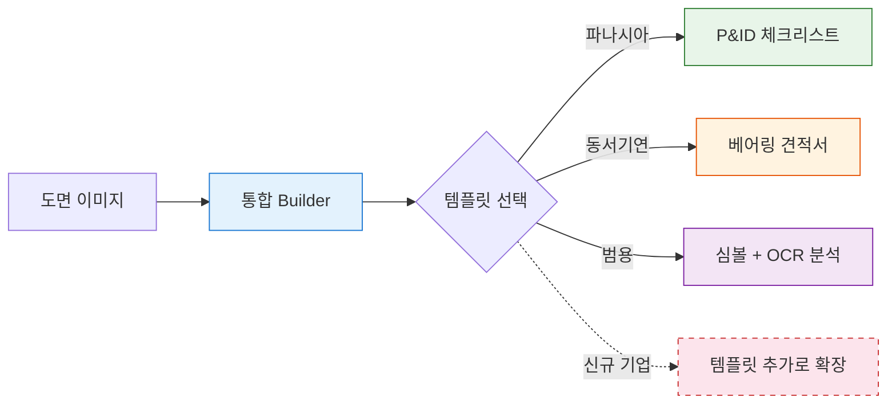

---

## 지원 기업 및 활용 사례

### 파나시아 (TECHCROSS) - 해양 BWMS 설계 검증

**도면 종류**: P&ID (배관 계장도)

P&ID 도면에서 밸브, 기기, 배관 연결을 검출하고, 60항목 BWMS 체크리스트를 자동 검증합니다.

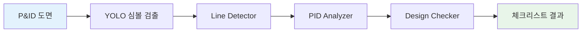

| 산출물 | 설명 |
|--------|------|
| **밸브 신호 리스트** | 밸브 종류, 신호 타입, 위치 추출 |
| **기기 리스트** | ECU/FMU/PUMP/TANK 등 태그 검출 |
| **BWMS 체크리스트** | 60항목 적합성 검증 (ISO 10628, ISA 5.1) |
| **편차 분석** | 표준 대비 설계 편차 검출 |

**관련 템플릿**: TECHCROSS BWMS 1-1 ~ 1-4, PANASIA MCP Panel

---

### 동서기연 (DSE) - 터빈 베어링 제조 견적

**도면 종류**: 기계 부품도 (베어링 링, 케이싱, 스러스트)

도면에서 표제란/부품표/치수를 OCR로 추출하고, 재질+규격 기반으로 자동 견적을 생성합니다.

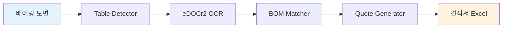

| 산출물 | 설명 |
|--------|------|
| **표제란 데이터** | 도번, 품명, 재질, 중량 자동 추출 |
| **부품표 (BOM)** | 부품 목록 + 수량 + 재질 매칭 |
| **자동 견적서** | 중량 계산 → 재료비 → 가공비 → 마진 → Excel 출력 |
| **HITL 검증** | 사람이 BOM/견적을 확인·수정하는 Human-in-the-Loop |

**관련 템플릿**: DSE Bearing 1-1, 2-1~2-8, 3-2

---

### 범용 - 기계 도면 분석

**도면 종류**: 일반 기계 도면 (조립도, 부품도)

심볼 검출 → OCR 치수 인식 → 공차 분석 → AI 설명 생성의 범용 파이프라인입니다.


| 산출물 | 설명 |
|--------|------|
| **심볼 검출** | 부품, GD&T, 텍스트 영역 위치 |
| **치수 OCR** | 치수값, 공차, 일반 텍스트 추출 |
| **공차 분석** | Skin Model 기반 기하공차 시뮬레이션 |
| **AI 설명** | VLM 기반 도면 내용 요약 |

**관련 템플릿**: Complete Drawing Analysis, Speed Pipeline, Accuracy Pipeline

---

## 통합 플랫폼 구조

모든 기업의 워크플로우가 **하나의 Builder UI**에서 실행됩니다.

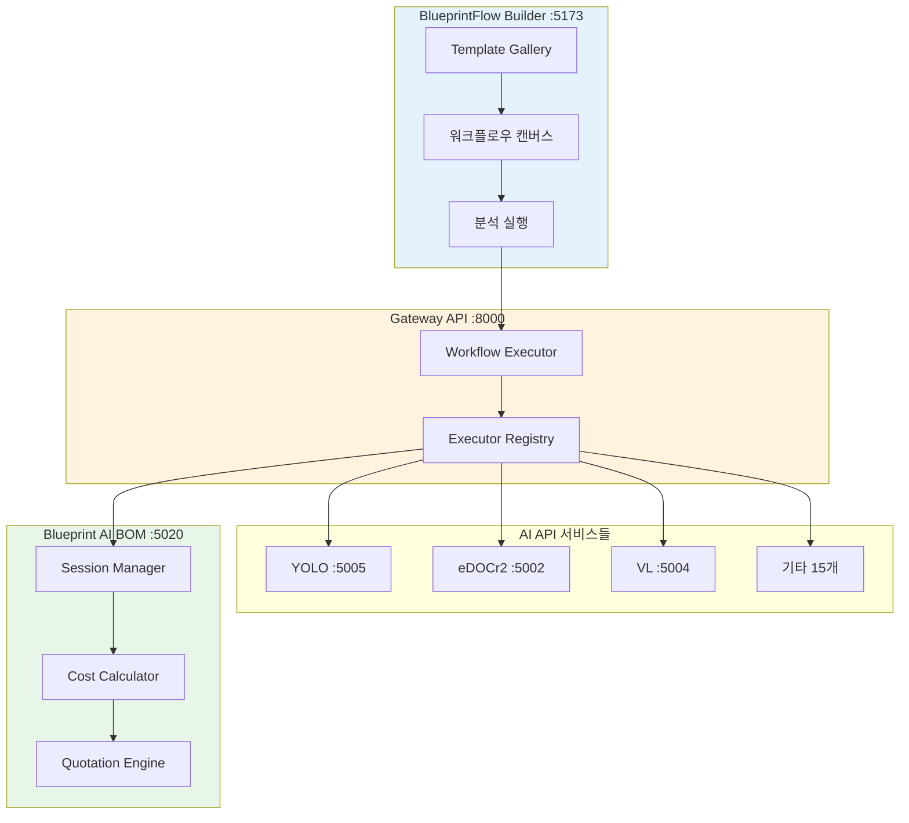

### 핵심 레이어

| 레이어 | 역할 | 위치 |
|--------|------|------|
| **Frontend** | Builder UI, Template Gallery, 프로젝트 관리 | web-ui :5173 |
| **Gateway** | 워크플로우 실행, 노드 오케스트레이션 | gateway-api :8000 |
| **AI APIs** | 개별 AI 모델 서비스 (18개) | :5002 ~ :5022 |
| **BOM System** | 세션 관리, 원가 계산, 견적 생성 | blueprint-ai-bom :5020 |

---

## 템플릿 시스템 (핵심 메커니즘)

**템플릿 = 기업별 워크플로우 레시피**

템플릿이 Builder를 특정 기업의 분석 파이프라인으로 구성합니다.

### 템플릿 선택 시 일어나는 일

1. Builder 캔버스에 **노드들이 자동 배치**됨
2. 노드 간 **연결선(엣지)이 자동 생성**됨
3. 각 노드의 **파라미터가 프리셋 값으로 설정**됨
4. ImageInput의 **features가 템플릿에 맞게 체크**됨 (가장 중요!)

### 전체 템플릿 목록 (28개)

#### 범용 (11개)

| 템플릿 | 노드 구성 | 용도 |
|--------|----------|------|
| **Complete Drawing Analysis** | ESRGAN → YOLO → AI BOM → eDOCr2 → SkinModel → VL | 범용 정밀 분석 |
| **Speed Pipeline** | YOLO → eDOCr2 | 빠른 기본 분석 |
| **Accuracy Pipeline** | ESRGAN → YOLO → eDOCr2 → SkinModel | 고정밀 분석 |
| **Basic OCR Pipeline** | eDOCr2 단독 | 기본 OCR |
| **P&ID Analysis Pipeline** | YOLO → Line Detector → PID Analyzer → Design Checker | P&ID 연결 분석 |
| **OCR Ensemble** | 4개 OCR 엔진 가중 투표 | OCR 정확도 극대화 |
| **Multi-OCR Comparison** | 여러 OCR 결과 비교 | OCR 엔진 비교 |
| **VL-Assisted Analysis** | VL 기반 분석 | AI 보조 분석 |
| **AI-Enhanced Analysis** | Knowledge + VL | AI 심화 분석 |
| **Conditional OCR Pipeline** | IF 분기 + OCR | 조건부 OCR |
| **Loop Detection Pipeline** | Loop + YOLO | 반복 검출 |

#### 파나시아 TECHCROSS (5개)

| 템플릿 | 산출물 | 용도 |
|--------|--------|------|
| **BWMS 1-1: Checklist** | 60항목 체크리스트 | BWMS 적합성 검사 |
| **BWMS 1-2: Valve Signal** | 밸브 신호 리스트 | 밸브 분류 + 신호 추출 |
| **BWMS 1-3: Equipment** | 기기 리스트 | ECU/FMU/PUMP 태그 검출 |
| **BWMS 1-4: Deviation** | 편차 목록 | ISO/ISA/BWMS 표준 편차 |
| **MCP Panel Detection** | 심볼 BOM | 27종 전력기기 심볼 검출 |

#### 동서기연 DSE Bearing (6개)

| 템플릿 | 산출물 | 용도 |
|--------|--------|------|
| **1-1: Single Part** | BOM + 치수 | 단품 도면 분석 |
| **2-1: Ring Assembly** | 링 BOM | 틸팅패드/타원형 베어링 링 |
| **2-2: Casing Assembly** | 케이싱 BOM | 상하 분할 구조 분석 |
| **2-3: Thrust Bearing** | 스러스트 BOM | 12 PAD + PIVOT 분석 |
| **2-8: YOLO Parts List** | 부품표 | YOLO 기반 부품표 추출 |
| **3-2: Full Auto Quote** | 견적서 Excel | 표제란→부품표→치수→견적 전자동 |

#### 벤치마크 (6개 - 개발/평가용)

OCR 비교, 검출 비교, 세그멘테이션 비교, 분석 비교, 전처리 비교, AI 비교

---

## Feature 시스템

**Feature = 분석 파이프라인 스위치**

ImageInput 노드에서 체크한 feature가 **어떤 AI를 호출하고, BOM 화면에서 어떤 섹션을 표시할지** 결정합니다.

### Feature → 노드 → 화면 섹션 연결

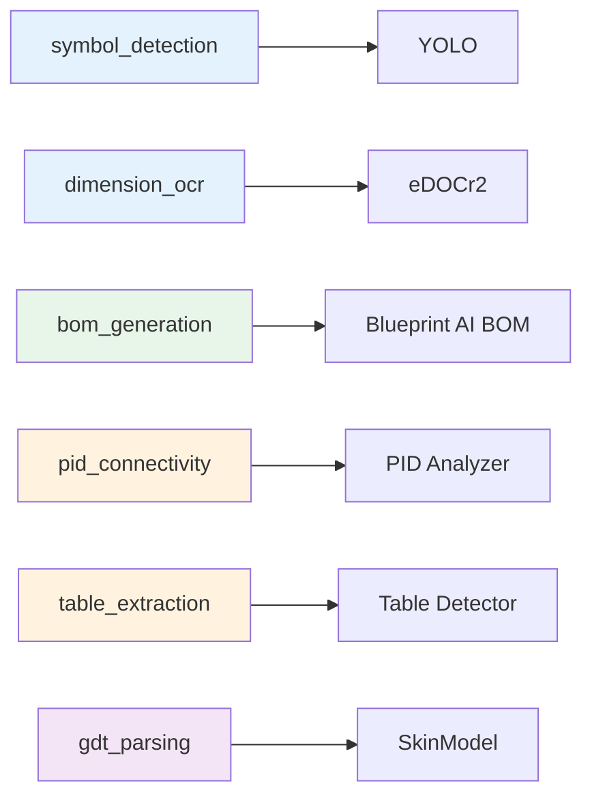

### 자동 활성화 (implies)

특정 feature를 켜면 관련 feature가 **자동으로 함께 활성화**됩니다.

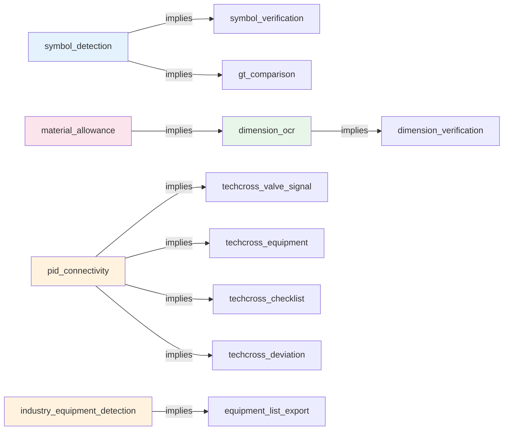

> 예: `pid_connectivity`를 켜면 → 밸브/기기/체크리스트/편차 4개가 자동 활성화, `material_allowance`를 켜면 → `dimension_ocr`가 자동 활성화

### 기업별 주요 Feature

| 기업 | 핵심 Feature | 자동 활성화 |
|------|-------------|------------|
| **파나시아** | `pid_connectivity` | valve_signal, equipment, checklist, deviation |
| **동서기연** | `dimension_ocr` + `material_allowance` | dimension_verification |
| **범용** | `symbol_detection` | symbol_verification, gt_comparison |

### 전체 Feature 목록 (26개)

| 그룹 | Feature | 상태 | 용도 |
|------|---------|------|------|
| **기본 검출** | `symbol_detection` | 구현완료 | 심볼/부품 검출 (YOLO) |
| | `dimension_ocr` | 구현완료 | 치수 텍스트 인식 (eDOCr2) |
| | `symbol_verification` | 구현완료 | 검출 결과 사람 검증 |
| | `dimension_verification` | 구현완료 | 치수 결과 사람 검증 |
| | `gt_comparison` | 구현완료 | Ground Truth 비교 |
| **GD&T** | `gdt_parsing` | 부분구현 | 기하공차 분석 (SkinModel) |
| | `line_detection` | 구현완료 | 라인/파이프 검출 |
| | `relation_extraction` | 구현완료 | 부품 간 관계 추출 |
| | `welding_symbol_parsing` | 부분구현 | 용접 기호 인식 |
| | `surface_roughness_parsing` | 부분구현 | 표면 거칠기 인식 |
| **P&ID** | `pid_connectivity` | 구현완료 | P&ID 연결 분석 |
| | `industry_equipment_detection` | 구현완료 | 산업 기기 검출 |
| | `equipment_list_export` | 구현완료 | 기기 리스트 내보내기 |
| **TECHCROSS** | `techcross_valve_signal` | 구현완료 | 밸브 신호 리스트 |
| | `techcross_equipment` | 구현완료 | 기기 리스트 |
| | `techcross_checklist` | 구현완료 | 60항목 체크리스트 |
| | `techcross_deviation` | 구현완료 | 표준 편차 분석 |
| **BOM** | `bom_generation` | 구현완료 | BOM 자동 생성 |
| | `title_block_ocr` | 구현완료 | 표제란 OCR |
| | `quantity_extraction` | 부분구현 | 수량 추출 |
| | `balloon_matching` | 부분구현 | 번호풍선 매칭 |
| | `material_allowance` | 구현완료 | 재료 여유치 계산 |
| **기타** | `vlm_auto_classification` | 구현완료 | VLM 도면 분류 |
| | `revision_comparison` | 구현완료 | 리비전 비교 |
| | `drawing_region_segmentation` | 구현완료 | 도면 영역 분할 |
| | `notes_extraction` | 구현완료 | 주기 텍스트 추출 |

---

## 프로젝트와 세션

### 용어 정의

| 개념 | 설명 | 예시 |
|------|------|------|
| **프로젝트** | 도면 묶음의 컨테이너 (고객사, BOM 계층) | "동서기연 터빈 베어링 T1~T8" |
| **세션** | 도면 1장 = 분석 1건 (metadata + features) | "TD0062017 RING UPPER" |
| **템플릿** | 세션 분석에 사용할 노드+파라미터 조합 | "DSE Bearing 1-1" |

### 프로젝트 생성 흐름

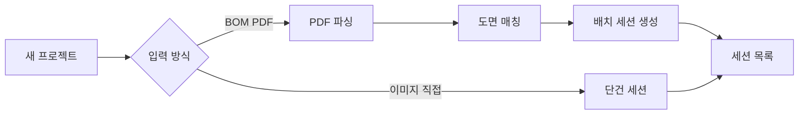

| 방식 | 설명 | 결과 |
|------|------|------|
| **BOM PDF 업로드** | PDF 파싱 → 계층 추출 → 도면 파일 매칭 | 53개 세션 자동 생성 |
| **이미지 직접 업로드** | 도면 이미지 1장 업로드 | 세션 1개 생성 |

### BOM 계층 구조

| 레벨 | 색상 | 설명 | 예시 |
|------|------|------|------|
| **Assembly** | PINK | 조립도 | TD0062016 (BEARING RING ASSY T1) |
| **Sub-Assembly** | BLUE | 하위 조립 | - |
| **Part** | WHITE | 개별 부품 → 세션 생성 | TD0062017P001 (RING UPPER) |

### 세션 메타데이터

| 필드 | 설명 | 예시 |
|------|------|------|
| `drawing_number` | 도면 번호 | TD0062017 |
| `material` | 재질 | SF45A+QT |
| `bom_quantity` | BOM 수량 | 2 |
| `size` | 규격 | Ø480 x 314 |
| `drawing_type` | 도면 유형 | mechanical / pid / electrical |
| `features` | 활성화된 분석 기능 | ["dimension_ocr", "material_allowance"] |
| `quote_status` | 견적 상태 | pending → quoted |

---

## 견적 파이프라인 (동서기연)

BOM 데이터가 생성된 후, 자동으로 원가를 계산합니다.

### 입력 → 출력

| 입력 | 예시 |
|------|------|
| 재질 | SF45A+QT |
| 규격 | Ø480 x 314 x 200 |
| 수량 | 2 |
| 품명 | RING UPPER |

### 원가 계산 9단계

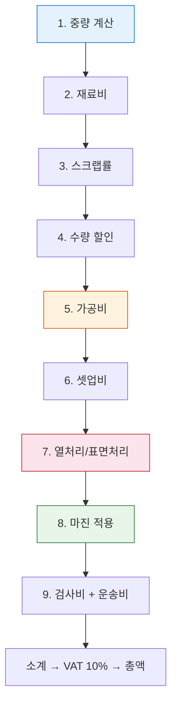

| 단계 | 설명 | 공식/기준 |
|------|------|----------|
| 1. 중량 | 형상별 체적 × 밀도 | 원형: π/4×(OD²-ID²)×H×ρ, 직사각: L×W×T×ρ |
| 2. 재료비 | 중량 × 단가/kg | 15개 재질 DB (SS400 ₩850, S45C ₩1,500 등) |
| 3. 스크랩 | 재료비 보정 | 원형 8% / 직사각 5% |
| 4. 수량할인 | 구간별 할인 | 10개↑5%, 50개↑10%, 100개↑15% |
| 5. 가공비 | 기본가공비 × 크기계수 × 난이도 | 중량 기반 5단계 |
| 6. 셋업비 | 소량 고정비 | 5개 이하 ₩50,000 |
| 7. 열처리 | 재질/텍스트에서 감지 | QT ₩800/kg, 하드크롬 ₩2,500/kg 등 |
| 8. 마진 | 재료 15% + 가공 20% | 설정값 기반 |
| 9. 검사+운송 | 검사비 3% + 운송비 ₩50/kg | 고정 비율 |

### 난이도 계수

기본값 1.0에서 아래 요소를 **가산**합니다.

| 요소 | 방법 | 예시 |
|------|------|------|
| **키워드** | 품명에서 가공 키워드 검색 | LAPPING +0.4, KEYWAY +0.3, GRINDING +0.3, BORING +0.2 |
| **난삭재** | 재질별 가산 | SUS/스테인리스 +0.3, SCM/SNCM +0.15, BABBITT +0.2 |
| **벽두께** | ID/OD 비율 | 0.85 초과(극박) +0.4, 0.75 초과(박벽) +0.2 |

### 열처리 자동 감지 (10종)

| 키워드 | 처리 종류 | 비용 (₩/kg) |
|--------|----------|-------------|
| `QT`, `Q.T`, `QUENCHING` | 조질처리 | 800 |
| `NORMALIZING` | 노말라이징 | 400 |
| `TEMPERING` | 뜨임 | 500 |
| `CARBURIZING` | 침탄 | 1,200 |
| `NITRIDING` | 질화처리 | 1,500 |
| `INDUCTION` | 고주파 열처리 | 1,000 |
| `CHROME` | 크롬도금 | 2,000 |
| `HARD CHROME` | 하드크롬도금 | 2,500 |
| `SPRAY` | 용사 코팅 | 3,000 |
| `BABBITT LINING` | 배빗 라이닝 | 5,000 |

### 프로젝트 견적 집계

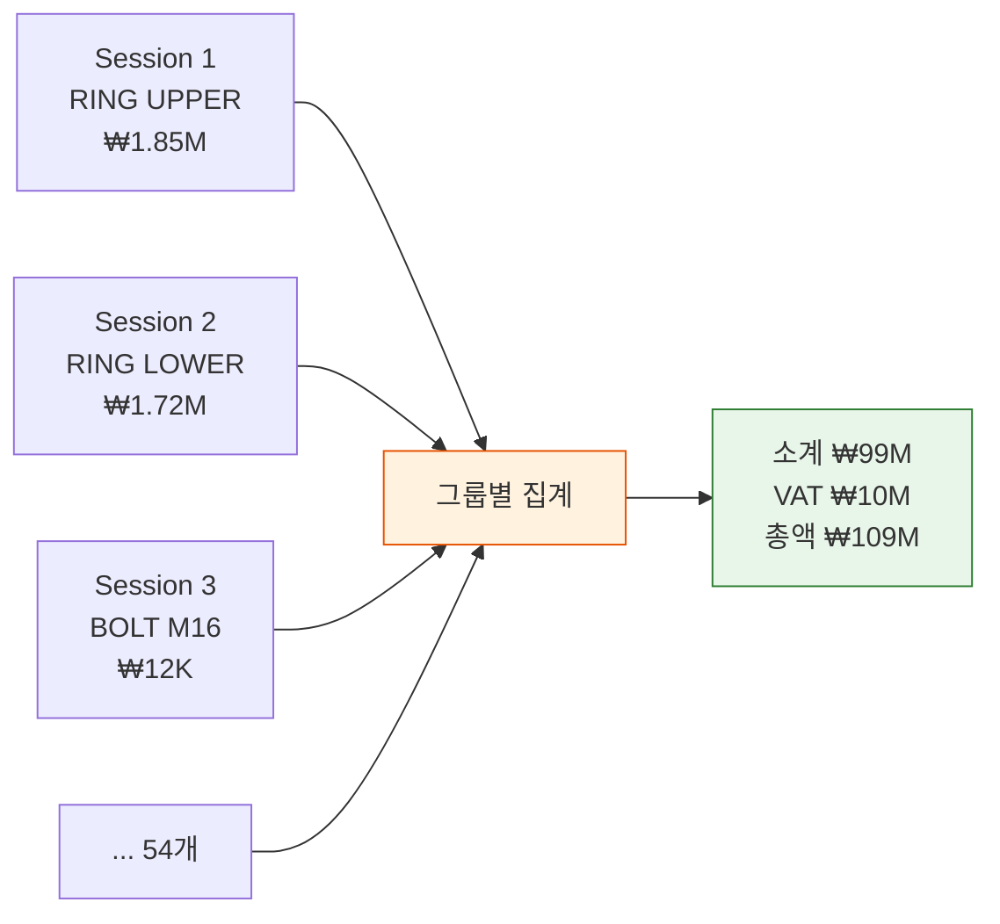

| 견적 타입 | 설명 | 비율 |
|----------|------|------|
| **Calculated** | 치수 → 중량 → 원가 산출 | 63% |
| **Catalog** | 규격품 (볼트, 너트) | 24% |
| **Estimated** | 치수 부족 → 추정 | 11% |
| **Manual** | 수동 입력 필요 | 2% |

---

## 전체 실행 흐름 (End-to-End)

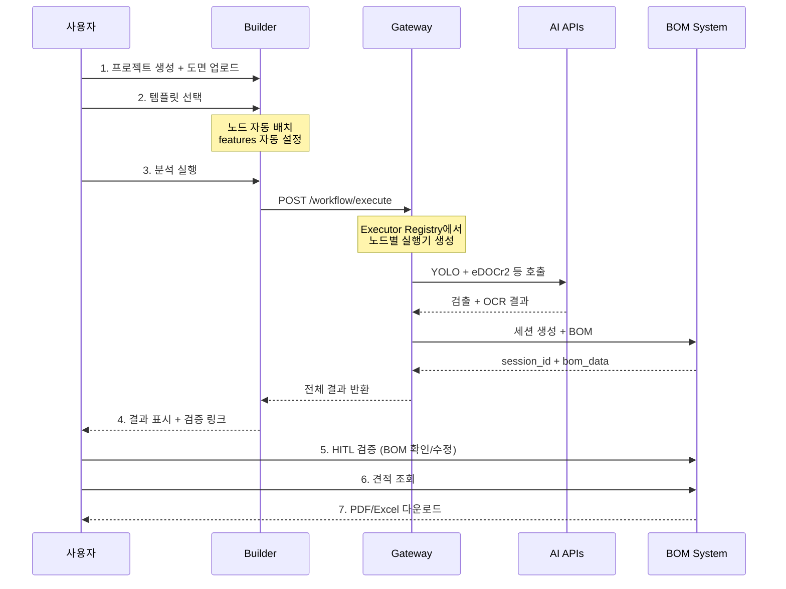

---

## 노드 카테고리 (35개)

Builder에서 사용 가능한 AI 노드 목록입니다.

| 카테고리 | 개수 | 노드 |
|----------|------|------|
| **Input** | 2 | ImageInput, TextInput |
| **Detection** | 2 | YOLO, Table Detector |
| **OCR** | 8 | eDOCr2, PaddleOCR, Tesseract, TrOCR, OCR Ensemble, SuryaOCR, DocTR, EasyOCR |
| **Segmentation** | 2 | EDGNet, Line Detector |
| **Preprocessing** | 1 | ESRGAN (4x 업스케일링) |
| **Analysis - 공차/검증** | 4 | SkinModel, GT Comparison, PID Features, Verification Queue |
| **Analysis - P&ID** | 3 | PID Analyzer, Design Checker, PID Composer |
| **Analysis - 도면파싱** | 3 | Title Block Parser, Parts List Parser, Dimension Parser |
| **Analysis - BOM/견적** | 5 | BOM Matcher, Quote Generator, Dimension Updater, PDF Export, Blueprint AI BOM |
| **Knowledge** | 1 | Knowledge (Neo4j + GraphRAG) |
| **AI** | 1 | VL (Vision-Language Model) |
| **Control** | 3 | IF, Loop, Merge |

### 주요 노드 파라미터

#### YOLO (심볼 검출)

| 파라미터 | 기본값 | 설명 |
|----------|--------|------|
| `model_type` | drawing | 모델 종류 (drawing, pid, electrical, bom_detector, panasia_mcp) |
| `confidence` | 0.4 | 검출 임계값 |
| `use_sahi` | true | 대형 이미지 분할 처리 |
| `imgsz` | 1024 | 입력 해상도 |

#### eDOCr2 (치수 OCR)

| 파라미터 | 기본값 | 설명 |
|----------|--------|------|
| `language` | ko+en | OCR 언어 |
| `extract_dimensions` | true | 치수 추출 |
| `extract_gdt` | true | GD&T 추출 |
| `extract_text` | true | 일반 텍스트 |
| `crop_preset` | quadrants | 크롭 프리셋 |

---

## API 서비스 맵 (21개)

| 카테고리 | 서비스 | 포트 | 용도 |
|----------|--------|------|------|
| **Detection** | YOLO | 5005 | 심볼/부품 검출 |
| **Detection** | Table Detector | 5022 | 테이블 검출 |
| **OCR** | eDOCr2 | 5002 | 한국어 치수 인식 (메인) |
| **OCR** | PaddleOCR | 5006 | 다국어 OCR |
| **OCR** | Tesseract | 5008 | 문서 OCR |
| **OCR** | TrOCR | 5009 | 필기체 OCR |
| **OCR** | OCR Ensemble | 5011 | 4엔진 가중 투표 |
| **OCR** | Surya OCR | 5013 | 90+ 언어 |
| **OCR** | DocTR | 5014 | 2단계 파이프라인 |
| **OCR** | EasyOCR | 5015 | 80+ 언어 |
| **Segmentation** | EDGNet | 5012 | 엣지 세그멘테이션 |
| **Segmentation** | Line Detector | 5016 | P&ID 라인 검출 |
| **Preprocessing** | ESRGAN | 5010 | 4x 업스케일링 |
| **Analysis** | SkinModel | 5003 | 공차 분석 |
| **Analysis** | PID Analyzer | 5018 | P&ID 연결 분석 |
| **Analysis** | Design Checker | 5019 | P&ID 설계 검증 |
| **Analysis** | Blueprint AI BOM | 5020 | Human-in-the-Loop BOM |
| **Visualization** | PID Composer | 5021 | SVG 오버레이 |
| **Knowledge** | Knowledge | 5007 | Neo4j + GraphRAG |
| **AI** | VL | 5004 | Vision-Language |
| **Orchestrator** | Gateway | 8000 | 파이프라인 조정 |

---

## 노드 실행 구조

Gateway가 각 노드를 실행할 때, **Executor Registry**가 실행기를 결정합니다.

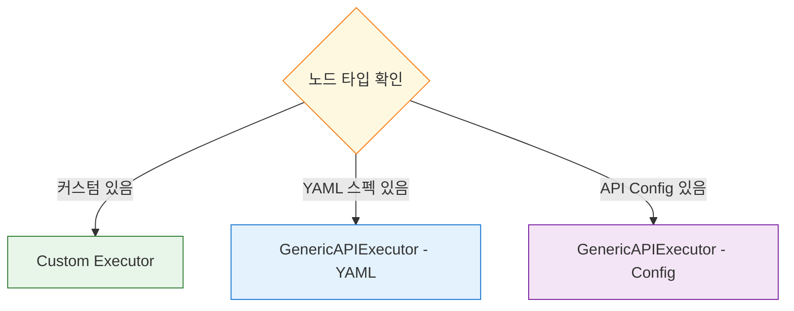

**YAML 기반 실행**의 장점:
- 새 API 추가 시 **코드 변경 없이 YAML만 작성**
- 파라미터 검증 자동 수행
- API 스펙과 실행 코드가 동일 소스

```yaml
kind: APISpec
metadata:
  id: edocr2
  host: edocr2-api-v2
  port: 5002
server:
  endpoint: /api/v2/ocr
  method: POST
parameters:
  - name: language
    default: ko+en
```

---

## 요약

| 개념 | 역할 |
|------|------|
| **프로젝트** | 도면 묶음의 컨테이너 (고객사 + BOM 계층) |
| **세션** | 도면 1장 단위 (features + metadata) |
| **템플릿** | 기업별 노드 조합 레시피 (28개) |
| **Feature** | 분석 파이프라인 스위치 (26개, implies 자동 활성화) |
| **노드** | 개별 AI API 호출 단위 (35개) |
| **Executor** | 노드 실행기 (YAML 스펙 또는 커스텀 코드) |
| **견적** | 세션별 BOM 원가 합산 → PDF/Excel 출력 |

### 기업별 핵심 경로

| 기업 | 템플릿 | 핵심 Feature | 최종 산출물 |
|------|--------|-------------|-----------|
| **파나시아** | TECHCROSS 1-1~1-4, MCP | `pid_connectivity` | 체크리스트, 밸브/기기 리스트 |
| **동서기연** | DSE Bearing 1-1~3-2 | `dimension_ocr` + `material_allowance` | BOM + 견적서 Excel |
| **범용** | Complete/Speed/Accuracy | `symbol_detection` | 검출 + OCR + 공차 분석 |
