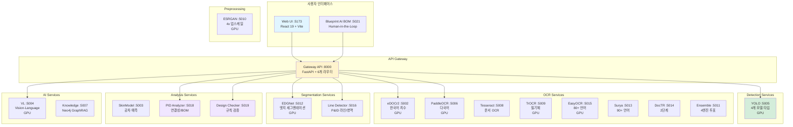
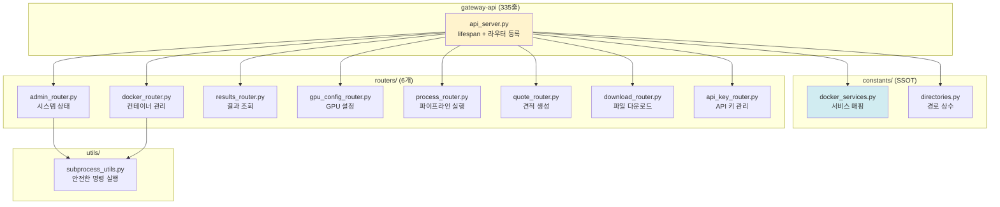
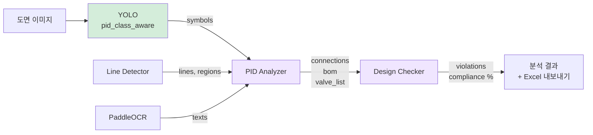
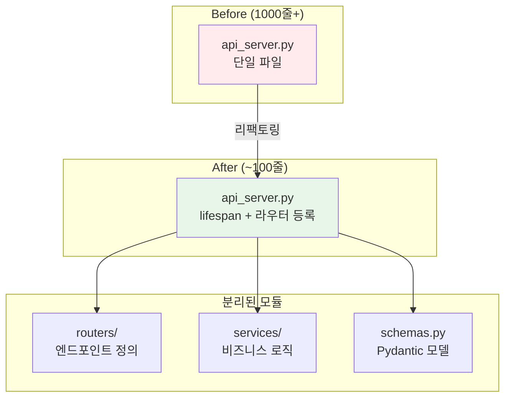
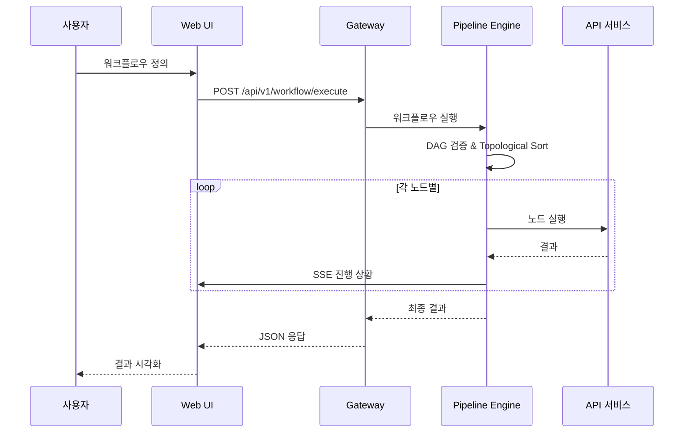
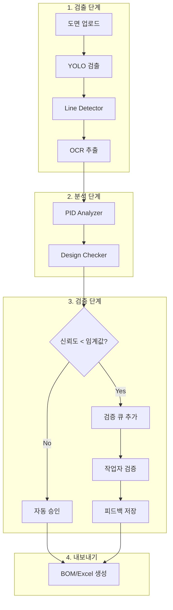

# AX 시스템 아키텍처

**버전**: 3.0.0
**최종 업데이트**: 2025-12-31
**디자인 패턴 점수**: 100/100

---

## 목차

1. [전체 시스템 개요](#전체-시스템-개요)
2. [아키텍처 다이어그램](#아키텍처-다이어그램)
3. [서비스 구조](#서비스-구조)
4. [모듈화 패턴](#모듈화-패턴)
5. [데이터 플로우](#데이터-플로우)
6. [배포 구조](#배포-구조)

---

## 전체 시스템 개요

AX 시스템은 기계 도면 자동 분석 및 제조 견적 생성을 위한 **마이크로서비스 아키텍처** 기반 AI 플랫폼입니다.

### 핵심 특징

| 항목 | 내용 |
|------|------|
| **마이크로서비스** | 19개 독립 API 서비스 |
| **GPU 가속** | YOLO, eDOCr2, PaddleOCR, EDGNet 등 8개 서비스 |
| **통합 웹 UI** | React 19 + Vite + ReactFlow |
| **워크플로우 빌더** | BlueprintFlow 시각적 파이프라인 빌더 |
| **Human-in-the-Loop** | Blueprint AI BOM 검증 시스템 |
| **테스트 커버리지** | 505개 테스트 통과 (gateway 364, web-ui 141) |

### 처리 파이프라인

```
도면 이미지 → VLM 분류 → YOLO 검출 → OCR 추출 → 공차 분석 → 리비전 비교 → 견적 PDF
```

---

## 아키텍처 다이어그램

### 1. 전체 시스템 구조



### 2. Gateway API 라우터 구조 (v3.0)



### 3. P&ID 분석 파이프라인



### 4. 모듈화된 API 구조



---

## 서비스 구조

### API 서비스 목록 (19개)

| 카테고리 | 서비스 | 포트 | GPU | 설명 |
|----------|--------|------|-----|------|
| **Orchestrator** | Gateway | 8000 | - | 통합 API 게이트웨이 |
| **Detection** | YOLO | 5005 | ✓ | 객체 검출 (4개 모델 타입) |
| **OCR** | eDOCr2 | 5002 | ✓ | 한국어 치수 인식 |
| **OCR** | PaddleOCR | 5006 | ✓ | 다국어 OCR |
| **OCR** | Tesseract | 5008 | - | 문서 OCR |
| **OCR** | TrOCR | 5009 | ✓ | 필기체 OCR |
| **OCR** | EasyOCR | 5015 | ✓ | 80+ 언어 |
| **OCR** | Surya | 5013 | - | 90+ 언어, 레이아웃 |
| **OCR** | DocTR | 5014 | - | 2단계 파이프라인 |
| **OCR** | Ensemble | 5011 | - | 4엔진 가중 투표 |
| **Segmentation** | EDGNet | 5012 | ✓ | 엣지 세그멘테이션 |
| **Segmentation** | Line Detector | 5016 | - | P&ID 라인/영역 검출 |
| **Analysis** | SkinModel | 5003 | - | 공차 예측 (XGBoost) |
| **Analysis** | PID Analyzer | 5018 | - | 연결성 분석, BOM |
| **Analysis** | Design Checker | 5019 | - | 설계 규칙 검증 |
| **Analysis** | Blueprint AI BOM | 5020 | - | Human-in-the-Loop |
| **AI** | VL | 5004 | ✓ | Vision-Language |
| **Knowledge** | Knowledge | 5007 | - | Neo4j GraphRAG |
| **Preprocessing** | ESRGAN | 5010 | ✓ | 4x 업스케일링 |

### YOLO 모델 타입

| model_type | 클래스 수 | 용도 |
|------------|----------|------|
| engineering | 14 | 기계도면 치수/GD&T |
| pid_class_aware | 32 | P&ID 심볼 분류 |
| pid_class_agnostic | 1 | P&ID 심볼 위치만 |
| bom_detector | 27 | 전력 설비 심볼 |

---

## 모듈화 패턴

### 파일 크기 규칙

| 라인 수 | 상태 | 조치 |
|---------|------|------|
| < 300줄 | ✅ 이상적 | 유지 |
| 300-500줄 | ✅ 양호 | 유지 |
| 500-800줄 | ⚠️ 주의 | 리팩토링 고려 |
| > 1000줄 | ❌ 위반 | 즉시 분리 |

### 리팩토링 결과 (9개 대형 파일)

| 파일 | Before | After | 분리 결과 |
|------|--------|-------|----------|
| gateway-api/api_server.py | 2,044줄 | 335줄 | 6개 라우터 |
| web-ui/Guide.tsx | 1,235줄 | 151줄 | guide/ 디렉토리 |
| web-ui/APIDetail.tsx | 1,197줄 | 248줄 | api-detail/ |
| pid_features_router.py | 1,101줄 | 118줄 | pid_features/ (6개) |
| region_extractor.py | 1,082줄 | 57줄 | region/ (5개) |
| api_server_edocr_v1.py | 1,068줄 | 97줄 | edocr_v1/ |
| bwms_rules.py | 1,031줄 | 89줄 | bwms/ (8개) |
| NodePalette.tsx | 1,024줄 | 189줄 | node-palette/ |

### 표준 API 모듈 구조

```
models/{api-name}-api/
├── api_server.py           # 100-200줄 (lifespan + 라우터)
├── schemas.py              # Pydantic 모델
├── routers/
│   ├── __init__.py         # 라우터 export
│   └── *_router.py         # 엔드포인트
├── services/
│   ├── __init__.py         # 서비스 export
│   ├── model.py            # 모델 로드/추론
│   └── state.py            # 전역 상태 관리
└── Dockerfile
```

### 프론트엔드 분리 패턴

```
ComponentName.tsx (대형 파일)
    ↓ 분리
component-name/
├── index.ts              # re-export
├── hooks/
│   ├── useState.ts       # 상태 관리
│   └── useHandlers.ts    # 이벤트 핸들러
├── components/
│   └── SubComponent.tsx  # 하위 컴포넌트
├── sections/             # UI 섹션
└── constants.ts          # 상수
```

---

## 데이터 플로우

### BlueprintFlow 파이프라인 실행



### Human-in-the-Loop 워크플로우



---

## 배포 구조

### Docker Compose 구성

```yaml
services:
  # Frontend
  web-ui:           # :5173
  blueprint-ai-bom: # :5020, :5021

  # Gateway
  gateway-api:      # :8000

  # Detection (GPU)
  yolo-api:         # :5005

  # OCR (8개)
  edocr2-v2-api:    # :5002 (GPU)
  paddleocr-api:    # :5006 (GPU)
  tesseract-api:    # :5008
  trocr-api:        # :5009 (GPU)
  easyocr-api:      # :5015 (GPU)
  surya-ocr-api:    # :5013
  doctr-api:        # :5014
  ocr-ensemble-api: # :5011

  # Segmentation
  edgnet-api:       # :5012 (GPU)
  line-detector-api: # :5016

  # Analysis
  skinmodel-api:    # :5003
  pid-analyzer-api: # :5018
  design-checker-api: # :5019

  # AI
  vl-api:           # :5004 (GPU)
  knowledge-api:    # :5007

  # Preprocessing
  esrgan-api:       # :5010 (GPU)

networks:
  ax_poc_network:
    driver: bridge
```

### GPU Override 시스템

GPU 설정은 `docker-compose.override.yml`에서 동적으로 관리:

```yaml
# docker-compose.override.yml (로컬, .gitignore)
services:
  yolo-api:
    deploy:
      resources:
        reservations:
          devices:
          - capabilities: [gpu]
            count: 1
```

| GPU 지원 서비스 | 기본 상태 | 활성화 방법 |
|----------------|----------|------------|
| YOLO | OFF | Dashboard 또는 override.yml |
| eDOCr2 | OFF | Dashboard 또는 override.yml |
| PaddleOCR | OFF | Dashboard 또는 override.yml |
| TrOCR | OFF | Dashboard 또는 override.yml |
| EDGNet | OFF | Dashboard 또는 override.yml |
| ESRGAN | OFF | Dashboard 또는 override.yml |
| EasyOCR | OFF | Dashboard 또는 override.yml |
| VL | OFF | Dashboard 또는 override.yml |

---

## 기술 스택

### Frontend
- **Framework**: React 19 + TypeScript
- **빌드**: Vite
- **상태 관리**: Zustand
- **UI**: Tailwind CSS + shadcn/ui
- **워크플로우**: ReactFlow
- **i18n**: i18next (ko/en)

### Backend
- **Framework**: FastAPI 0.104+
- **Python**: 3.10+
- **비동기**: Uvicorn + asyncio
- **HTTP Client**: httpx (async)

### AI/ML
- **객체 검출**: YOLOv11 (PyTorch)
- **OCR**: eDOCr2, PaddleOCR, TrOCR 등
- **세그멘테이션**: EDGNet, Line Detector
- **공차 예측**: XGBoost
- **Vision-Language**: Qwen2-VL

### 인프라
- **컨테이너**: Docker + Docker Compose
- **GPU**: NVIDIA (CUDA 11.8+)
- **네트워크**: ax_poc_network (bridge)

---

## 테스트 현황

| 영역 | 테스트 수 | 상태 |
|------|----------|------|
| gateway-api | 238개 | ✅ |
| web-ui | 141개 | ✅ |
| models | 65개 | ✅ |
| **총계** | **400개+** | ✅ |

---

**작성자**: Claude Code (Opus 4.5)
**마지막 업데이트**: 2025-12-31
**버전**: 3.0.0
